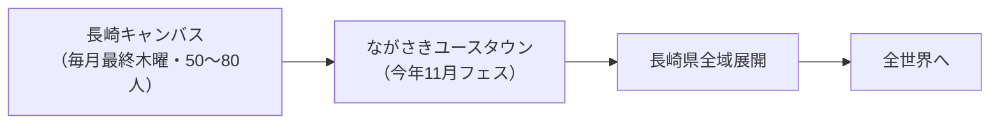
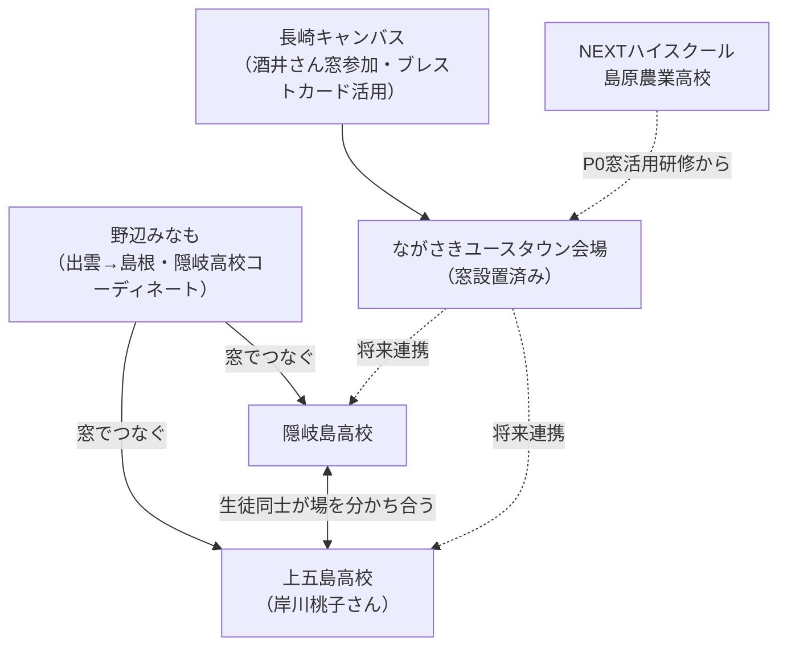
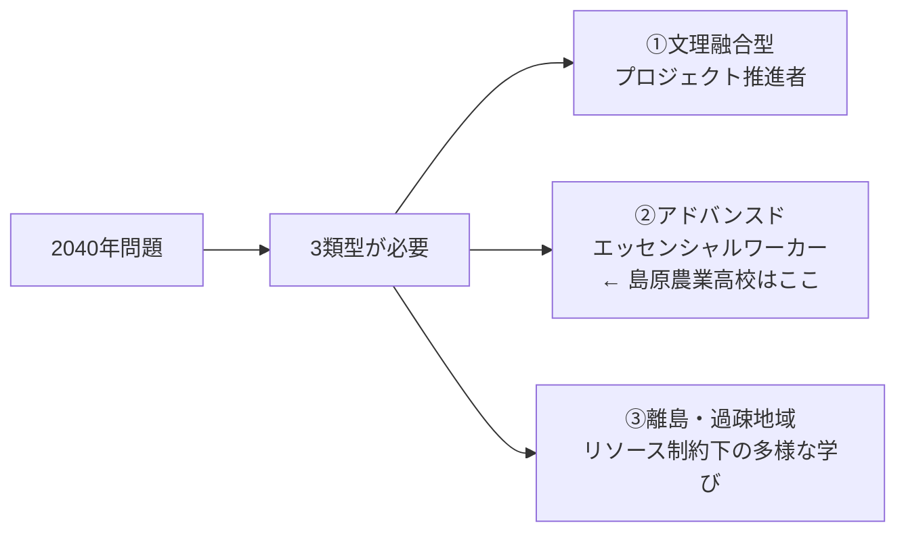
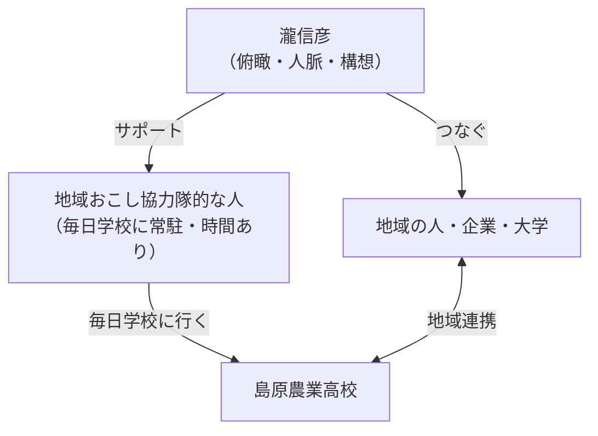
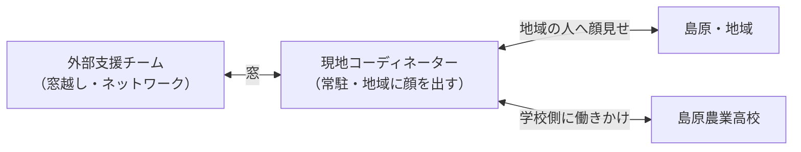
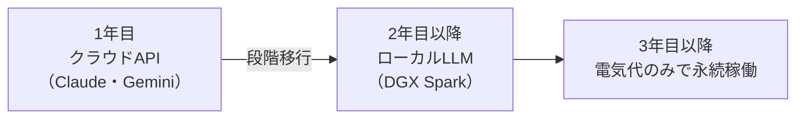

---
tags:
  - NEXTハイスクール
  - プラネタリーラーニング
  - 両利きの学校
  - 島原農業高校
  - KAEL
  - 議事録
created: 2026-04-09
updated: 2026-04-09
---

- [ ] 確認

# NEXTハイスクール チーム顔合わせMTG 議事録

**日時：** 2026年4月9日 20:03〜
**形式：** Zoom
**参加者：** 田原真人・北田朋也・野辺みなも（みなもラボ）・伊原淳子・瀧信彦（エンゲージメントパートナーズ）

---

## ミーティング目的

1. 瀧信彦さんとチーム合流 → 相互自己紹介
2. 提案書の内容すり合わせ・瀧さんの位置づけ確認
3. 提案書の最終確定・提出

---

## 自己紹介まとめ

### 野辺みなも（みなもラボ）

- 出身：島根県 隠岐島（沖ノ島）
- 社会人以来9年間、高校常駐の教育コーディネーター（探究学習・地域連携）
- 「窓」（MUSVI）との関わり：隠岐の4島をつなぐプロジェクトから参入 → 現在高校3台導入
- 出雲在住。窓越しに隠岐島高校のコーディネートを継続中（6月から拠点移動予定）
- 「窓があればどこでも仕事ができる」を自ら体現
- 今回島原に全ノウハウを注ぎ込む構想

### 北田朋也（KAEL）

- 京都市在住。元京都市立葵小学校（公立）教員 16年間
- 学習する組織に則った学校改革・探究学習プロジェクトリーダー
- 田原さんとはコロナ禍のZoom革命時代から連携（子どものオンライン探究的学びを協働）
- 2025年3月退職・独立。「AI時代に小学校の先生やってていいのか」と一念発起
- 現在：AI×教育コミュニティ（KAEL）主宰。全国教育関係者と研究継続中

### 伊原淳子

- 茨城県霞ヶ浦市在住。元東京通勤サラリーマン → 10年前に転身
- 田原さんのコミュニティとの出会いを機に地域活動へ
- 1年前：駅前空き店舗をリノベし**コミュニティカフェ**をオープン
  - シェアキッチン（曜日ごとに出店者が変わる）
  - 一箱本棚（35箱オーナー制）
- カフェに「窓」設置済み → 田原さんがイベント時に窓から登壇

### 瀧信彦（エンゲージメントパートナーズ代表）

- 青山学院大学卒。伊藤忠商事7年（ファッションブランドマーケティング）
- 30歳から外資金融23年（GEコンシューマーファイナンス・東京スター銀行・HSBC・日本IBM・メットライフ生命）
- 専門：データドリブン組織変革・顧客ロイヤルティ向上・エンゲージメント経営
- **メットライフ生命 長崎拠点（1300人）責任者**として2019年着任 → 長崎との出会い
- 長崎で「**ハピネスタスクフォース**」（エンプロイ・カスタマー・コミュニティの3軸）を立ち上げ
  - 44人手挙げ → 22人が地域貢献活動 → エンゲージメント激増をデータで実証
  - 大学12コマの授業・インターンプログラムも創出
- 2024年独立。パーパス：「**楽しんでいる人を増やす**」
  - 働く場：エンゲージメント経営・リーダー研修
  - 学びの場：小中高大・ビジネススクール・キャリア教育・AI活用問題解決
  - コミュニティ：**長崎キャンバス**（毎月最終木曜・50〜80人・学生25人）
- 日立DDK（半導体→ウェルビーイング転換）をAI×ウェアラブルで支援中
- **「アフター生成AI企業」として一人でAIフル活用で事業展開**

---

## ながさきユースタウン（今年スタート予定）

長崎キャンバスから生まれたプロジェクト。

| 項目 | 内容 |
|------|------|
| 対象 | 中高大学生中心 |
| フィールド | 長崎市街（企業・商店街・農業・漁業） |
| ゴール | 未来の長崎を描く体験・自己理解 → アウトプット |
| フェス | 2026年11月14・15日 |
| 会場 | 商店街・美術館・メットライフ内子育て支援施設（窓設置済み）等 |
| 行政連携 | 長崎県教育長・長崎市市長 巻き込み中 |

---

## 窓ネットワークの現状

---

## キーインサイト（田原さんの言語化）

> **「チームのラストピースがはまった」**

- 田原さん：「一人一人の声が立ち上がって参加型コミュニティが自然発生する × テクノロジー」
- 瀧さん：「エンゲージメントを上げる × データドリブン」
- → 言葉は違うが**原理は同じ**。ビジネスと教育を往復している動き方まで一致

---

## ファシリ視点：瀧さんがもたらす価値（提案書記載を超えた可能性）

| 提案書上の位置づけ | 実際に期待できる価値 |
|------|------|
| 島原・長崎常駐の現地コーディネーター | 長崎県教育長・長崎市市長へのパイプ = **政策連携窓口** |
| 探索の連携 | データドリブン組織変革の知見 → **H4（コンセンサス型意思決定）の実証パートナー** |
| 地域コーディネーション | ながさきユースタウンをNEXTハイスクール**成果発表・社会流通の場**にできる |
| — | AI×ウェルビーイング × ウェアラブル = **学びの効果検証への応用可能性** |

---

## 提案書の内容説明（田原さん）

### プラネタリーラーニングとは

| | グローバリズム | プラネタリー |
|--|--|--|
| 方向性 | 地球を均質・標準化・統一 | 多元的・多様な名前が共存 |
| 思想的背景 | 西洋中心主義 | 反グローバリズム・惑星思考 |
| 教育への応用 | 標準化教育（近代型） | 一人一人の違いが意味を持つ学習構造 |

> **「一人一人が違っているということが、ちゃんと意味が生まれるような学習構造」**

**構想の起源：** 窓をいろんな学校に入れたが「誰も窓を使っていない」問題 → 「窓を使わせる」ではなく上位の構想が必要 → プラネタリーラーニング構想へ（野辺みなも＋梅田さん＋田原さん → 北田さん・あっちゃんがジョイン）

---

### 島原農業高校の位置づけ

---

### AIチューター開発の具体像

- ベース：田原さんの**フィズ予備（物理）**AIチューターシステムを流用
- 実績：**慶應大学 線形代数AIチューター**（400人向け）→ プロンプト設計の知見あり
- モード：**ティーチャーモード**（解説）× **チューターモード**（質問を投げかける）
- 実業高校専門科目（農業等）のAIチューター → 全国の実業高校で汎用展開できる
- 開発は田原さんが起動 → **北田さん・野辺みなもさんに移行**していく方針

### AI探究パートナー開発

- 「双発AI（生成AI）を探究に使っている人がほんとに少ない」
- 瀧さんも同じ発想で双発AIを実践 → 開発に重要な知見
- 18歳未満使用制限問題（Claude Code・Gemini CLI等）→ 学校で使える形に作り変える必要あり
- 現地（島原）で子どもたちがどう使うかを見ながらデザイン思考的に開発

### 田原さんの設計思想

> **「現場で違うなと思ったら、爽やかにそっちに移動する」**
> 提案書は予算通過のための最大限の構想。現場の真実が優先。

---

## 探索・ZINE・地域連携の説明（田原さん）

### AI探究パートナーのイメージ

> **「調査したことがとにかく蓄積していって、絡み合ってもつれ合ってはねる」**

- Claude Code × Obsidian：データがフォルダに溜まり、Claude Codeから読んでネットワーク化・分析
- AIと仮説を立て → フィールドに出てデータ収集 → 検証するサイクル
- 田原さん自身が23個のプロジェクトをこの環境で並行運営中 → 子どもたちにも同じ環境を

### ZINE×地域連携のフロー

> 探究して終わり → じゃなく → ZINE作って地域に配って役立ててもらうまでがフロー

- 文学フリマ・雑誌文化が若者の間で流行中 → 長崎文学フリマ的な場へ
- 高校生が探究して作ったZINEを地域の人が買う・読む → 接点が生まれる

---

## 現地コーディネーターの役割（野辺みなも × 田原さん）

### 野辺みなもさんによる整理

コーディネーターの役割が多すぎる問題 → 最近は人数を増やし組織化

**コーディネーターの核心的役割：**
- 授業設計・生徒の外出調整の窓口（先生の細かな交渉時間を節約）
- 地域の「ちっちゃな面白いタネ」を拾って学校に届ける
- 学校で育ちそうなことを適切な粒度で地域に流す
- **「何回言えば何かになるか」「どの先生につなぐか」「どの文脈を拾うか」の判断**

### 田原さんによる瀧さんの役割設計

- 地域おこし協力隊の人は「時間はあるが人脈がない」
- 瀧さんは「人脈はあるが毎日常駐は難しい」
- → 補完関係として地域おこし協力隊的な人を瀧さんのサポートとして配置する案
- 人件費に余裕があるため現実的な選択肢として検討中

---

## 窓コーディネーターの構造（野辺みなも × 田原さん）

### 野辺みなもさんの整理

> **「窓文化を育てるのに、外部（窓越し）と現地（常駐）の両者が必要」**

- 外部だけでは地域の人にたどり着けない
- 窓だけでは「窓文化」が育まれない
- **瀧さん = ハブ**として俯瞰・人脈・ハンドリング → 実動は周りの人たちに分担

### 野辺みなもさん自身の経験（隠岐）

- 「学校側の窓カルチャーを育んでから、反対側（地域）に行って、育まれたカルチャーのところにつないだ」
- 両側をやった人だから成り立った → **島原でも同じ前提条件を作ることが必要**

---

## 導入プロセス詳細（P0〜P3）

### P0：窓活用研修

- 野辺みなもさんが現地に一回訪問
- 「あっちゃん（伊原さん）が焚き火にいて、つなぎながら窓文化を育てる第一歩」

### P1：AI反転授業研修

> **田原さんの「AI反転授業」**：AIアプリで意見収集 → AIで統合 → 全体像を見ながら授業

- 長崎県教育委員会（長尾さん・岸川さん）が参加した研修で「民主主義教育だ」と刺さった
- → 長崎への食い込みのきっかけになった実績あり
- **授業の構造と職員会議の構造を一致させる** → 「いろんな意見があることが大事」カルチャーを育てる
- 事例研究会で学校内に横展開

### P2・P3：カリキュラム共創・実践

- 外から押しつけず、先生たちと対話的にカリキュラムを作る
- AIチューター・AI探究パートナーを「先生・生徒と一緒に開発していく」ノリで進める
- ツール開発とカリキュラム開発を並走させる

---

### AI PROOF コンピテンシー「意味の自己生成」の核心

> **「自分を生成する。コミュニティを生成する。生成がキーワード」**

- 生成AIが「確率的にテキストを生成する」のに対し、人間は「意味を自己生成する」
- コミュニティのエンゲージメントが高まる現象と深く親和性がある（田原さん × 瀧さんの共通点）

---

## ローカルLLM戦略（田原さん）

### API費用問題と永続化の解決策

> **「予算があるうちに設備を買って、終わった後もちゃんと動く」**

- 生徒数百人 × APIコストで2年間数千万 → 予算終了後に止まるリスク大
- 解決策：**DGX Spark（ローカルLLMサーバー）を段階導入**
- 実装：有限会社スクラッチ（山本創さん）が2年前からローカルLLM実験中 → 現実的に構築できる唯一に近い存在
- 島根県（広田さん）からも「展開したい、予算どのくらいか見せてほしい」と引き合いあり

### 教師と生徒のAI環境の違い

| | 1年目 | 2年目〜 |
|--|--|--|
| 教師 | Claude Code × Obsidian（フル運用） | ローカルLLM移行 |
| 生徒 | APIベースのAI探究パートナー | ローカルLLM移行 |

---

## チームメンバー詳細（田原さんによる紹介）

### 竹本記子（NPO法人日本ファシリテーション協会 元会長）

- 大阪在住・長崎二拠点生活希望 → 長崎の仕事として参加
- 「繊細な多様性をちゃんと扱えるすごい力のファシリテーター」
- 学校の先生たちを扱う場（P1・P2）に入ってもらう

### 梅田雄基（Biden）

- 「一人一人の自分の人生を見つけていく」を伴奏する塾を運営
- 自分史を書きながら掘り下げ → 本当にやりたいことが見つかると突破力が生まれる
- 現在「梅田メソッド」の本を執筆中
- **Obsidian × AI × 梅田メソッドの掛け合わせ = 新しいキャリア教育プログラムの可能性**

### 山本創（有限会社スクラッチ）

- エンジニア20人を抱える会社の代表
- 2年前からローカルLLMの実験を継続中
- ローカルLLMサーバー構築を「現実的にできる人がほとんどいない」中で実績あり

---

## 予算の考え方（田原さん）

- コーディネーター費：**文科省基準 月額40万円**で統一
- 研修稼働：**時給2万円**（P0・P1等）
- API費用・コンテンツ開発費・システム開発費はすべて稼働した人に支払えるよう計上
- ローカルLLMサーバー代はフルフルで計上（後で足りなくなることを防ぐ）
- → 合計：**2億円の壁を越えた**

---

## 関連ドキュメント

- [[20260409_NEXTハイスクール統合提案書]]

---

*文字起こし：`C:\Users\vomoy\OneDrive\ドキュメント\Zoom\2026-04-09 20.06.03 ミーティング用\meeting_saved_closed_caption.txt`*
*AIナレッジファシリテーター：北田朋也（KAEL）× Claude Code*
