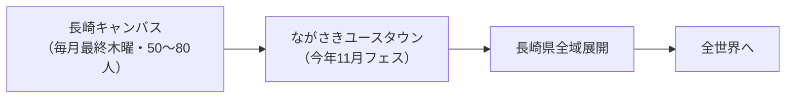
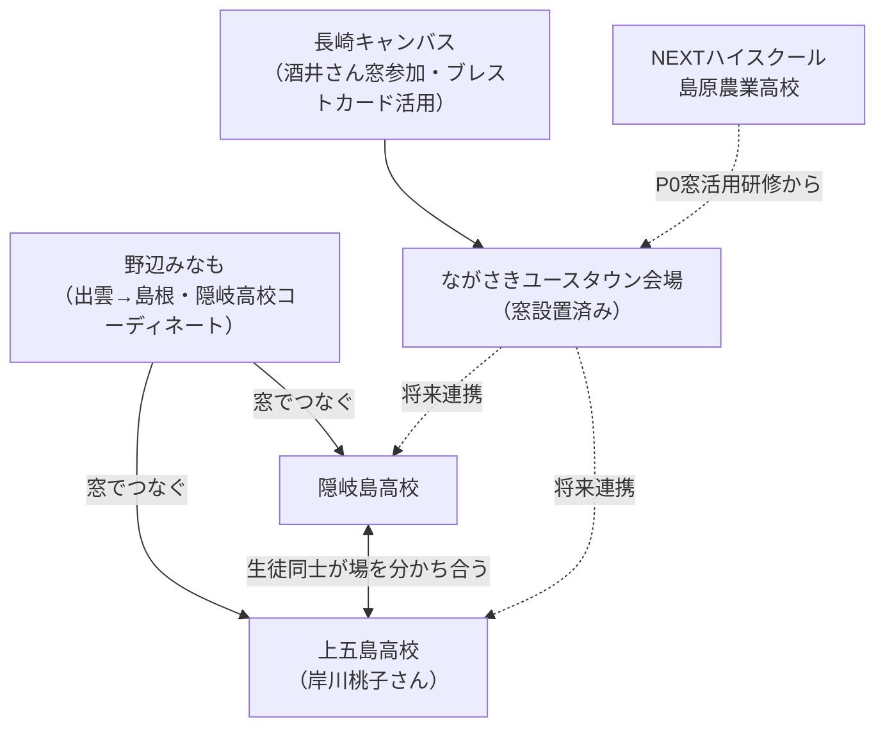

---
tags:
  - NEXTハイスクール
  - プラネタリーラーニング
  - 両利きの学校
  - 島原農業高校
  - KAEL
  - 議事録
created: 2026-04-09
updated: 2026-04-09
---

- [ ] 確認

# NEXTハイスクール チーム顔合わせMTG 議事録

**日時：** 2026年4月9日 20:03〜
**形式：** Zoom
**参加者：** 田原真人・北田朋也・野辺みなも（みなもラボ）・伊原淳子・瀧信彦（エンゲージメントパートナーズ）

---

## ミーティング目的

1. 瀧信彦さんとチーム合流 → 相互自己紹介
2. 提案書の内容すり合わせ・瀧さんの位置づけ確認
3. 提案書の最終確定・提出

---

## 自己紹介まとめ

### 野辺みなも（みなもラボ）

- 出身：島根県 隠岐島（沖ノ島）
- 社会人以来9年間、高校常駐の教育コーディネーター（探究学習・地域連携）
- 「窓」（MUSVI）との関わり：隠岐の4島をつなぐプロジェクトから参入 → 現在高校3台導入
- 出雲在住。窓越しに隠岐島高校のコーディネートを継続中（6月から拠点移動予定）
- 「窓があればどこでも仕事ができる」を自ら体現
- 今回島原に全ノウハウを注ぎ込む構想

### 北田朋也（KAEL）

- 京都市在住。元京都市立葵小学校（公立）教員 16年間
- 学習する組織に則った学校改革・探究学習プロジェクトリーダー
- 田原さんとはコロナ禍のZoom革命時代から連携（子どものオンライン探究的学びを協働）
- 2025年3月退職・独立。「AI時代に小学校の先生やってていいのか」と一念発起
- 現在：AI×教育コミュニティ（KAEL）主宰。全国教育関係者と研究継続中

### 伊原淳子

- 茨城県霞ヶ浦市在住。元東京通勤サラリーマン → 10年前に転身
- 田原さんのコミュニティとの出会いを機に地域活動へ
- 1年前：駅前空き店舗をリノベし**コミュニティカフェ**をオープン
  - シェアキッチン（曜日ごとに出店者が変わる）
  - 一箱本棚（35箱オーナー制）
- カフェに「窓」設置済み → 田原さんがイベント時に窓から登壇

### 瀧信彦（エンゲージメントパートナーズ代表）

- 青山学院大学卒。伊藤忠商事7年（ファッションブランドマーケティング）
- 30歳から外資金融23年（GEコンシューマーファイナンス・東京スター銀行・HSBC・日本IBM・メットライフ生命）
- 専門：データドリブン組織変革・顧客ロイヤルティ向上・エンゲージメント経営
- **メットライフ生命 長崎拠点（1300人）責任者**として2019年着任 → 長崎との出会い
- 長崎で「**ハピネスタスクフォース**」（エンプロイ・カスタマー・コミュニティの3軸）を立ち上げ
  - 44人手挙げ → 22人が地域貢献活動 → エンゲージメント激増をデータで実証
  - 大学12コマの授業・インターンプログラムも創出
- 2024年独立。パーパス：「**楽しんでいる人を増やす**」
  - 働く場：エンゲージメント経営・リーダー研修
  - 学びの場：小中高大・ビジネススクール・キャリア教育・AI活用問題解決
  - コミュニティ：**長崎キャンバス**（毎月最終木曜・50〜80人・学生25人）
- 日立DDK（半導体→ウェルビーイング転換）をAI×ウェアラブルで支援中
- **「アフター生成AI企業」として一人でAIフル活用で事業展開**

---

## ながさきユースタウン（今年スタート予定）

長崎キャンバスから生まれたプロジェクト。

| 項目 | 内容 |
|------|------|
| 対象 | 中高大学生中心 |
| フィールド | 長崎市街（企業・商店街・農業・漁業） |
| ゴール | 未来の長崎を描く体験・自己理解 → アウトプット |
| フェス | 2026年11月14・15日 |
| 会場 | 商店街・美術館・メットライフ内子育て支援施設（窓設置済み）等 |
| 行政連携 | 長崎県教育長・長崎市市長 巻き込み中 |

---

## 窓ネットワークの現状

---

## キーインサイト（田原さんの言語化）

> **「チームのラストピースがはまった」**

- 田原さん：「一人一人の声が立ち上がって参加型コミュニティが自然発生する × テクノロジー」
- 瀧さん：「エンゲージメントを上げる × データドリブン」
- → 言葉は違うが**原理は同じ**。ビジネスと教育を往復している動き方まで一致

---

## ファシリ視点：瀧さんがもたらす価値（提案書記載を超えた可能性）

| 提案書上の位置づけ | 実際に期待できる価値 |
|------|------|
| 島原・長崎常駐の現地コーディネーター | 長崎県教育長・長崎市市長へのパイプ = **政策連携窓口** |
| 探索の連携 | データドリブン組織変革の知見 → **H4（コンセンサス型意思決定）の実証パートナー** |
| 地域コーディネーション | ながさきユースタウンをNEXTハイスクール**成果発表・社会流通の場**にできる |
| — | AI×ウェルビーイング × ウェアラブル = **学びの効果検証への応用可能性** |

---

## 関連ドキュメント

- [[20260409_NEXTハイスクール統合提案書]]
- [[project_nalba]]

---

*文字起こし：`C:\Users\vomoy\OneDrive\ドキュメント\Zoom\2026-04-09 20.06.03 ミーティング用\meeting_saved_closed_caption.txt`*
*AIナレッジファシリテーター：北田朋也（KAEL）× Claude Code*
