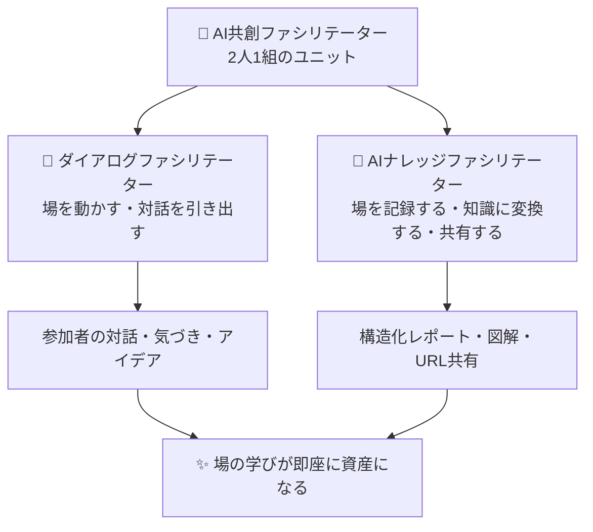
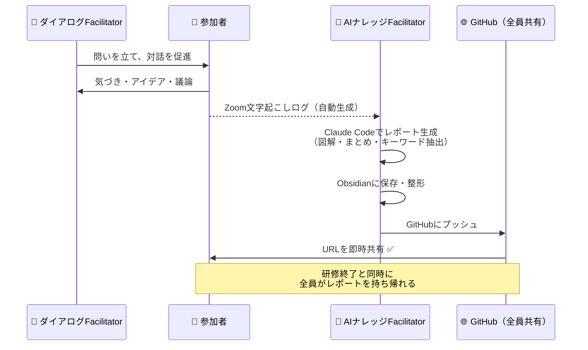
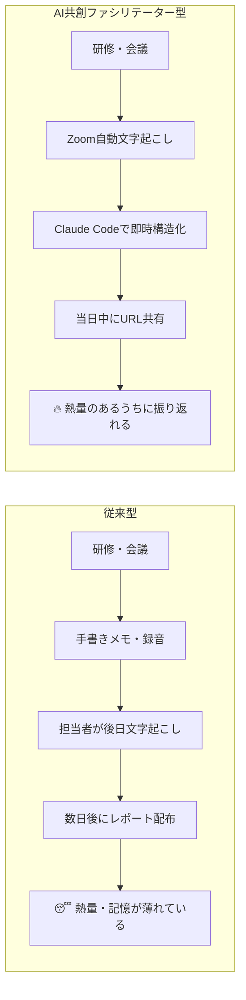
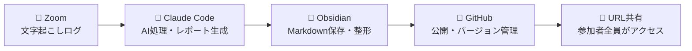
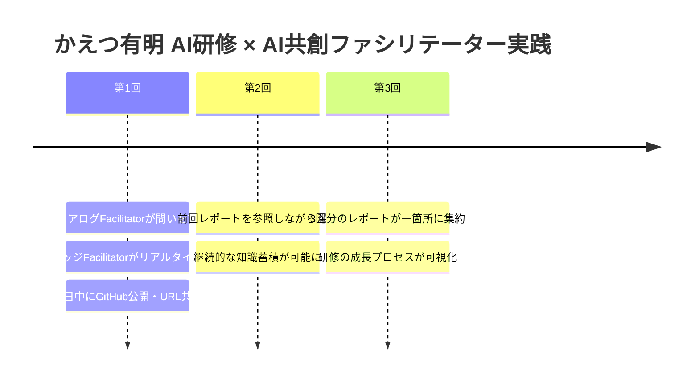
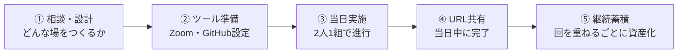

# AI共創ファシリテーター ── 会議・研修・ワークショップの新しいサポート形態

> **対象読者：** 教育機関の研修担当 / 企業の人材開発・組織改革担当 / AX（AI Transformation）推進担当

---

## 🔑 エグゼクティブサマリー

従来の研修・会議では、**「場の対話」と「知識の記録・共有」は別々の作業**として扱われてきた。
対話は盛り上がっても、レポートが出来上がるのは数日後。その頃には熱量も記憶も薄れている。

**AI共創ファシリテーター**は、この問題を根本から解決する。
AIツールを活用し、「対話」と「知識化・共有」をリアルタイムで同時に行う**2人1組の新しいファシリテーション形態**だ。

---

## 📐 AI共創ファシリテーターとは

### 役割の定義

| 役割 | 担う機能 | 主なツール |
|------|---------|-----------|
| **ダイアログファシリテーター** | 場の空気を読む・問いを立てる・対話を深める・参加者の思考を引き出す | ホワイトボード・付箋・問いかけ |
| **AIナレッジファシリテーター** | 発言をリアルタイムで記録・AI処理・構造化・即時公開 | Zoom文字起こし・Claude Code・Obsidian・GitHub |

---

## 🔄 研修・ワークショップの進行フロー

---

## 📊 従来型 vs AI共創ファシリテーター型

| 比較軸 | 従来型 | AI共創型 |
|--------|-------|---------|
| レポート完成まで | 数日〜1週間 | **当日中** |
| 共有方法 | メール添付・印刷 | **GitHub URL 1本** |
| 図解・可視化 | 担当者のスキル依存 | **AIが自動生成** |
| 知識の蓄積 | ローカル保存・散逸 | **GitHubで永続公開** |
| 参加者の体験 | 「後で読んでください」 | **その場で一緒に確認** |

---

## 🏗️ 技術スタック（ツール構成）

| ツール | 役割 | 費用感 |
|--------|------|--------|
| **Zoom** | 文字起こしログの自動生成 | Proプランで利用可 |
| **Claude Code** | AIによるレポート構造化・図解生成 | 月$20〜 |
| **Obsidian** | ローカルでのMarkdown編集・管理 | 無料 |
| **GitHub** | 全員共有・永続公開 | 無料（パブリックリポジトリ） |

---

## 🎯 このアプローチが刺さる組織・シーン

### 教育機関
- 校内研修・授業研究会の記録
- 探究学習・PBLの成果記録
- 保護者向け活動報告の即時公開

### 企業の研修・組織開発
- チームビルディングWSの気づきをリアルタイム資産化
- リーダーシップ研修の振り返りレポート
- 新人研修・OJTの学びの見える化

### AX（AI Transformation）推進
- AI活用の実践事例として社内展開できる
- 「AIを使う文化」を研修の場から醸成できる
- ナレッジマネジメントシステムの入口になる

---

## 💡 実践事例：かえつ有明 AI研修（2026年）

- **主催：** かえつ有明（東京）
- **AIナレッジFacilitator：** 北田朋也（KAEL）
- **使用ツール：** Zoom文字起こし × Claude Code × Obsidian × GitHub
- **成果：** 研修終了と同時にURLを共有、参加者が即日振り返り可能

---

## 🚀 導入ステップ

---

## 📬 お問い合わせ・依頼

**KAEL（Kyoto AI × Edu Lab）**
北田朋也

> 学校・企業・コミュニティの研修・ワークショップに「AI共創ファシリテーター」として参加します。
> 「研修の記録がいつも後手になる」「学びが組織に残らない」という課題をお持ちの方はぜひご相談ください。

---

*作成：KAEL 北田朋也 / 2026-03-26*
*Claude Code × Obsidian × GitHub ワークフローで作成*
