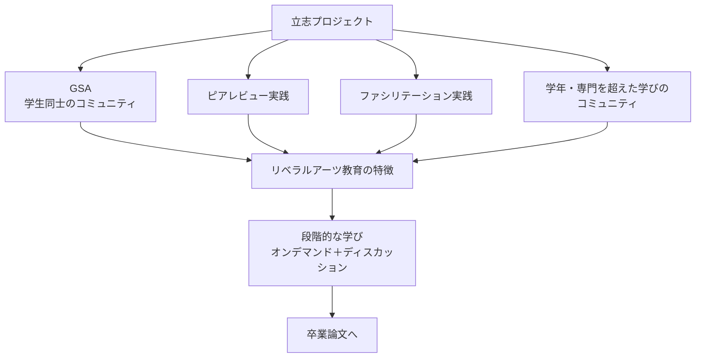
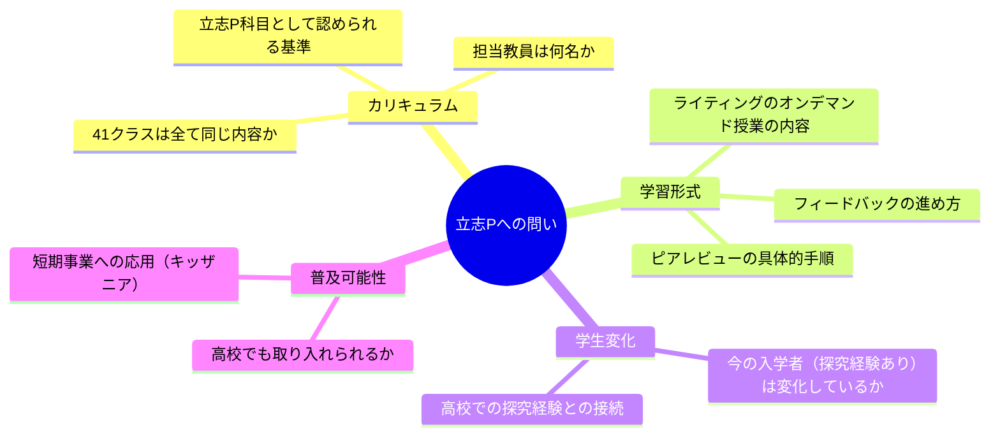

---
tags:
  - プラネタリーラーニング
  - リベラルアーツ教育
  - 立志プロジェクト
  - 大学教育
  - 探究学習
  - AI-Knowledge-Facilitator
created: 2026-04-24
updated: 2026-04-24
---

- [ ] 確認

# 立志プロジェクト × リベラルアーツ教育 勉強会レポート

**日時：** 2026年4月24日 16:33〜16:56
**形式：** Zoom ウェビナー（チャット）
**発表者：** 佐野真知子（NPO法人青春基地）
**ファシリテーター：** 長岡昂（Takashi Nagaoka）
**AI Knowledge Facilitator：** 北田朋也（KAEL）

---

## 全体の流れ

| 時刻 | 内容 |
|------|------|
| 16:33〜 | 佐野真知子さんによる「立志プロジェクト」紹介 |
| 16:35〜 | 参加者チャットによる質問・感想タイム |
| 16:37〜 | 各校・各大学からの反応 |
| 16:54〜16:56 | 渡邉大輔さんの問い → 長岡さんのコメント |

---

## 発表内容：立志プロジェクト（佐野真知子）

### プログラムの特徴

### 主要コンセプト

| 要素 | 内容 |
|------|------|
| **GSA** | 学生同士のコミュニティ（横断的な学びの場） |
| **ピアレビュー実践** | 後輩育成にかかわる先輩学生が評価者・レビュアーとして参加 |
| **ファシリテーション実践** | 受講した学生が次世代のファシリテーターとして育成に関与 |
| **授業形式** | オンデマンド講義 ＋ ディスカッション形式（単位認定あり） |
| **カリキュラム** | 段階的な学びの積み上げ → 卒業論文へ接続 |

### 参加者の感想（チャット抜粋）

**村上 正行（大阪大学）**
> 非常に体系立てたカリキュラムを運営されていて、すばらしいなと思います。

**笹木 優希（株式会社BYD）**
> ファシリテーション実践・ピアレビュー実践を受講した学生が、ファシリ＆レビュアーとして後輩育成の立場に入り、学びが繋がっていくシステム、とても面白いと感じました！

**奥田隆史（愛知県立大学）**
> AIの時代、理系学生にとってリベラルアーツ、特に人文は本当に大事だと思います。素晴らしい取組です！

**コウロ（東北大学知の創出センター）**
> 理系や工学系の方が注目とファンディングを集める今、リベラルアーツの存在意味について新たに考えさせられました。

---

## 参加者からの主な問い

### 問い一覧

| 質問者 | 所属 | 問いの内容 |
|--------|------|------------|
| 大沼美里 | 宮城県気仙沼高校 | 探究経験のある入学者の変化は見られるか？ |
| 田口一博 | 新潟県立大学 | 理系大学のリベラルアーツにはどんな学が入るか？ |
| 郡谷 | 北海道科学大学 | 41クラスは全て同じ内容か、担当教員は何名か |
| 棚橋沙由理 | 筑波大学 | 立志Pの科目として認定される基準は？ |
| 清水郁子 | 東京農工大学 | ディスカッション形式の担当教員数は？ |
| 飯島隆広 | 山形大学 | ライティングオンデマンドの内容とフィードバック形式は？ |
| 新川慶光 | 兵庫県立阪神昆陽 | ファシリテーター実践は学生が教える側になる授業か、単位取得できるか |
| 渡邉大輔 | 北海道札幌西高等学校 | 導入の背景・成果と今後の課題は何か |
| 北田朋也 | KAEL | ピアレビューの具体的な進め方（異なる立場が混在する中での方法） |
| 甲斐照章 | キッザニア福岡 | 短期高校生事業への応用のヒントを探っている |
| 五十畑将義 | 栃木県立真岡高校 | 学生同士の学び合いを高校でも取り入れたい |

---

## 深まった問い：高校教育との接続

**渡邉大輔（北海道札幌西高等学校）16:54**

> 子供の頃は「なんで？」「どうして？」に満ちあふれていたのに、大学に入る頃には問いを立てることが苦手になってしまう。高校では総合的な探究や歴史総合でも自ら問いを立てて探究させることをしている。新カリキュラムで学んだ生徒が大学に入学するようになって2年が経ちましたが、入学してくる学生たちに変化は見られますか？

---

## 北田朋也の考察

### 「えんたくん」への注目（勝山鉄矢：京都・丹後緑風高校）

勝山先生の「えんたくん が気になる」というコメントは象徴的。**物理的な対話ツール**が対話の質を変えることへの直感的な関心。プラネタリーラーニングの場でも問い直したいテーマ。

### 学びのループ設計

ピアレビュー実践・ファシリテーション実践が「受講した学生が次世代の担い手になる」構造は、**KAELが目指す学びのエコシステム**と完全に共鳴する。問いを問い続ける人材を育てる場が、大学内に制度として存在していることの価値は大きい。

### 渡邉先生の問いが核心

「問いを立てることが苦手になる」プロセスはどこで起きているのか。高校でのカリキュラム改革が実際に大学入学者の変化を生んでいるかどうか——この問いへの答えが、高大接続の「現在地」を示す。

---

## アクションアイテム

- [ ] 立志プロジェクトの詳細資料・佐野さんへの質問を整理する
- [ ] ピアレビューの仕組みをKAELのコミュニティ設計に応用検討
- [ ] 渡邉先生・大沼先生の問いをKAELの研究テーマとして記録する
- [ ] 「えんたくん」活用事例を調べてプラネタリーラーニングでの活用を検討

---

## 参加者一覧

| 氏名 | 所属 |
|------|------|
| 佐野真知子 | NPO法人青春基地 |
| 嶋本美智代 | 富山県立高岡南高校 |
| 大沼美里 | 宮城県気仙沼高校 |
| 田口一博 | 新潟県立大学 |
| 郡谷 | 北海道科学大学 |
| 勝山鉄矢 | 京都・丹後緑風高校 |
| 村上 正行 | 大阪大学 |
| 笹木 優希 | 株式会社BYD |
| 棚橋沙由理 | 筑波大学 |
| 斉藤栄子 | 東京都小金井北高校 |
| 五十畑将義 | 栃木県立真岡高校 |
| 清水郁子 | 東京農工大学 |
| 石黒千晶 | 東京大学大学院教育学研究科附属学校教育高度化・効果検証センター |
| コウロ | 東北大学知の創出センター |
| 北田朋也 | KAEL |
| 奥田隆史 | 愛知県立大学 |
| 甲斐照章 | キッザニア福岡 |
| 新川慶光 | 兵庫県立阪神昆陽 |
| 渡邉大輔 | 北海道札幌西高等学校 |
| 飯島隆広 | 山形大学 |
| 鷹羽里奈 | 株式会社BYD |
| 長岡昂 | （ファシリテーター） |
