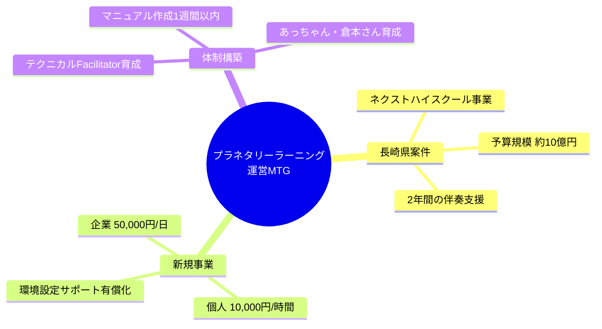
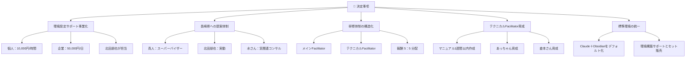
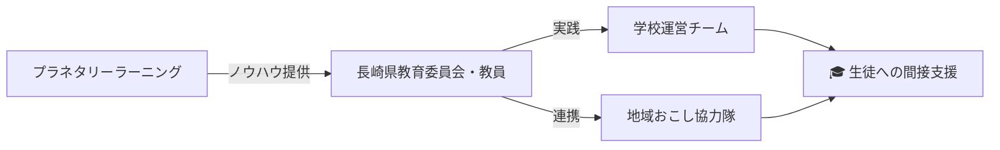
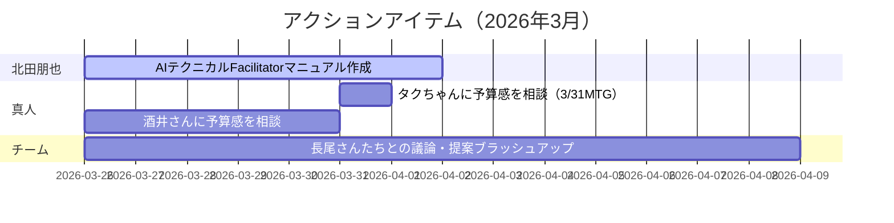
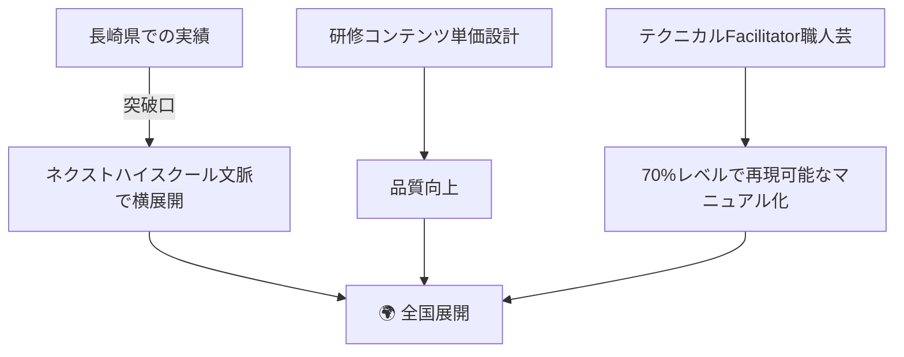

# 🌍 プラネタリーラーニング 運営MTG レポート

**日時：** 2026年3月26日 09:17（JST）
**形式：** オンライン（Zoom）

---

## 🗺️ 全体サマリー



---

## ✅ 主な成果

| 項目 | 内容 |
|------|------|
| 🏫 長崎県教育委員会 | ネクストハイスクール事業への参画依頼あり |
| 💰 予算見込み | 2年間の予算確保が見込まれる状況 |
| 🆕 新規事業 | Claude＋Obsidian環境設定サポートの有償化決定 |
| 👤 担当者 | 北田朋也が実動担当として正式に位置付け |

---

## 📋 決定事項



---

## 🏫 長崎県案件 詳細

### 現状

```
📊 長崎県教育委員会 状況
─────────────────────────────
👥 研修実績  : 教育委員会 7名 × 1.5時間
⭐ 評価      : 高評価獲得
📧 特記事項  : 重鎮的な教育委員より個別に感謝のメール依頼あり
💴 予算規模  : 約 10億円
🏫 配分予定  : 300万円 × 3校
```

### 提案メニュー

| 形態 | 内容 | 担当 |
|------|------|------|
| ⏱️ 時間単価型 | スポット研修・コンテンツ提供（梅ちゃんの総合型選抜AI等） | チーム |
| 📅 月額型 | 500,000円/月 × 2年間の伴奏支援 | チーム |
| 🤖 AI軸 | 教員向けAI研修と実践支援 | 北田朋也 |
| 🪟 窓軸 | 紙ごと高校等への窓導入コンサル | 水さん |

### 期待される役割



---

## 👤 北田朋也 担当業務

### 1. 環境設定サポート（新規事業）

```
🖥️ 環境設定サポート サービス概要
──────────────────────────────────
📋 形式    : リモート・ハンズオン（画面共有）
⏱️ 所要時間 : 約1時間
🛠️ 対象    : Claude / Obsidian / Bolt
           └ セットアップ＋パス設定
💰 料金    : 個人 10,000円/時間
           : 企業 50,000円/日
```

### 2. 長崎県案件

- 🤖 AI関連の実動担当として教員研修を実施
- 🎤 メインFacilitator または テクニカルFacilitatorとして参加
- 📚 今越で実施している手法のメソッド化・定番化を推進

---

## ⚠️ 保留事項

| 項目 | 予定 |
|------|------|
| 💴 予算の組み方・相場感 | 3月31日：ひろ＆タクちゃんとのMTGで相談 |
| 📝 契約形態（個人委託 or 組織委託） | 未定 |
| ✅ 長崎県教育委員会の正式予算承認 | 4月上旬まで |

---

## 🚀 アクションアイテム



---

## 🔭 今後の展開



---

*作成日：2026-03-26 ／ プラネタリーラーニング 運営MTGメモより*
