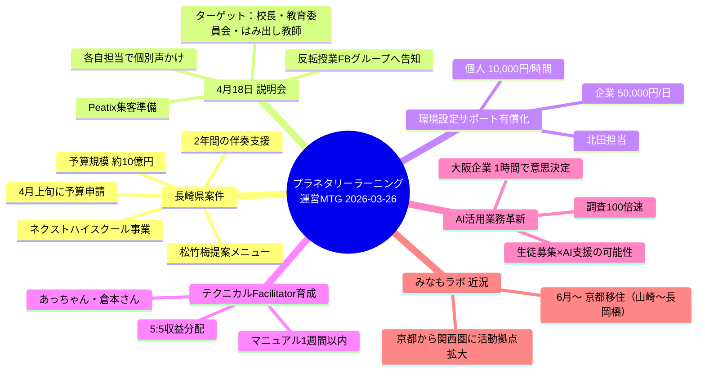
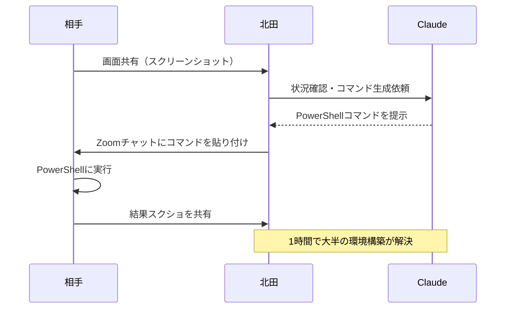
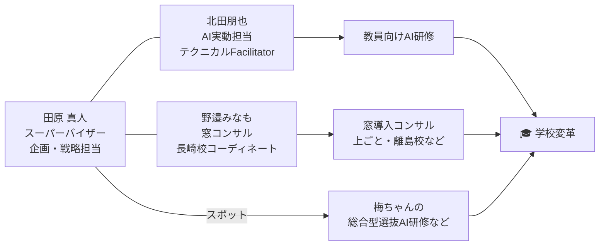
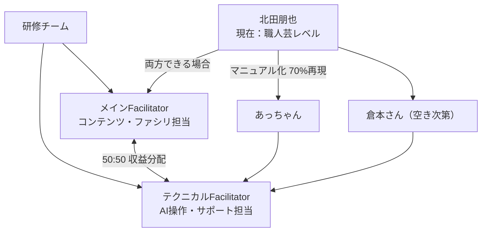
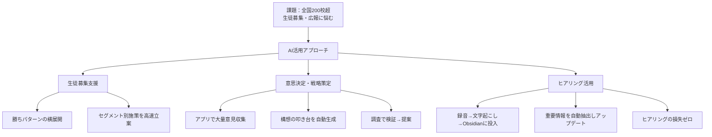
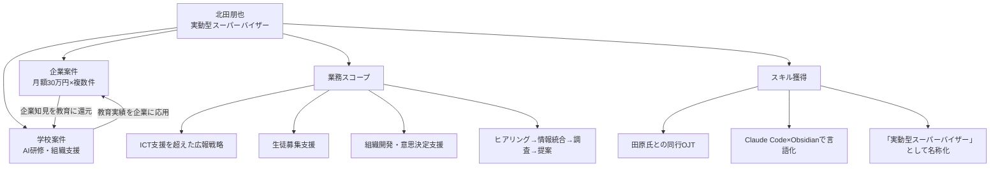
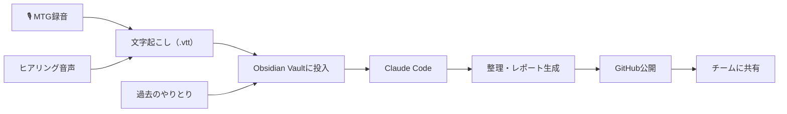
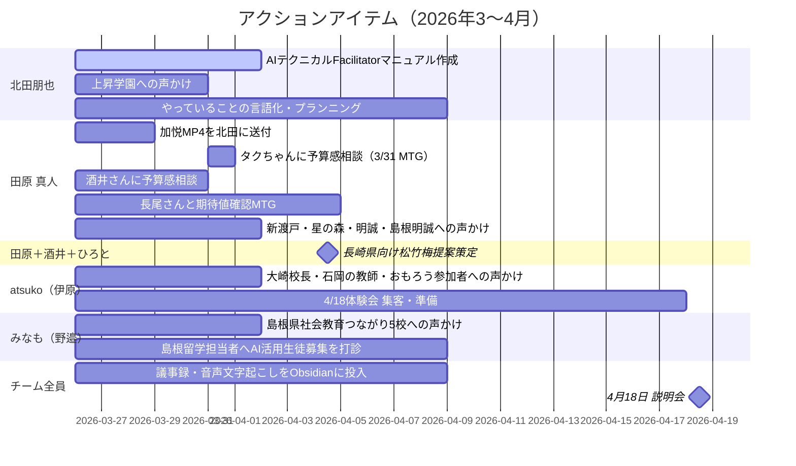
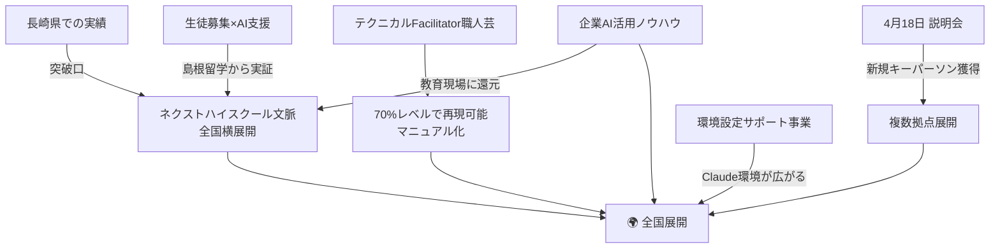

---
tags:
  - プロジェクト
  - AI×教育
  - 長崎県
  - プラネタリーラーニング
created: 2026-03-26
updated: 2026-03-26
---

- [ ] 確認

# 🌍 プラネタリーラーニング 運営MTG レポート

**日時：** 2026年3月26日 09:17〜09:50（JST）
**形式：** オンライン（Zoom）
**参加者：** 真人 田原 / 北田朋也 / atsuko ihara / 野邉｜みなもラボ

---

## 🗺️ 全体サマリー



---

## ✅ 主な成果・決定事項

| 項目 | 内容 |
|------|------|
| 🏫 長崎県教育委員会 | ネクストハイスクール事業への参画依頼。予算案を4月上旬に提出 |
| 💴 予算見込み | 約10億円規模。DXハイスクール予算（20〜30万円）も活用可 |
| 🆕 環境設定サポート | Claude＋Obsidian環境設定の有償化決定。北田が担当 |
| 🎯 4月18日 | 校長・教育委員会・はみ出し教師向け説明会。各自担当振り分け完了 |
| 🧑‍🏫 研修体制 | メイン＋テクニカルFacilitatorの2人体制を構築。収益5:5 |
| 👤 北田新役割 | 「実動型スーパーバイザー」として位置付け確立 |

---

## 📋 議題① 環境設定サポートの有償化

### サービス概要

```
🖥️ Claude Code × Obsidian 環境設定サポート
──────────────────────────────────────────
📋 形式    : リモート・ハンズオン（画面共有）
⏱️ 所要時間 : 約1時間
🛠️ 内容    : Obsidianインストール → Claude Codeインストール
           → Vaultフォルダへ移動 → PowerShellでパス設定まで
💰 料金    : 個人 10,000円 / 時間
           : 企業 50,000円 / 日
👤 担当    : 北田朋也（田原チームからリファレンス）
```

### 背景・仕組み



> 「田原環境で設定できなくて困っている人が結構いる。10,000円で北田さんがサポートしますって言えば全部回す。」—田原

---

## 📋 議題② 長崎県教育委員会 案件

### 現状

```
📊 長崎県 ネクストハイスクール 状況
─────────────────────────────────────────
👥 研修実績  : 教育委員会 7名 × 1.5時間
⭐ 評価      : 重鎮メンバーから個別に感謝メール依頼あり
💴 予算規模  : 約 10億円（県全体）
🏫 配分予定  : 300万円 × 3校
📅 申請期限  : 4月上旬（松竹梅メニューを提出）
🎯 既存拠点  : 佐世保南 / 出島むすびの父 / 紙ごと高校 / 後藤孝行さん校（離島）
📡 コンタクト : 酒井さん → 長尾さん（教育委員会）経由
```

### 体制案



### 提案メニュー（松竹梅）

| 形態 | 内容 | 予算感 |
|------|------|--------|
| 🥉 梅：時間単価型 | スポット研修・コンテンツ提供 | 時間単価 |
| 🥈 竹：月額型 | 500,000円/月 × 2年間 伴奏支援 | 年600万円 |
| 🥇 松：フルコミット | AI軸＋窓軸 包括支援＋月額型 | 要交渉 |

> 「向こうの期待感と、こっちの提案の中間ぐらいで松竹梅を作って折り合う」—田原

### 確認・ネクストステップ

| 日程 | 予定 | 担当 |
|------|------|------|
| 3月31日 | ひろとさん・タクちゃんとMTG → 予算感・相場を確認 | 田原 |
| 調整中 | 酒井さんに相談 → 予算感ヒアリング | 田原 |
| 調整中 | 長尾さんと再度MTG → 期待値の確認 | 田原 |
| 4月上旬 | 松竹梅メニューを長崎側に提出 | 田原 |

---

## 📋 議題③ 4月18日 説明会

### イベント概要

```
🎪 プラネタリーラーニング 説明会
──────────────────────────────────────
📅 日付    : 2026年 4月18日
🎯 目的    : 「第二の下越値」を探す、研修依頼につながるキーパーソンとの出会い
👥 ターゲット : 校長 / 教育委員会 / はみ出し教師
📣 集客    : Peatix ＋ 反転授業Facebookグループ ＋ 個別声かけ
🔗 Peatix  : https://peatix.com/event/4940259/dashboard
```

> 「授業と職員会議が変わる」がキーメッセージ。
> キーパーソンと繋がるきっかけへ。→ かえつ的研修へ繋がるといい

### 個別声かけ 担当振り分け

| 学校・人物 | 担当 | 備考 |
|-----------|------|------|
| 新渡戸文化 | 田原 | 渡辺さんとやりとりあり |
| 星の森 | 田原 | 反応悪め、でも頑張る |
| 島根明誠 | 田原 | — |
| シマノ名声（島根） | 田原 | MTG内で追加 |
| 大崎校長 | 伊原（あっちゃん） | 稲垣さん経由 |
| 安富（学校） | 伊原（あっちゃん） | — |
| オモローの先生たち | 伊原（あっちゃん） | — |
| 石岡の小学校（なすとみさん） | 伊原（あっちゃん） | NVC×授業改革を頑張っている |
| 上昇学園 | 北田朋也 | 田代さんの次の校長 |
| 島根県つながり | みなも | 社会教育費つながり5校ほど |

> 「数は要らなくていい。来てほしいのはキーパーソン。反転授業Facebookグループにも告知する」—田原

---

## 📋 議題④ テクニカルFacilitator 育成

### 研修体制の設計



### 育成ロードマップ

```
📅 テクニカルFacilitatorロードマップ
──────────────────────────────────────────────────
Week 1   : 北田が「今ハイツでやっていること」をマニュアル化（1週間以内）
         → Claude Code × Obsidian環境での実践内容を整理

Week 2-3 : あっちゃんへのOJT・手順共有
         → 環境の標準化（Claude+ObsidianをDeafaultに）

Month 2+ : あっちゃんがテクニカルFacilitatorとして独立稼働
         → 倉本さんを3人目として育成開始
```

> 「今北田さんしかできない職人芸みたいな領域が結構あって。それを70%ぐらいのレベルに落として誰でもできるマニュアルをあっちゃんに渡す」—田原

---

## 🤖 AI活用業務革新（大阪企業 実証事例）

### 意思決定支援の事例

```
💡 大阪企業 AI活用事例
────────────────────────────────────────────
🏢 状況   : 混沌として何を決めたらいいか分からない会社
🔍 課題   : 自社開発 4,000万円 vs 既存SaaS乗り換え 1,000万円
⏱️ 解決   : 1時間でクラウドコードが調査→比較→意思決定を支援
✅ 結果   : 1,000万円で乗り換え → 差額3,000万円を別施策へ
🚀 次     : 攻めのクリエイティブ戦略（来週MTG）

※ キーワードが分からなくても全文脈をもとに適切なキーワード群を自動生成し
  エージェントが並行して一斉調査 → 通常のGoogle検索の100倍以上のパワー
```

### 学校支援への応用



| AI機能 | 内容 | 効果 |
|--------|------|------|
| 🔍 調査エージェント | 適切なキーワード群を自動生成し並行調査 | 100倍の調査速度 |
| 📝 質問項目生成 | 業者への詳細確認リストを自動作成 | 見積もり精度向上 |
| 📣 広報エージェント | プロマネ含めて施策を自動立案 | 無料で専門家レベル |
| 🎙️ 文字起こし活用 | 録音→Obsidian→構想更新 | ヒアリング損失ゼロ |
| 🧠 意思決定支援 | コンセンサス型でメンバーの願いを統合 | 意思決定速度10倍 |

> 「この環境を使いこなして教育文脈がわかる人が1人入るだけで10人分働く。それをマルチで学校に派遣していくイメージ」—田原

---

## 👤 北田朋也 新ポジション構想「実動型スーパーバイザー」



> 「北田さん、今の仕事を言語化してClaudeCodeとObsidianでどう価値を説明して、いくらで提供するかを整理すると仕事になる」—田原

---

## 🗺️ みなもさん（野邉｜みなもラボ）の動き

### 生徒募集×AI支援への展開

```
🏫 島根留学 リブランディング構想
──────────────────────────────────────
📍 概要    : 島根県が「島根留学」ブランドで全国留学をとりまとめ
🔄 課題    : 全国的な流れの中でリブランディングの方針が未決定
🤝 アクション : 県の島根留学担当者に連絡・AI活用生徒募集を提案
🎯 対象校  : 大阪 or 岡山の学校（実績1校目候補）
📅 本番    : 秋（8〜11月のオープンスクール）、早ければ6月から

目星：大阪か岡山の2〜3校
```

### 個人ニュース

```
🏠 みなもさん 転居情報
──────────────────────────────
📅 時期    : 2026年6月〜
📍 行先    : 京都（山崎〜長岡橋エリア）
🚗 移動    : 夫の転勤のため、京都・島根の二拠点に
🤝 北田さんと : 「集まれる距離！」（北田談）
```

---

## 💬 ObsidianへのMTG記録活用について



> 「とにかくObsidianに文字起こしを入れると覚えてくれる。前に話して忘れてることもちゃんと覚えてる。めっちゃありがたい」—田原

---

## ⚠️ 保留・確認事項

| 項目 | 担当 | 期限 |
|------|------|------|
| 💴 長崎県の予算感・相場確認 | 田原（ひろと・タク・酒井さんに相談） | 3月31日 |
| 📝 契約形態（個人委託 or 組織） | 田原 | 未定 |
| ✅ 長崎県教育委員会の予算承認 | 長尾さん側 | 4月上旬 |
| 🎬 加悦MP4（録画の欠損部分）送付 | 田原 → 北田 | 今週中 |
| 🏫 生徒募集に悩む校長への個別アプローチ | みなも | 4月中 |

---

## 🚀 アクションアイテム



### 個別サマリー

| 人物 | ネクストステップ |
|------|----------------|
| 🧑‍💻 北田朋也 | テクニカルFacilitatorマニュアル作成（1週間以内）、上昇学園連絡、自分の動きの言語化・プランニング |
| 📢 atsuko（伊原） | 4/18体験会の声かけ（大崎校長・人見さん・おもろう先生方など） |
| 🌊 みなも（野邉） | 4/18声かけ（生徒募集文脈）、島根留学担当者へのアプローチ設定 |
| 🎯 田原 真人 | ひろと・酒井・長尾さんとのMTG設定、MP4送付、提案精度向上 |

---

## 🔭 今後の展開



**キーフレーズ：** 「授業と職員会議が変わる」
**次のマイルストーン：** 長崎県向け提案（4月上旬）・4月18日 説明会

---

*作成：2026-03-26 ／ プラネタリーラーニング 運営MTG 文字起こし＋チャットログより*
*担当：北田朋也（Claude Code × Obsidian ワークフロー）*
