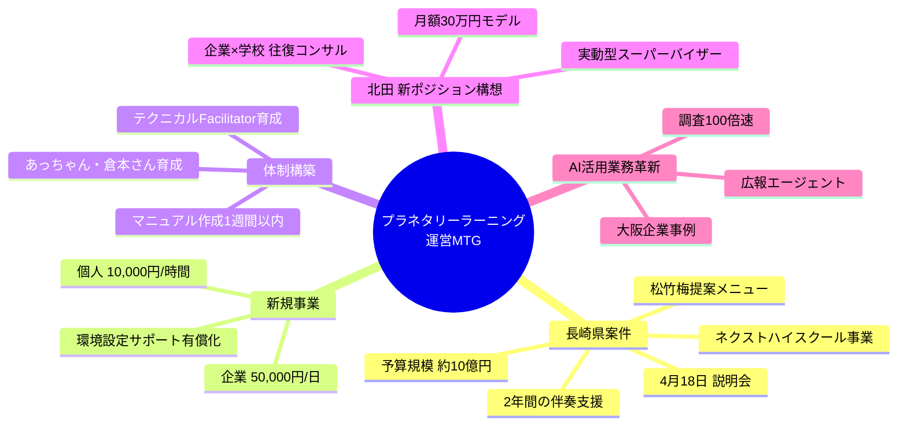
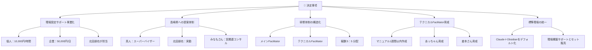
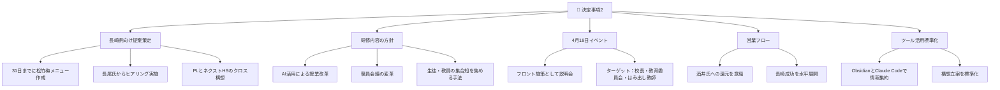
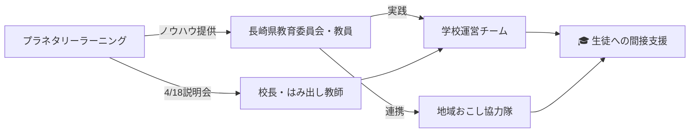
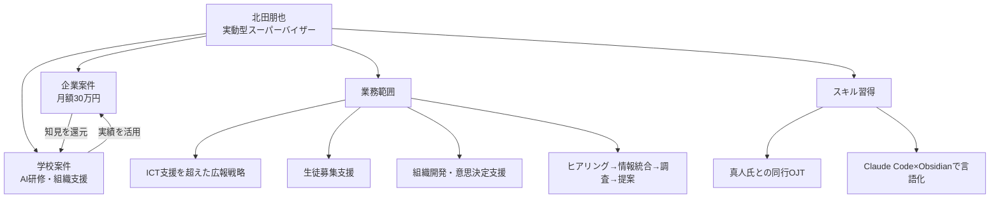
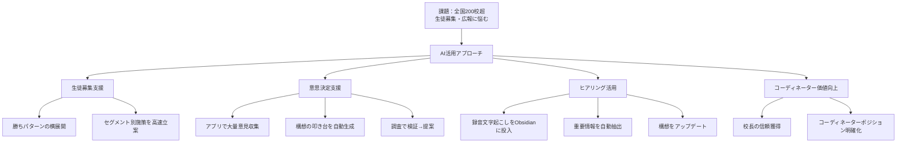
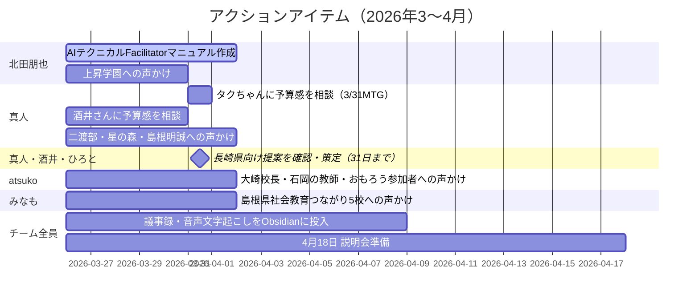
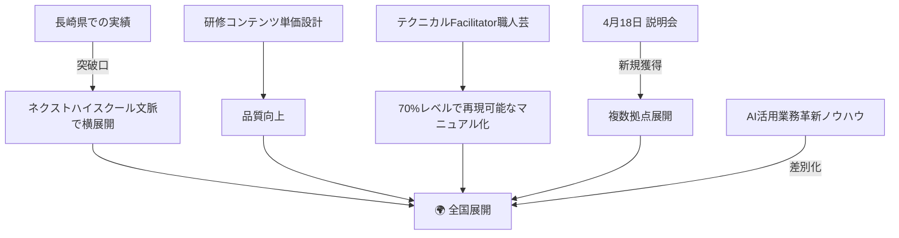

---
tags:
  - プロジェクト
  - AI×教育
  - 長崎県
  - プラネタリーラーニング
created: 2026-03-26
updated: 2026-03-26
---

- [ ] 確認

# 🌍 プラネタリーラーニング 運営MTG レポート

**日時：** 2026年3月26日 09:17〜（JST）
**形式：** オンライン（Zoom）

---

## 🗺️ 全体サマリー



---

## ✅ 主な成果

| 項目 | 内容 |
|------|------|
| 🏫 長崎県教育委員会 | ネクストハイスクール事業への参画依頼あり |
| 💰 予算見込み | 2年間の予算確保が見込まれる状況 |
| 🆕 新規事業 | Claude＋Obsidian環境設定サポートの有償化決定 |
| 📅 提案策定 | 31日までに長崎県向け松竹梅提案を策定することが決定 |
| 🎯 4月18日 | 校長・教育委員会・はみ出し教師向け説明会を実施 |
| 👤 北田新役割 | 実動型スーパーバイザーとして位置付け確立 |

---

## 📋 決定事項（09:17 セッション）



## 📋 決定事項（09:41 セッション）



---

## 🏫 長崎県案件 詳細

### 現状

```
📊 長崎県教育委員会 状況
─────────────────────────────
👥 研修実績  : 教育委員会 7名 × 1.5時間
⭐ 評価      : 高評価獲得
📧 特記事項  : 重鎮的な教育委員より個別に感謝のメール依頼あり
💴 予算規模  : 約 10億円
🏫 配分予定  : 300万円 × 3校（DXハイスクール予算 20-30万円も活用可）
🎯 拠点候補  : 佐世保・南・出島むすび・五島高校 等
```

### 提案メニュー（松竹梅）

| 形態       | 内容                            | 担当    |
| -------- | ----------------------------- | ----- |
| ⏱️ 時間単価型（梅） | スポット研修・コンテンツ提供（梅ちゃんの総合型選抜AI等） | チーム   |
| 📅 月額型（竹）   | 500,000円/月 × 2年間の伴奏支援         | チーム   |
| 🚀 フルコミット型（松） | 月額型＋AI軸・窓軸を組み合わせた包括支援 | チーム全員 |
| 🤖 AI軸   | 教員向けAI研修と実践支援                 | 北田朋也  |
| 🪟 窓軸    | 紙ごと高校等への窓導入コンサル               | みなもさん |

### 期待される役割



---

## 👤 北田朋也 担当業務

### 1. 環境設定サポート（新規事業）

```
🖥️ 環境設定サポート サービス概要
──────────────────────────────────
📋 形式    : リモート・ハンズオン（画面共有）
⏱️ 所要時間 : 約1時間
🛠️ 対象    : Claude / Obsidian / Bolt
           └ セットアップ＋パス設定
💰 料金    : 個人 10,000円/時間
           : 企業 50,000円/日
```

### 2. 長崎県案件

- 🤖 AI関連の実動担当として教員研修を実施
- 🎤 メインFacilitator または テクニカルFacilitatorとして参加
- 📚 今越で実施している手法のメソッド化・定番化を推進
- 📣 上昇学園への声かけ担当

### 3. 新ポジション構想「実動型スーパーバイザー」



---

## 🤖 AI活用による業務革新

### 大阪企業 実証事例

```
💡 AI活用 意思決定事例（大阪企業）
────────────────────────────────────
🔍 課題   : 混沌とした意思決定
⏱️ 解決時間: 1時間
📊 選択肢 : 4,000万円の開発 vs 1,000万円の乗り換え
✅ 結果   : 1,000万円乗り換えを選択 → 3,000万円を別施策へ振り向け
🚀 手法   : Claude Codeエージェント調査による高速判断
```

### 学校支援への応用可能性



| AI機能 | 内容 | 効果 |
|--------|------|------|
| 🔍 調査エージェント | 適切なキーワード群を自動生成し並行調査 | 100倍の調査速度 |
| 📝 質問項目自動生成 | 業者への詳細確認リストを自動作成 | 見積もり精度向上 |
| 📣 広報エージェント | プロマネ含めて施策を自動立案 | 無料で専門家レベル |
| 🎙️ 文字起こし活用 | 録音→Obsidian→構想更新 | ヒアリング損失ゼロ |

---

## ⚠️ 保留・確認事項

| 項目 | 予定 |
|------|------|
| 💴 予算の組み方・相場感 | 3月31日：ひろ＆タクちゃんとのMTGで相談 |
| 📝 契約形態（個人委託 or 組織委託） | 未定 |
| ✅ 長崎県教育委員会の正式予算承認 | 4月上旬まで |
| 🤝 長尾氏との期待値すり合わせMTG | 日程調整中 |
| 🏫 長崎県内複数拠点の展開可能性 | 佐世保・南・出島むすび・五島高校 等 検証中 |
| 👨‍💼 生徒募集課題を抱える校長への個別アプローチ | 方法検討中 |

---

## 🚀 アクションアイテム



---

## 🔭 今後の展開



**次回MTG：** 4月18日 説明会準備＋長尾氏ヒアリング結果を踏まえた提案ブラッシュアップ

---

*作成日：2026-03-26 ／ プラネタリーラーニング 運営MTGメモ（09:17 & 09:41セッション）より*
