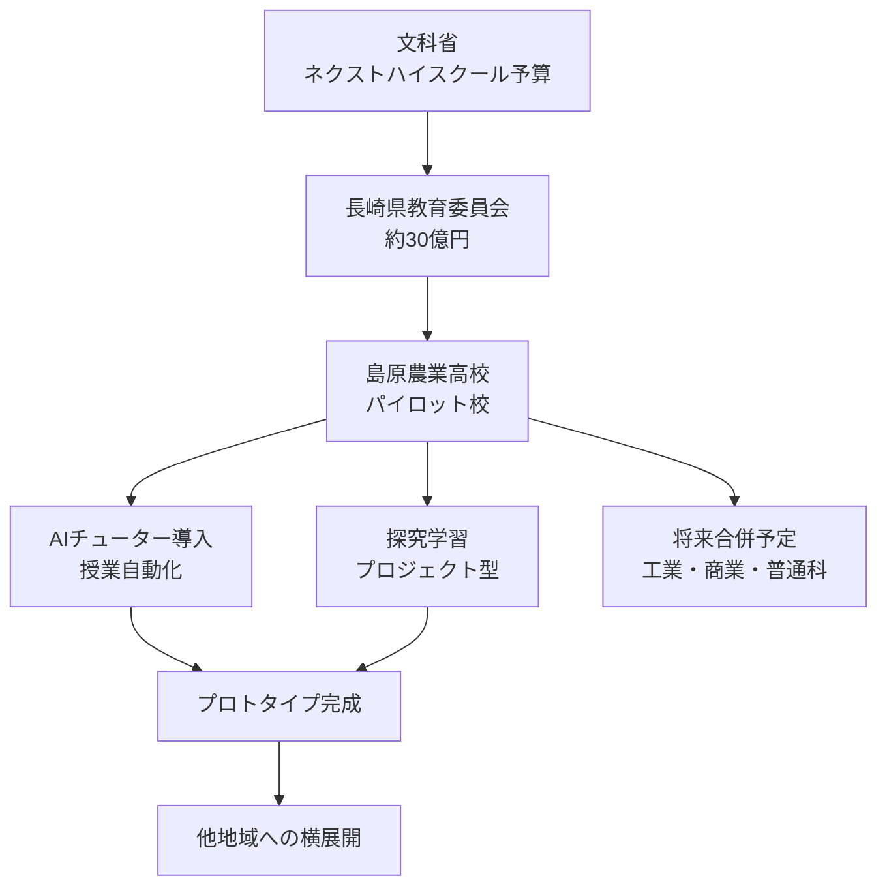
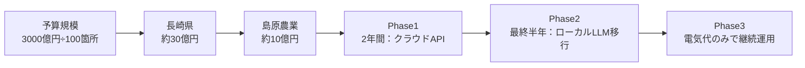
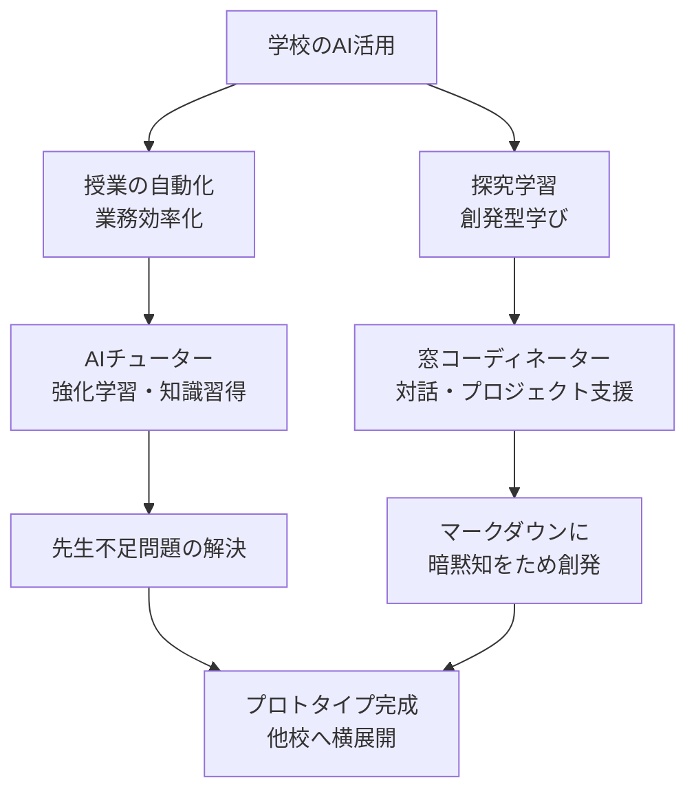
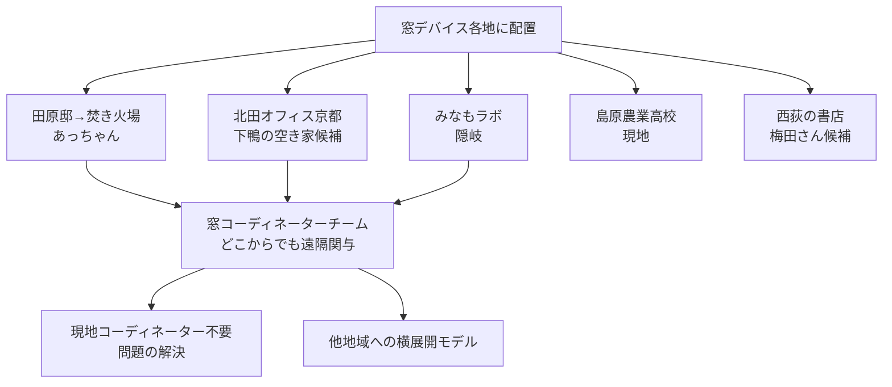
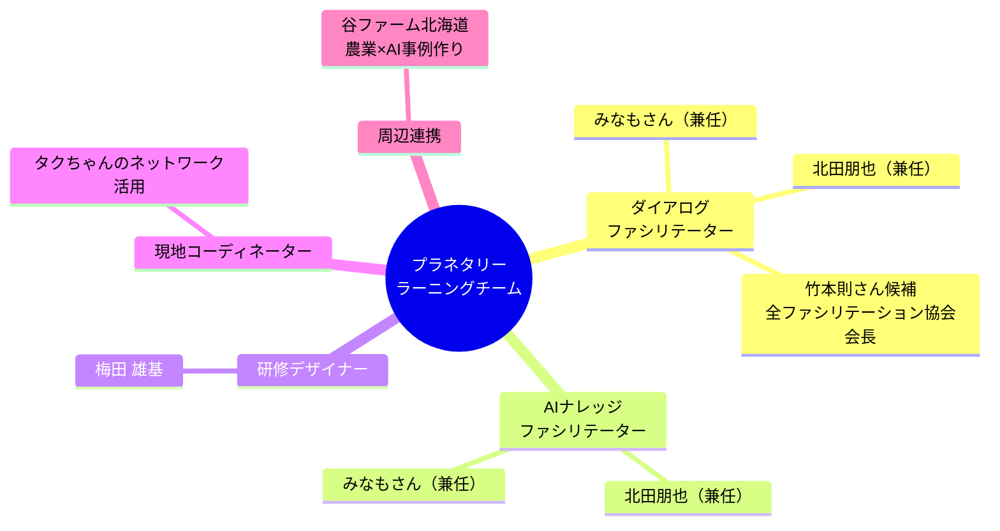

---
tags:
  - プロジェクト
  - プラネタリーラーニング
  - ネクストハイスクール
  - AI×教育
  - 窓コーディネーター
  - 会議録
created: 2026-04-02
updated: 2026-04-02
---

# プラネタリーラーニング運営MTG 2026-04-02

## 概要

| 項目 | 内容 |
|------|------|
| 日時 | 2026年4月2日（木）午前 |
| 形式 | Zoom オンライン |
| 時間 | 約42分 |
| 主催 | 真人 田原（むすび） |

### 参加者

| 名前 | 役割・拠点 |
|------|-----------|
| 真人 田原 | プロジェクトリーダー（むすび） |
| 北田朋也 | コーディネーター候補・関西担当（京都） |
| atsuko ihara（あっちゃん） | コーディネーター候補・焚き火場担当 |
| 野邉｜みなもラボ（水面さん） | コーディネーター候補・隠岐在住 |
| 梅田 雄基（うめちゃん） | キャリア教育担当 |

※ 川原さん：欠席（緊急対応）

---

## 主な報告・議論

### 1. 広田拓也さん（タクちゃん）との連携

田原さんより、あっちゃん紹介の **広田拓也さん** との連携が決定。

- **タクちゃんのポジション**：マイスターハイスクール等の文科省案件に横断的に関与
- デロイトトーマツから伴走支援を依頼されているレイヤーで動く人物
- ネクストハイスクール5箇所（熊本・島根・長崎等）に関与
- **奇跡のつながり**：長崎・島原農業高校にもタクちゃんが関与 → **共同宣言で連携決定**

---

### 2. ネクストハイスクール × 島原農業高校（長崎）

- 島原農業高校：農業ビジネス科・食品サイエンス科等、専門性の高い特色校
- 将来的に近隣の工業・商業・普通科と合併予定 → **統合モデルの先行事例**として位置づけ
- 隠岐・熊本など他の地域への横展開モデルに

---

### 3. 予算とビジネスモデル

**コスト課題と解決策：**
- API代：生徒200人 × 5,000円/月 = **100万円/月** → ネクストハイスクール終了後に継続困難
- **解決策（エレガントリープ社 山本さんと連携）**
  - 最初2年：クラウドAPI（Claude等）で運用
  - 最後半年：ローカルLLMサーバーへ切り替え
  - 終了後：電気代のみで持続可能なAI学習環境を実現
- コーディネーター費：**月額40万円**（文科省予算より）

---

### 4. AIチューター × プロジェクト学習モデル

> 「両利きの経営」を学校に適用する

**AIチューターの仕組み（開発中）：**
- Claude Code + Obsidian で「田原先生エージェント」作成
- 1日で科目テキスト量産 → チューターシステムに組み込み
- 先生不足の実業高校（水産・農業等）へのソリューション

---

### 5. Gemini CLI × コスト削減の可能性

- Claude CodeをGoogle Gemini CLIで代替実験 → 動作確認済み
- GeminiはAPIの無料枠が大きい → 学校現場への導入コスト削減
- **Obsidian + MCP + Gemini** の組み合わせが学校現場に馴染みやすい
- **本質はMarkdownファイルネットワーク** → ツールは置き換え可能という思想

---

### 6. 窓コーディネーターシステム

**窓コーディネーターとしてブランディングする方向性：**
- 「現地コーディネーターがいない問題を、窓で解決する」
- 地方過疎地・現地張り付き不可能な地域へのソリューション
- 窓慣れ × 探究学習 × AIナレッジ の三位一体が差別化要因

**北田さんの役割：**
- 母親の実家（**下鴨の一等地**）が空き家 → 「**むすびオフィス京都**」候補
- 大型窓デバイスを設置予定
- コーディネーター費 月額40万円 + 施策ごとの追加単価

---

### 7. チームロールと追加候補

---

### 8. 梅田さん関連

- **茨城県の高校**（来月）：総合型選抜 + 就職試験対策でプロトタイプ作成
- ヤマショウさん（Claude Code × Obsidian 実践者）に4月中マンツーマンで教わる予定
- **書籍出版**：講談社等への企画持ち込みを進める（チームのブランディング切り札）
  - 「梅田メソッド」のキャリア教育書籍
  - 田原さんからリクエスト：「中華料理屋で話を決めてきてほしい」

---

## アクションアイテム

| 担当    | タスク                           | 期限            |
| ----- | ----------------------------- | ------------- |
| 田原さん  | 予算積み上げの叩き台作成・広田さん＋チームに共有      | 4月第1週（4/4-5頃） |
| みなもさん | 窓コーディネーターの実践をObsidianでドキュメント化 | 2日以内（4/4頃）    |
| 梅田さん  | 書籍出版社へのメール送付                  | 今週中           |
| 梅田さん  | 茨城の高校でのプロトタイプ準備               | 4月中           |
| 北田さん  | 下鴨の空き家をオフィス化・窓設置の検討           | 要調整           |

---

## 所感・メモ

- 「追い風が強すぎる、吹き飛ばされないように」（田原さんの言葉）→ チームとして具体化の段階へ
- 広田さん（タクちゃん）の参加で、文科省予算の文脈・ネットワークが一気に広がった
- **マークダウン × AI = 知恵の財産** という思想がチームの軸として明確化
- 北田さんのロール：関西担当コーディネーター + AIナレッジ + ダイアログ の「リベロ」
- 下鴨空き家のオフィス化は、プロジェクト拡大の重要なインフラになりうる

---

## 関連ノート

- [[プラネタリーラーニング]]
- [[ネクストハイスクール]]
- [[窓コーディネーター]]
- [[KAEL]]
- [[AI共創ファシリテーター]]
