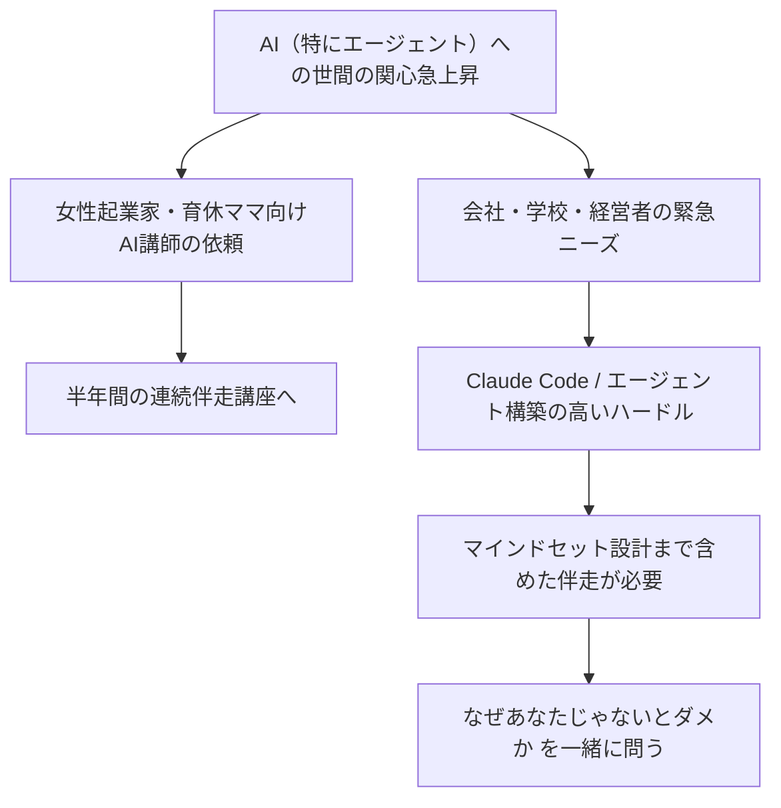
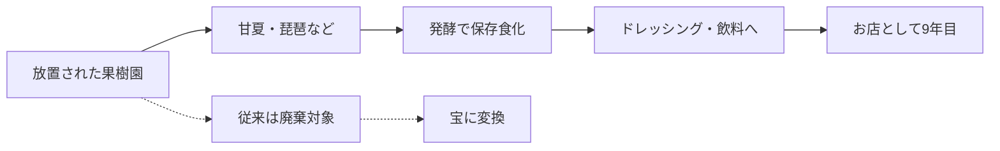

---
tags:
  - プロジェクト
  - プラネタリーラーニング
  - AI×教育
  - 会議録
  - AI-Knowledge-Facilitator
created: 2026-04-30
updated: 2026-04-30
---

- [ ] 確認

# プラネタリーラーニング運営MTG 2026-04-30 レポート【生成中】

## 概要

| 項目 | 内容 |
|------|------|
| 日時 | 2026年4月30日（木）09:01〜（進行中） |
| 形式 | Zoom オンライン（クローズドキャプション） |
| ダイアログFacilitator | 田原真人 |
| AI Knowledge Facilitator | 北田朋也（KAEL） |
| テーマ | 各メンバー近況共有／社会再生のロールモデルとしての発酵食ビジネス |

### 参加者

| 名前 | 役割・拠点 |
|------|-----------|
| 田原真人 | プロジェクトリーダー（むすび） |
| 北田朋也 | コーディネーター・関西担当（京都／KAEL） |
| 内藤恵梨 | 発酵食店オーナー（長崎） |

---

## 全体の流れ

| 時刻 | セクション | 内容 |
|------|-----------|------|
| 09:01〜 | チェックイン | 各自一言・近況共有 |
| 09:02〜 | 北田 近況 | AI一般化と伴走講座の手応え／マインドセット設計の必要性 |
| 09:05〜 | 内藤 近況 | 長崎で9年目の発酵食ビジネス／放置果樹園の活用 |
| 09:07〜 | 田原コメント | 「ゴミが宝になる」社会再生モデル／内藤さんのストーリー化 |

---

## 主要トピック

### 1. AI一般化と伴走の現場ニーズ（北田朋也）



**ポイント：**
- AIエージェントへの世間の関心が急速に高まり、北田の事業（個人の趣味から始めた領域）が浸透しつつある
- 一般層・経営者・学校・先生にも「緊急性のあるニーズ」が出てきた
- ただし**構築のハードル**（Claude Code・エージェント運用）は依然高く、伴走が必要
- 技術だけ教えると「AIのための仕事」になり、**無力感・「私要らないよね」感**が生まれる
- → **「あなたの願いは何か」「あなたじゃないと駄目な部分はどこか」を設計する**ことが重要
- AI設定だけでなく**マインドセットもセットで伴走**しないと豊かさは生まれない

### 2. 内藤恵梨さんの発酵食ビジネス（長崎）



**店舗概要：**
- 長崎で**9年目**
- テーマ：**「もったいないものを活かす」**
- 素材：放置果樹園の甘夏・琵琶（収穫されず放置されているもの）
- 加工：発酵で保存食化 → ドレッシング、お湯・炭酸割り飲料

### 3. 田原さんの解釈：「ゴミが宝になる」社会再生モデル

```
従来の社会構造          ＝＞      新しい社会
─────────────────              ─────────────────
 これは「ゴミ」だ                  これは「宝」だ
（社会の見立てが規定）              （見立ての切り替え）

  ▼                                   ▼
廃棄の増加                         必要なものへの再生
必要なものが不足                    循環ビジネス成立
```

**田原さんの読み解き：**
- 社会が壊れて再生していくプロセスでは「ゴミが宝になるビジネス」が象徴的に立ち上がる
- いまの社会構造が「ゴミ」とみなしているものが、新しい社会では宝になっていく
- **その切り替え地点に立つビジネス**として内藤さんの店はわかりやすいロールモデル
- 内藤さんのストーリーをプラネタリーラーニング文脈で**活かしたい**

---

## キーフレーズ

- 「AIのための自分の仕事」になっていく危うさ
- 「あなたじゃないとなぜダメなんですか？」
- 「あなたの願いを叶えるためにAIをどう使うんですか？」
- 「ゴミが宝になるビジネス」
- 「生まれ変わりのプロセスにおける見立ての切り替え」

---

## アクションアイテム

- [ ] 内藤さんの発酵食ビジネスのストーリーをプラネタリーラーニングの文脈で発信できる形に整理（田原・内藤）
- [ ] 北田の伴走講座の知見を「マインドセット設計」フレームとして整理し共有
- [ ] 次回MTGで「ゴミ→宝」モデルを他のメンバー事業にも当てはめて議論

---

*このレポートはAI Knowledge Facilitator（Claude Code）が会議中にリアルタイム生成しています。会議終了後に最終版へ更新されます。*
