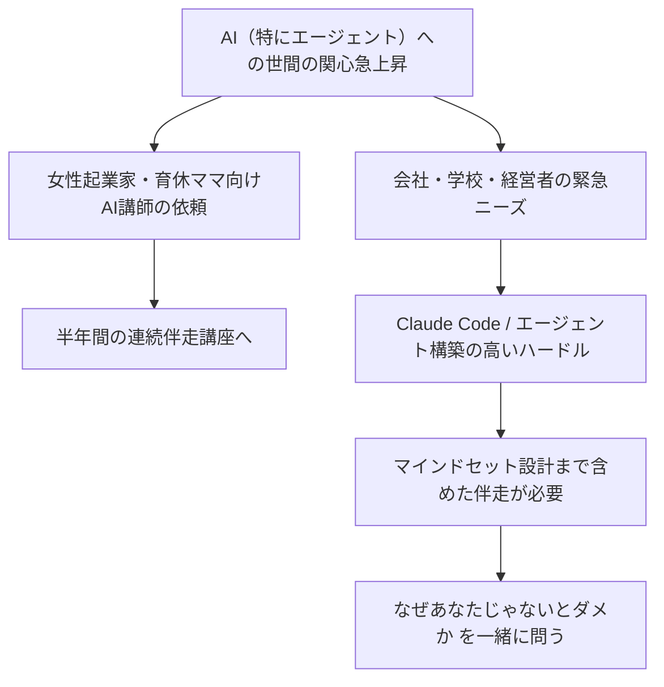
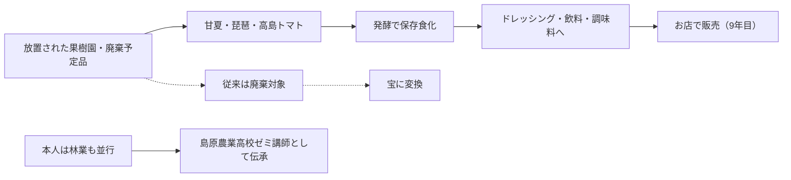
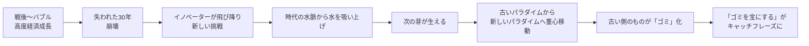
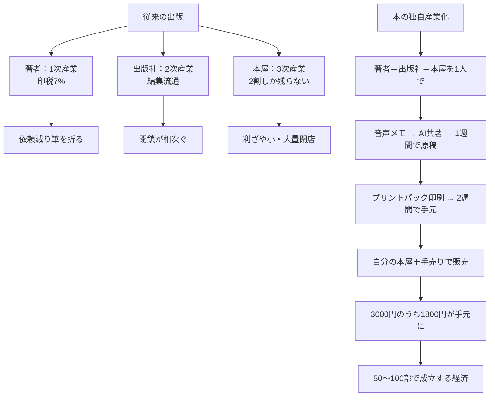
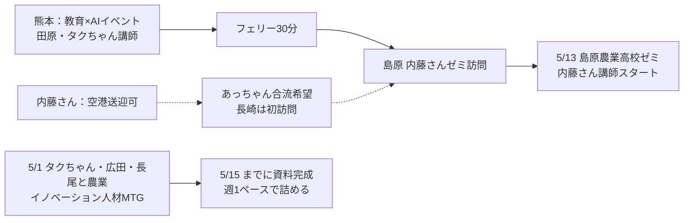
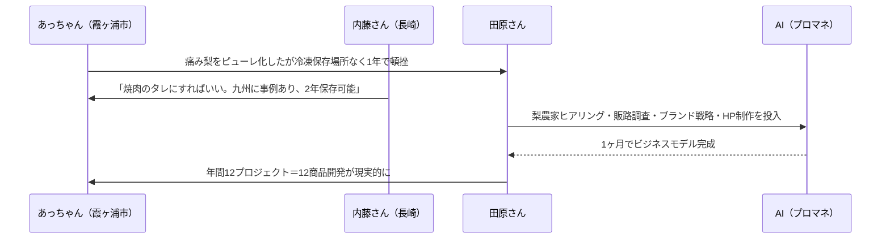
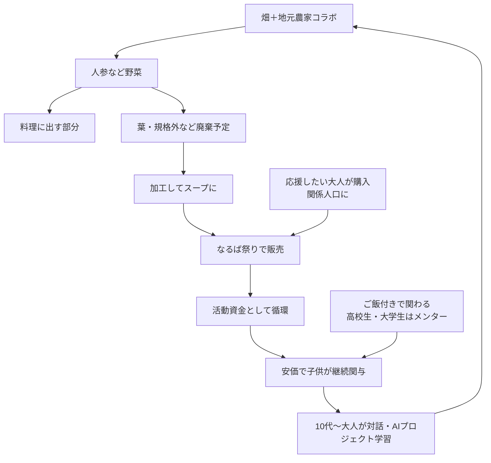
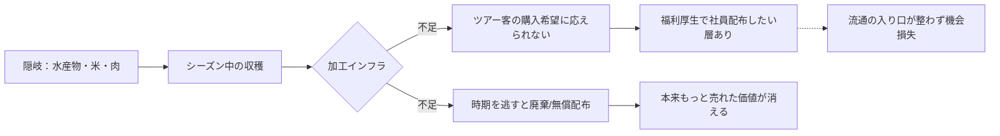
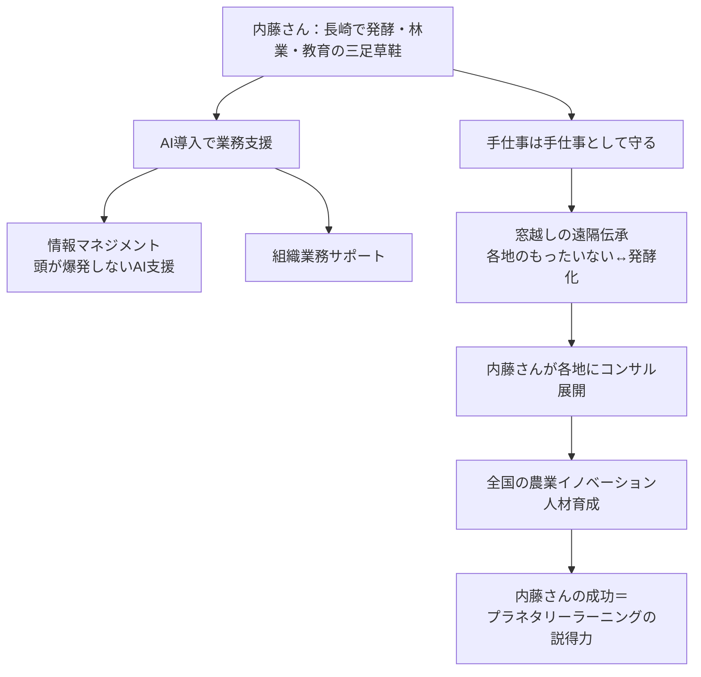
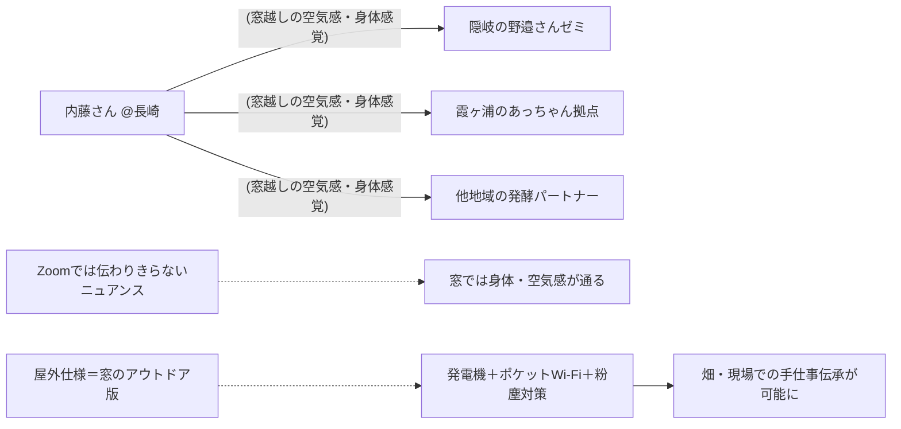

---
tags:
  - プロジェクト
  - プラネタリーラーニング
  - AI×教育
  - 会議録
  - エコシステム開発
  - 農業イノベーション人材
  - AI-Knowledge-Facilitator
created: 2026-04-30
updated: 2026-04-30
---

- [ ] 確認

# プラネタリーラーニング運営MTG 2026-04-30 レポート【最終版】

## 概要

| 項目 | 内容 |
|------|------|
| 日時 | 2026年4月30日（木）09:01〜09:52（約51分） |
| 形式 | Zoom オンライン（クローズドキャプション） |
| ダイアログFacilitator | 田原真人 |
| AI Knowledge Facilitator | 北田朋也（KAEL） |
| テーマ | 各メンバー近況共有／「ゴミが宝になる」エコシステム開発／農業イノベーション人材の像 |

### 参加者

| 名前 | 役割・拠点 |
|------|-----------|
| 田原真人 | プロジェクトリーダー |
| 北田朋也 | コーディネーター・関西担当（京都／KAEL） |
| 内藤恵梨 | 発酵食店オーナー・林業／島原農業高校ゼミ講師（長崎） |
| atsuko ihara（あっちゃん） | 焚き火場担当（霞ヶ浦） |
| 野邉みなも | 窓コーディネーター（隠岐／出雲） |

---

## 全体の流れ

| 時刻 | セクション | 内容 |
|------|-----------|------|
| 09:01〜 | チェックイン開始 | 田原ファシリで近況共有スタート |
| 09:02〜 | 北田 近況 | AI一般化と伴走講座／マインドセット設計の重要性 |
| 09:05〜 | 内藤 近況 | 長崎で9年目の発酵食ビジネス／放置果樹園の活用 |
| 09:07〜 | 田原コメント | 「ゴミが宝になる」社会再生モデルとして内藤さんを位置づけ |
| 09:08〜 | 田原構想① | 内藤さんの本づくり構想 |
| 09:09〜 | 内藤の事例 | 高島トマトの発酵保存 |
| 09:10〜 | 5月ツアー計画 | 熊本→島原→内藤さん訪問の段取り |
| 09:12〜 | 手仕事×AI論 | AIは周辺を支え、手仕事は喜びの源泉として残す |
| 09:14〜 | あっちゃんCI | 竹林・組子職人など「もったいない」の山 |
| 09:20〜 | 野邉 一時挨拶 | 移動中、後ほど合流 |
| 09:20〜 | 田原構想② | 本の独自産業化／2週間で本が手元に届く |
| 09:24〜 | 田原 理論編 | 「ゴミが宝になる」エコシステム開発論 |
| 09:30〜 | 梨×焼肉のタレ | AIプロマネで1ヶ月新規事業開発／霞ヶ浦の失敗事例から学ぶ |
| 09:36〜 | 北田の事例 | nalba（京都・自学自炊コミュニティ）の循環モデル |
| 09:41〜 | 田原構想③ | 北田が編集者でnalbaを書籍化／ジン化 |
| 09:41〜 | 野邉 合流 | 隠岐の水産物・福利厚生需要・流通ボトルネック |
| 09:44〜 | 内藤AX構想 | 内藤さんを「農業イノベーション人材のロールモデル」に |
| 09:45〜 | 手仕事×窓 | 遠隔で手仕事を伝える可能性／窓のアウトドア版が欲しい |
| 09:50〜 | クロージング | 5/15明日のタクちゃん・広田さんMTG予告で締め |

---

## 主要トピック

### 1. AI一般化と伴走の現場ニーズ（北田朋也・近況）



- AIエージェントへの世間の関心が急速に高まり、北田の事業（個人の趣味から始めた領域）が浸透
- 一般層・経営者・学校・先生にも「緊急性のあるニーズ」
- 構築のハードルは依然高く、伴走が必要
- 技術だけ教えると「AIのための仕事」になり、無力感が生まれる
- → **「あなたの願いは何か」「あなたじゃないと駄目な部分はどこか」を設計する**ことが重要
- AI設定だけでなく**マインドセットもセット**で伴走しないと豊かさは生まれない

### 2. 内藤恵梨さんの発酵食ビジネス（長崎）

**店舗概要：**
- 長崎で**9年目**
- テーマ：**「もったいないものを活かす」**
- 素材：放置果樹園の甘夏・琵琶（収穫されず放置）
- 加工：発酵で保存食化 → ドレッシング、お湯・炭酸割り飲料



**追加事例：高島トマト**
- 船でしか出せないブランドトマト、傷ものは**ショベルカーで廃棄**
- 内藤さんは送料相当で買い取り、発酵→ドレッシング・炭酸割り飲料に
- 何年も保存可能／カウンターで「発酵していく姿」を客が楽しむ

**もう一つの顔：林業／教育**
- 「AI時代に全速力で逆走している」発言
- 実際は山林作業・林業も並行し、もったいないものを活かす立場で**島原農業高校の講師**として伝承中
- 5/13に新ゼミがスタート

### 3. 「ゴミが宝になる」エコシステム開発論（田原・理論）

```
【古いパラダイム：一直線モデル】
  資源 ────► 商品 ────► 廃棄物
   ↓                       ↓
  枯渇                    増大
   └──── 利益減少 ────┘
   └──── 社会の機能不全 ──┘

【新しいパラダイム：循環＝エコシステム】
  ┌─→ Aの「ゴミ」 ─→ Bの「資源」 ─┐
  │                                  │
  └─ Cの「資源」 ←── Dの「ゴミ」 ←──┘
        ↑
   このマッチングを AI が大量にシミュレーション
```

- KPI＝売上最大化は単純化と均質化を強制し、多様性を捨ててきた
- 資源枯渇／環境破壊で行き詰まり、「**ゴミと資源の区別がなくなる**」段階へ
- 多様性のマッチングが膨大に必要 → これは**AIが圧倒的に得意**
- 「**組織開発の時代は終わった。これからはエコシステム開発**」を田原さんはイベントで公言中
- 越境した対話に**AIをかます**ことで「刺激になりました」で終わらせず、循環が生まれるところまでやりきれる

**社会変容の地図**



### 4. 手仕事 × AI のレイヤー設計

```
   現場仕事（手仕事・林業・発酵）
   ─────────────────────────────
   │ 人がやる   │ 喜びの源泉      │ ← 残す・価値を高める
   ─────────────────────────────
   │ 営業・販売  │ ブランディング   │ ← AIで支える
   │ 構想立案    │ 価値の組み換え   │
   ─────────────────────────────
```

- 現場仕事は**喜びの場所**として残す
- AIは**周辺の営業・販売・構想・価値の組み換え**を担う
- 「価値の組み換え」によって今まで光が当たらなかった手仕事に光が当たり、お金が流れる
- 例：あっちゃんの**組子職人（貝塚さん）**——欄間オーダーがなくなり技術の使い場所がない
  → 別の価値で残す道筋づくりが課題

### 5. 田原構想①：本の独自産業化



- 田原さんは**5月から本屋を引き継ぐ**
- 「誕生日プレプロジェクト」で**朝の音声メモ→当日入稿→2週間後に本が届く**を実証
- 「何かあったら本を書いて2週間後に販売」のサイクルへ
- **内藤さんの本も同じ仕組みで作り、内藤さんの店で売る**構想
- 北田が編集者として入って**nalbaの本／ジン化**もアイデアに浮上

### 6. 5月の島原ツアー＆翌日MTG計画



- 熊本→フェリー→島原のルートで**5月か6月**に確定見込み
- あっちゃんは自腹合流希望／長崎市〜島原は車で約1時間
- **5/13 内藤さんが島原農業高校で新ゼミスタート**
- 田原は内藤さんに「**森の再生は僕らの再生**」を5月手渡し
- 翌日（5/1）タクちゃん・広田拓也さん・長尾さんと「農業イノベーション人材」MTG
  - 一旦「農水産イノベーション」案は長尾が複雑として却下、農業フレーミングに戻して資料を出し直す方針

### 7. 梨×焼肉のタレ：AIプロマネ型 新規事業開発



- 霞ヶ浦のフードロスPJは**冷凍保存場所と販路不足で1年で頓挫**
- 内藤：保存可能な発酵調味料（焼肉のタレ）に変換するアイデア／ドレッシング・お味噌など加工バリエ豊富
- 田原：**AIをプロマネ**にすればヒアリング・調査・ブランド・HP・壁打ちが1ヶ月で完了
- 短距離走で**テンションが高いうちに商品化**まで到達できる
- 食べ物は**消費される＝サイクルが早い**。お土産としても回り、循環性が高い
- 年間12プロジェクトの商品開発が射程

### 8. 北田の実例：nalba（京都・自学自炊コミュニティ）

**運営者：** 楠本ていあいさん（葵小学校北側／京都）



**特徴：**
- **食事を一緒に作って食べてから学ぶ**を基本構造に
- 4月から**NVCベースの対話**でチームビルディングを実施
- 廃棄予定の野菜→子供と一緒にレシピ考案→**なるば祭り**で販売
- 売上は次のプロジェクトの活動資金へ循環
- 「ゴミだったものに価値が生まれ、応援文化が育つ」**応援経済**の実例
- ストーリーがあるからすぐ売れる
- 田原案：**北田が編集者として入り、活動を書籍化／ジン化**して循環の一部にする

### 9. 隠岐の現状とボトルネック（野邉みなも）



- **企業ツアー**で訪れた人が「ストーリー込みで買いたい」と申し出
- 福利厚生で社員に**3000円相当の隠岐産品**を配るほうが現金より喜ばれる
- しかし**加工・流通の入り口**が整っていないため取りこぼしている
- 内藤さんの「もったいない→保存食」変換ノウハウがそのまま隠岐にも刺さる構造

### 10. 「内藤AX」構想：農業イノベーション人材のロールモデル化

田原さんの提案として、内藤さんを**農業イノベーション人材の現状ロールモデル**として位置づけ、AI活用の実践研究（=「内藤AX／人体実験」）を行う。



**ポイント：**
- 内藤さんが成功するほど、プラネタリーラーニングの「農業イノベーション人材」モデルの説得力が増す
- AIで**情報・組織業務をサポート**しながら、手仕事の価値は守る
- 窓越しに**遠隔で手仕事の感覚**を伝える可能性（次節）

### 11. 手仕事×窓の遠隔伝承



**論点：**
- 手仕事は本来「**手から手**」の伝承。Zoomでは伝わりきらない
- 野邉さんの実感として、**窓越しの空気感・身体感覚は確実に届く**（黒曜石矢尻の事例など）
- 後半は「**窓につながっているだけで体がチューニングされる**」という効果
- 屋外で使える窓があれば、畑・現場仕事に直接持ち込める
- 田原：**酒井さんに次回の窓定例MTGで提案する**

### 12. 翌日MTGの方針確認

- 5/1 タクちゃん・広田拓也さん・長尾さんと「農業イノベーション人材」設計MTG
- 5/15までに資料完成、週1ペースで進める方針
- 田原は当初「**農水産イノベーション人材**」（農業×水産業の掛け合わせ）を提案したが、長尾さんが「複雑になる」として一旦却下
  → 一旦**農業フレーミング**で再提示し、向こうの反応を見ながら進める
- 今日のMTGの内容で、農業イノベーション人材の像が**だいぶ見えてきた**との手応え

---

## キーフレーズ

- 「AIのための自分の仕事」になっていく危うさ
- 「あなたじゃないとなぜダメなんですか？」「あなたの願いを叶えるためにAIをどう使うんですか？」
- 「ゴミが宝になるビジネス」
- 「組織開発の時代は終わった。これからはエコシステム開発」
- 「刺激になりました、で終わるな。循環が生まれるまでやりきれ」
- 「**本の独自産業化**」（著者＝出版社＝本屋を1人で）
- 「窓につながっているだけで体がチューニングされる」
- 「内藤さんが成功すれば成功するほど、我々の話は説得力が出てくる」

---

## アクションアイテム

- [ ] **5/1（明日）：** タクちゃん・広田拓也さん・長尾さんと農業イノベーション人材MTG（田原）
- [ ] **5/15まで：** 農業イノベーション人材の資料完成（週1ペース／チーム全体）
- [ ] **5月／6月：** 熊本→島原ツアー日程確定（田原・タクちゃん・あっちゃん・内藤）
- [ ] 田原 → 内藤に「**森の再生は僕らの再生**」を5月手渡し
- [ ] 内藤さんの本企画を**独自産業化スキーム**でプロトタイプ化（田原・内藤）
- [ ] 北田が編集者として **nalbaの書籍化／ジン化**を検討（北田）
- [ ] あっちゃん地域（霞ヶ浦）のフードロス・組子職人リソースを「エコシステム開発」テーマに登録
- [ ] **AIプロマネ型 新規事業開発フロー**を内藤さん事例（梨×焼肉のタレ／ドレッシング）で実装テスト
- [ ] **内藤AX**：内藤さんを「農業イノベーション人材ロールモデル」として情報・組織業務をAIサポート化
- [ ] **窓のアウトドア仕様**を酒井さんに提案（次回窓定例MTGで田原）
- [ ] 隠岐（野邉）の流通ボトルネックに「もったいない→保存食」変換ノウハウを当てはめて検討

---

*このレポートはAI Knowledge Facilitator（Claude Code）が会議中にリアルタイム生成し、終了後に最終版へ統合しました。*
