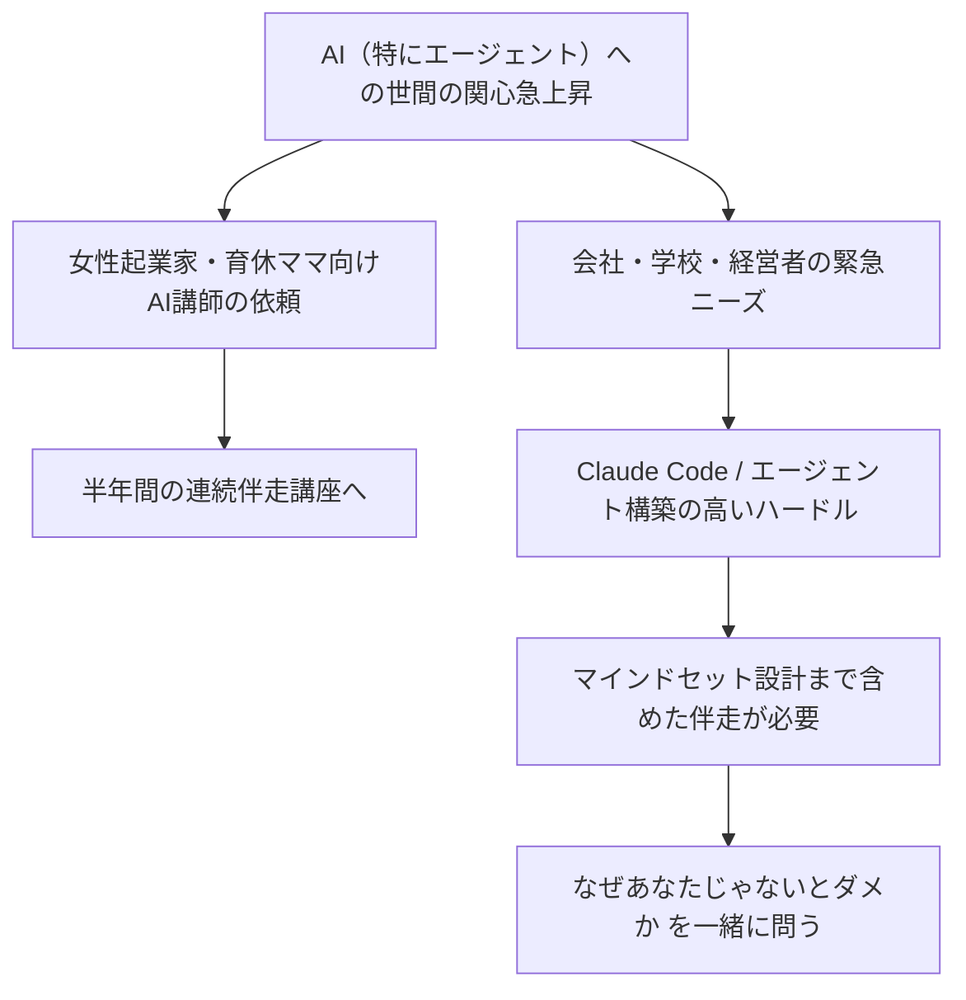
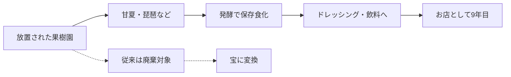
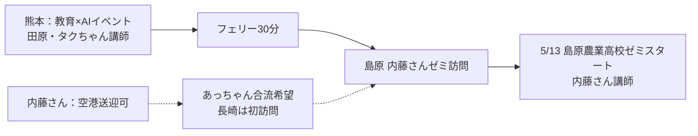
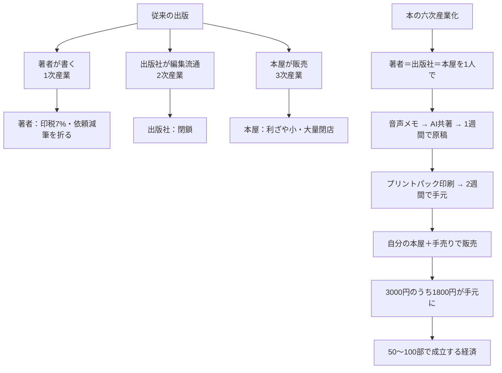
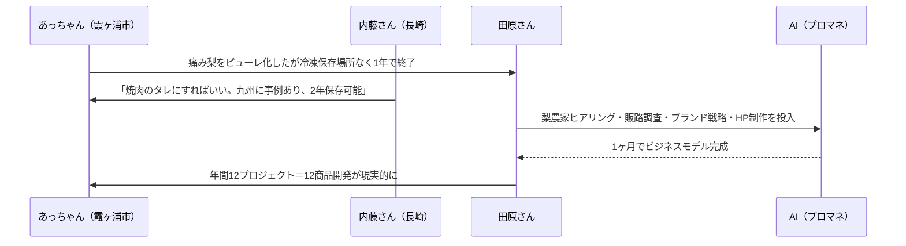

---
tags:
  - プロジェクト
  - プラネタリーラーニング
  - AI×教育
  - 会議録
  - AI-Knowledge-Facilitator
created: 2026-04-30
updated: 2026-04-30
---

- [ ] 確認

# プラネタリーラーニング運営MTG 2026-04-30 レポート【生成中】

## 概要

| 項目 | 内容 |
|------|------|
| 日時 | 2026年4月30日（木）09:01〜（進行中） |
| 形式 | Zoom オンライン（クローズドキャプション） |
| ダイアログFacilitator | 田原真人 |
| AI Knowledge Facilitator | 北田朋也（KAEL） |
| テーマ | 各メンバー近況共有／社会再生のロールモデルとしての発酵食ビジネス |

### 参加者

| 名前 | 役割・拠点 |
|------|-----------|
| 田原真人 | プロジェクトリーダー |
| 北田朋也 | コーディネーター・関西担当（京都／KAEL） |
| 内藤恵梨 | 発酵食店オーナー（長崎） |

---

## 全体の流れ

| 時刻 | セクション | 内容 |
|------|-----------|------|
| 09:01〜 | チェックイン | 各自一言・近況共有 |
| 09:02〜 | 北田 近況 | AI一般化と伴走講座の手応え／マインドセット設計の必要性 |
| 09:05〜 | 内藤 近況 | 長崎で9年目の発酵食ビジネス／放置果樹園の活用 |
| 09:07〜 | 田原コメント | 「ゴミが宝になる」社会再生モデル／内藤さんのストーリー化 |

---

## 主要トピック

### 1. AI一般化と伴走の現場ニーズ（北田朋也）



**ポイント：**
- AIエージェントへの世間の関心が急速に高まり、北田の事業（個人の趣味から始めた領域）が浸透しつつある
- 一般層・経営者・学校・先生にも「緊急性のあるニーズ」が出てきた
- ただし**構築のハードル**（Claude Code・エージェント運用）は依然高く、伴走が必要
- 技術だけ教えると「AIのための仕事」になり、**無力感・「私要らないよね」感**が生まれる
- → **「あなたの願いは何か」「あなたじゃないと駄目な部分はどこか」を設計する**ことが重要
- AI設定だけでなく**マインドセットもセットで伴走**しないと豊かさは生まれない

### 2. 内藤恵梨さんの発酵食ビジネス（長崎）



**店舗概要：**
- 長崎で**9年目**
- テーマ：**「もったいないものを活かす」**
- 素材：放置果樹園の甘夏・琵琶（収穫されず放置されているもの）
- 加工：発酵で保存食化 → ドレッシング、お湯・炭酸割り飲料

### 3. 田原さんの解釈：「ゴミが宝になる」社会再生モデル

```
従来の社会構造          ＝＞      新しい社会
─────────────────              ─────────────────
 これは「ゴミ」だ                  これは「宝」だ
（社会の見立てが規定）              （見立ての切り替え）

  ▼                                   ▼
廃棄の増加                         必要なものへの再生
必要なものが不足                    循環ビジネス成立
```

**田原さんの読み解き：**
- 社会が壊れて再生していくプロセスでは「ゴミが宝になるビジネス」が象徴的に立ち上がる
- いまの社会構造が「ゴミ」とみなしているものが、新しい社会では宝になっていく
- **その切り替え地点に立つビジネス**として内藤さんの店はわかりやすいロールモデル
- 内藤さんのストーリーをプラネタリーラーニング文脈で**活かしたい**

---

## キーフレーズ

- 「AIのための自分の仕事」になっていく危うさ
- 「あなたじゃないとなぜダメなんですか？」
- 「あなたの願いを叶えるためにAIをどう使うんですか？」
- 「ゴミが宝になるビジネス」
- 「生まれ変わりのプロセスにおける見立ての切り替え」

---

## アクションアイテム

- [ ] 内藤さんの発酵食ビジネスのストーリーをプラネタリーラーニングの文脈で発信できる形に整理（田原・内藤）
- [ ] 北田の伴走講座の知見を「マインドセット設計」フレームとして整理し共有
- [ ] 次回MTGで「ゴミ→宝」モデルを他のメンバー事業にも当てはめて議論

---

## ＜追記＞09:08〜09:35

### 4. 田原構想①：内藤さんの本づくり（09:08〜09:09）

- 内藤さんのお店の知恵・経験を**1冊の本にまとめて店頭で売る**構想
- 1〜2時間では語りきれないストーリーを本という形で残す
- 「いつまでに書く」段階の話に発展する可能性

### 5. 高島トマト発酵：もう一つの実例（09:09〜09:11）

- **高島トマト**：船でしか出せないブランドトマト。少しの傷でショベルカーで廃棄
- 内藤さんは送料相当で買い取り、発酵→ドレッシング・炭酸割り飲料に
- **何年も保存できる**／カウンターで「発酵していく姿」を客が楽しむ

### 6. 5月の島原ツアー計画（09:10〜09:19）



**メモ：**
- タクちゃん経由で熊本に呼ばれる教育×AIイベント → そのまま島原へ
- あっちゃんは自腹だが合流希望／長崎市〜島原は車で約1時間
- 5/13 内藤さんが**島原農業高校で新ゼミスタート**

### 7. 手仕事 × AI のレイヤー設計（田原）（09:12〜09:14）

```
   現場仕事（手仕事・林業・発酵）
   ─────────────────────────────
   │ 人がやる   │ 喜びの源泉      │ ← 残す・価値を高める
   ─────────────────────────────
   │ 営業・販売  │ ブランディング   │ ← AIで支える
   │ 構想立案    │ 価値の組み換え   │
   ─────────────────────────────
```

- 現場仕事は**喜びの場所**として残す
- AIは**周辺の営業・販売・構想・価値の組み換え**を担う
- 「価値の組み換え」によって今まで光が当たらなかった手仕事に光が当たり、お金が流れる
- 例：あっちゃんの**組子職人（貝塚さん）**——欄間オーダーがなくなり技術の使い場所がない
  → 別の価値で残す道筋づくりが課題

### 8. あっちゃんのチェックイン：もったいないだらけ（09:14〜09:16）

- 周辺に放置竹林・甘くならない梨など「もったいない」が大量
- 竹細工職人も途絶えるギリギリの状態
- 「プラネタリーラーニングの中で活かせたら最高」
- 内藤さんに**発酵の修行**に行きたい（発酵か腐敗かの境目が怖くて踏み込めない）

### 9. 田原構想②：本の六次産業化（09:20〜09:24）



- 田原さんは**5月から本屋を引き継ぐ**
- 「誕生日プレプロジェクト」で**朝の音声メモ→当日入稿→2週間後に本が届く**を実証
- 何かあったら本を書く → 2週間で販売、というサイクルへ
- このモデルで内藤さんの本も作り、内藤さんの店で売る構想

### 10. 「ゴミが宝になる」エコシステム開発論（09:24〜09:30）

```
【古いパラダイム：一直線モデル】
  資源 ────► 商品 ────► 廃棄物
   ↓                       ↓
  枯渇                    増大
   └──── 利益減少 ────┘
   └──── 社会の機能不全 ──┘

【新しいパラダイム：循環＝エコシステム】
  ┌─→ Aの「ゴミ」 ─→ Bの「資源」 ─┐
  │                                  │
  └─ Cの「資源」 ←── Dの「ゴミ」 ←──┘
        ↑
   このマッチングを AI が大量にシミュレーション
```

**田原さんの主張：**
- KPI＝売上最大化は単純化と均質化を強制し、多様性を捨ててきた
- 資源枯渇／環境破壊で行き詰まり、「**ゴミと資源の区別がなくなる**」段階へ
- 多様性のマッチングが膨大に必要 → これは**AIが圧倒的に得意**
- 「組織開発の時代は終わった。これからは**エコシステム開発**」と公言中
- 越境した対話に**AIをかます**ことで「刺激になりました」で終わらせず、**循環が生まれるところまで**やりきれる

### 11. 梨×焼肉のタレ：エコシステム開発の具体例（09:30〜09:35）



**ポイント：**
- 霞ヶ浦のフードロスプロジェクトは**冷凍保存場所と販路不足で1年で頓挫**
- 内藤：保存可能な発酵調味料（焼肉のタレ）に変換するアイデア
- 田原：**AIをプロマネ**にすればヒアリング・調査・ブランド・HP・壁打ちが1ヶ月で完了
- 短距離走で**テンションが高いうちに商品化まで到達**できる
- 年間12プロジェクトの商品開発が射程に入る

---

## アクションアイテム（追加）

- [ ] 5月の島原ツアー日程確定（田原・タクちゃん・あっちゃん・内藤）
- [ ] 田原 → 内藤に「森の再生は僕らの再生」を5月手渡し
- [ ] 内藤さんの本企画を六次産業化スキームでプロトタイプ化
- [ ] あっちゃん地域（霞ヶ浦）のフードロス・組子職人リソースを「エコシステム開発」のテーマに登録
- [ ] AIプロマネ型 新規事業開発フローを内藤さん・あっちゃん事例で実装テスト

---

*このレポートはAI Knowledge Facilitator（Claude Code）が会議中にリアルタイム生成しています。会議終了後に最終版へ更新されます。*
