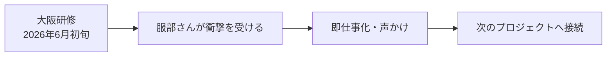
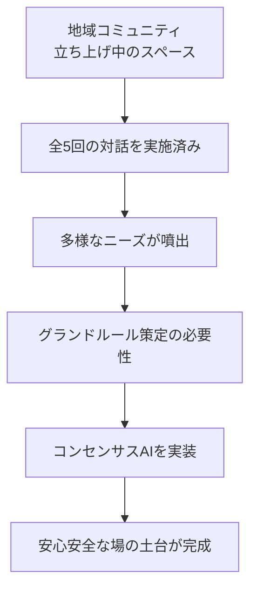
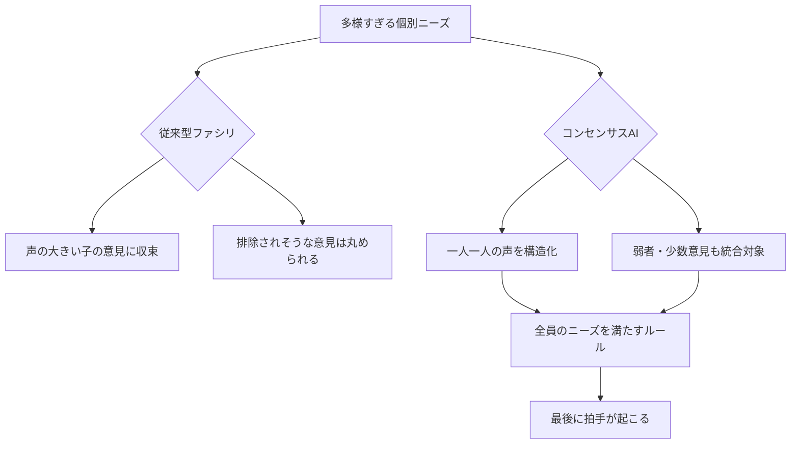
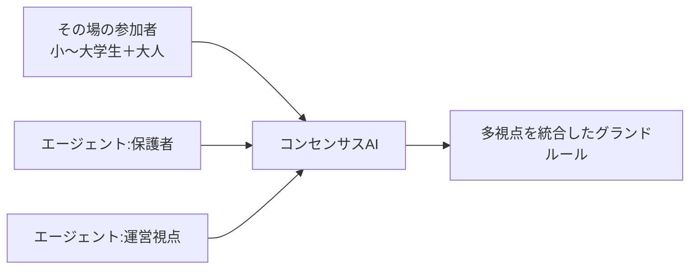
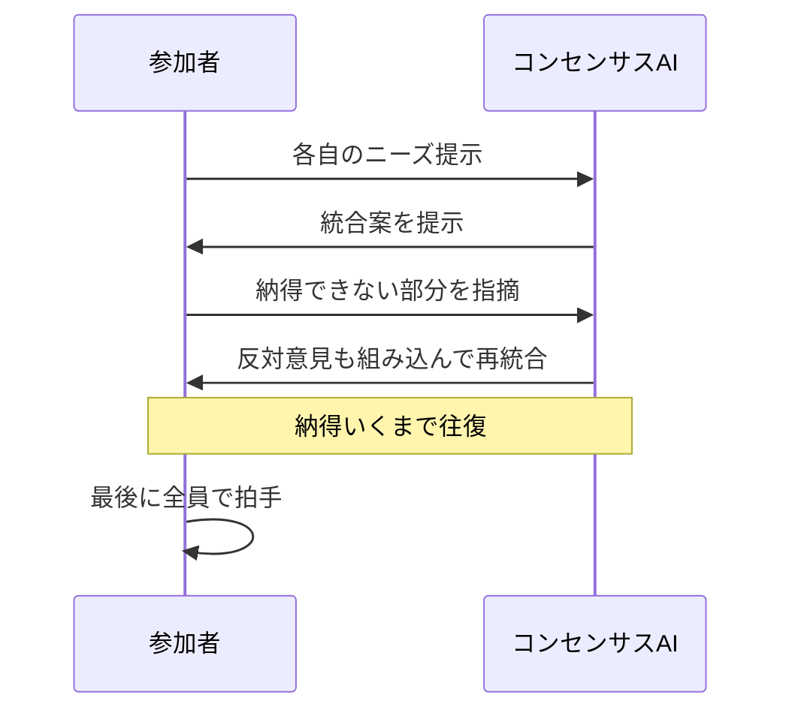

---
tags:
  - プロジェクト
  - プラネタリーラーニング
  - AI×教育
  - 会議録
  - コンセンサスAI
  - 地域コミュニティ
  - AI-Knowledge-Facilitator
created: 2026-06-04
updated: 2026-06-04
---

- [ ] 確認

# プラネタリーラーニング運営MTG 2026-06-04 レポート【最終版】

## 概要

| 項目 | 内容 |
|------|------|
| 日時 | 2026年6月4日（木）09:06〜（チェックイン部分のみ収録） |
| 形式 | Zoom オンライン（クローズドキャプション） |
| ダイアログFacilitator | 田原真人 |
| AI Knowledge Facilitator | 北田朋也（KAEL） |
| テーマ | 大阪研修フォロー／コンセンサスAI×地域コミュニティ実践報告 |

> ⚠️ 本文字起こしは09:13付近で途切れており、本レポートは**北田朋也・atsuko iharaのチェックイン部分**を中心に構成しています。後半の議論は別途追記が必要です。

### 参加者（確認できた範囲）

| 名前 | 役割・拠点 |
|------|-----------|
| 田原真人 | プロジェクトリーダー |
| 北田朋也 | コーディネーター・関西担当（京都／KAEL） |
| atsuko ihara（あっちゃん） | 焚き火場担当（霞ヶ浦） |

---

## 全体の流れ

| 時刻 | セクション | 内容 |
|------|-----------|------|
| 09:06〜 | 北田 チェックイン開始 | 大阪研修の御礼／服部さんからの即仕事化 |
| 09:08〜 | 北田 実践報告① | 地域コミュニティで「コンセンサスAI」を実装した話 |
| 09:09〜 | 北田 実践報告② | 弱者・声の小さい子が活躍できた手応え |
| 09:10〜 | あっちゃん 反応 | 多様な意見の統合結果に関心 |
| 09:10〜 | 北田 補足 | グランドルール決定→イラスト化まで一貫実施 |
| 09:11〜 | 田原コメント | コンセンサス型をここの先生にも入れたい |
| 09:11〜 | あっちゃん 質問 | 統合ルールへの納得感を確認 |
| 09:12〜 | 北田 応答 | 「納得いくまでやる→最後に拍手」のサイクル |
| 09:12〜 | 田原提案 | 広水のりさん（原典カスタマイズ者）への共有を |
| 09:13〜 | あっちゃん チェックイン | 先週欠席のためキャッチアップ宣言 |
| 09:13〜 | （以降） | **文字起こしここで途切れる** |

---

## 主要トピック

### 1. 大阪研修の即仕事化（北田 チェックイン冒頭）



- 田原さんとの大阪研修が「面白かった」
- **服部さん**が衝撃を受け、その場で「ぜひやってほしい」と声かけ → 即仕事化
- 研修の体験が次のクライアントワークへ直結したケース

> 💡 関連: [[project_junion_union_ai_academy]] — 服部圭祐さん主催のユニオンAIアカデミー2026ゲスト登壇案件と地続きの可能性

---

### 2. コンセンサスAI × 地域コミュニティ実践（本日のメイン共有）

#### 場の設定



- 北田が関わる地域コミュニティ（**京都・自学自炊コミュニティ＝nalba／関連スペース**）
- 立ち上げ途中で、これまで**全5回の対話**でチームビルディングを実施
- 対話の中で「みんなのニーズ」が浮かび上がってきた段階
- → ニーズを満たすためのグランドルール（安心安全の土台）を策定する必要性

#### 参加者の世代構成

```
小学校高学年 ── 中学生 ── 高校生 ── 大学生 ── 大人
   └─────────── 世代をまたいで一つのテーマを学び合う ───────────┘
```

- **小学校高学年〜大学生**＋大人が混在
- 世代関係なく**一つのテーマをいろんな世代で学び合う**場

#### なぜコンセンサスAIが効いたか — 「声の小さい子」が活躍できた



**参加者の多様性（北田の言葉から）：**
- 声が小さい子（自分の意見が取り上げられない）
- ハーフの子（学習面・感情伝達でしんどさを抱える）
- 「悪ガキ」とレッテルを貼られ、学校で怒られてむしゃくしゃして来る男の子

**従来のファシリの限界：**
- 「丸く収めようとすると排除されそうな意見」が出る場面では、声の小さい子の意見が消える
- 葵小学校時代もファシリテートしていたが、当時はAI未実装

**コンセンサスAIで起きたこと：**
- **複雑すぎるニーズをAIが構造化・統合**
- 普段なら排除されそうな子が「活躍できた」場面が生まれた
- ＞ 「これからはこういう風にAI使っていきたいよね」と参加者が体感
- 参加していた子たちが「**心地よかった**」と発言

#### エージェント機能：いない人の声を入れる



- 大人は別会議で後半のみ合流 → **エージェント機能**で「ここにいない人」を場に召喚
- 例：その場にいない**保護者の視点**、**運営面の視点**
- 生徒たちから「これがすごい良かった」との声

#### 流れの一貫性：グランドルール → イラスト化まで

- ChatGPT上で対話を継続してグランドルールを決定
- **「じゃあこれをイラストにしよう」**まで同じ流れで実施
- 全部が一気通貫したので参加者は「おお〜！」と盛り上がった

---

### 3. 納得感はどう作られたか（あっちゃんの問いに対して）



- あっちゃん「統合されたルールに対して、みんなは結構納得感がいってる感じなんですか」
- 北田「**やり取りを繰り返すから、納得できへんは納得できへんって、その行くまでやる**」
- 田原「納得いくまでやるからね」
- 反対意見も「なぜ反対するのか」を入れながら統合
- → **最後に拍手が起こる**

> 💡 これが「予想の範囲を超えない」（うちうちで喋るだけ）からの脱却ポイント。

---

### 4. 田原からの接続提案：広水のりさんへ

| 人物 | 役割 |
|------|------|
| 広水のり（のりさん） | コンセンサス原理を**カスタマイズして使えるようにした**人物 |

- 田原「のりさんにあれちょっとさ、もともとのこの原理をカスタマイズして使えるようにしたのりさんだから」
- **「のりさんの考えたやつがAIで、エージェントも入ってこうなったんです」というストーリーを、のりさんに直接共有してほしい**
- 田原から後ほどのりさんに紹介を回す予定

---

## アクションアイテム

| 担当 | アクション | 期限・備考 |
|------|-----------|-----------|
| 北田 | 大阪研修フォロー・コンセンサスAI実践のログを場で共有 | チェックイン直後に実施宣言 |
| 田原 | 広水のりさんへの紹介をつなぐ | MTG後 |
| 北田 | のりさん経由で実装ストーリーを共有 | 紹介を受けてから |
| 全員 | ここの先生にもコンセンサス型メソッドを導入検討 | 田原提案 |

---

## チェックイン途中の状態（atsuko ihara）

- 先週欠席のためキャッチアップが必要
- 「一回は痩せてなく、こうちょっとなんだっけ？みたいになっちゃった」とコメント
- **「以上です」で正式チェックイン終了**

---

## 北田視点メモ

> 大阪研修 → 地域コミュニティでの即実装 → 子どもたちの「心地よかった」という体感
>
> このサイクルが**最短2週間以内**で回ったことが今日の最大の収穫。
> 「AIで弱者の声が活きる」ことを身体で確認できた事例として、今後の研修・講演で繰り返し引用できる。

---

## 補足

本レポートは文字起こしが09:13付近で途切れているため、**チェックイン部分の構造化**にフォーカスしています。
以降の議論（おそらく田原・あっちゃんの本論／プラネタリーラーニング運営事項）は、後日完全版の文字起こしが届き次第追記します。
