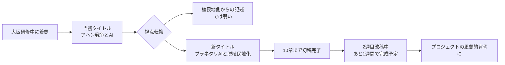
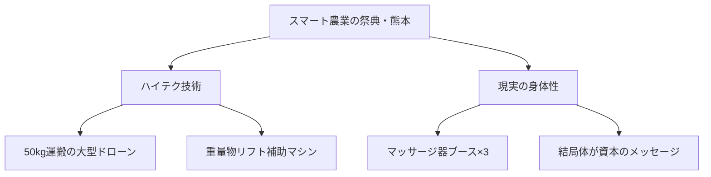
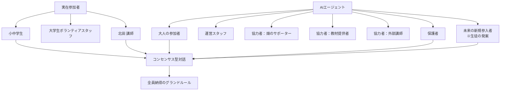
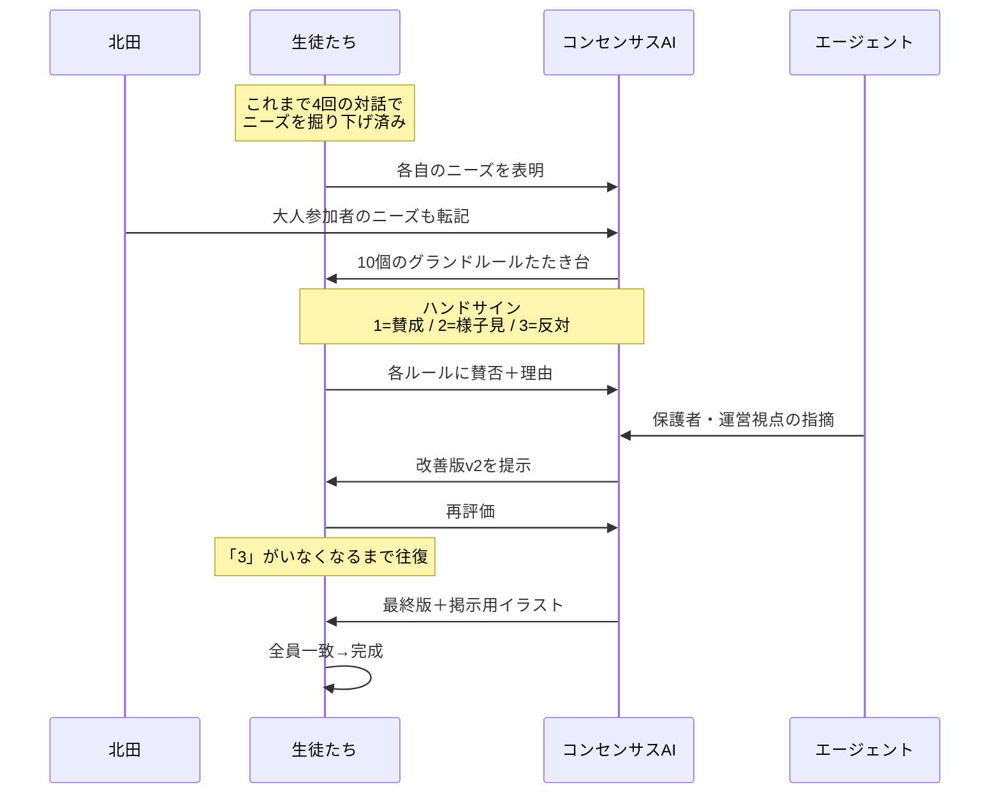
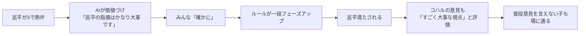
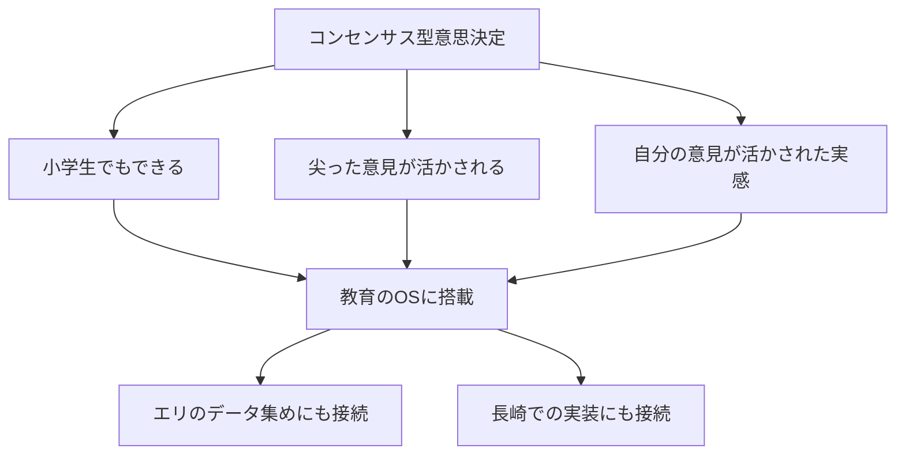
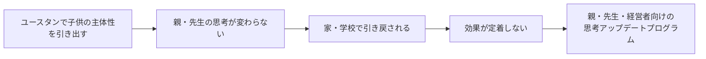
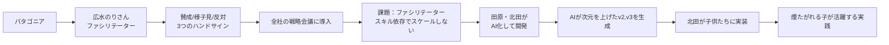
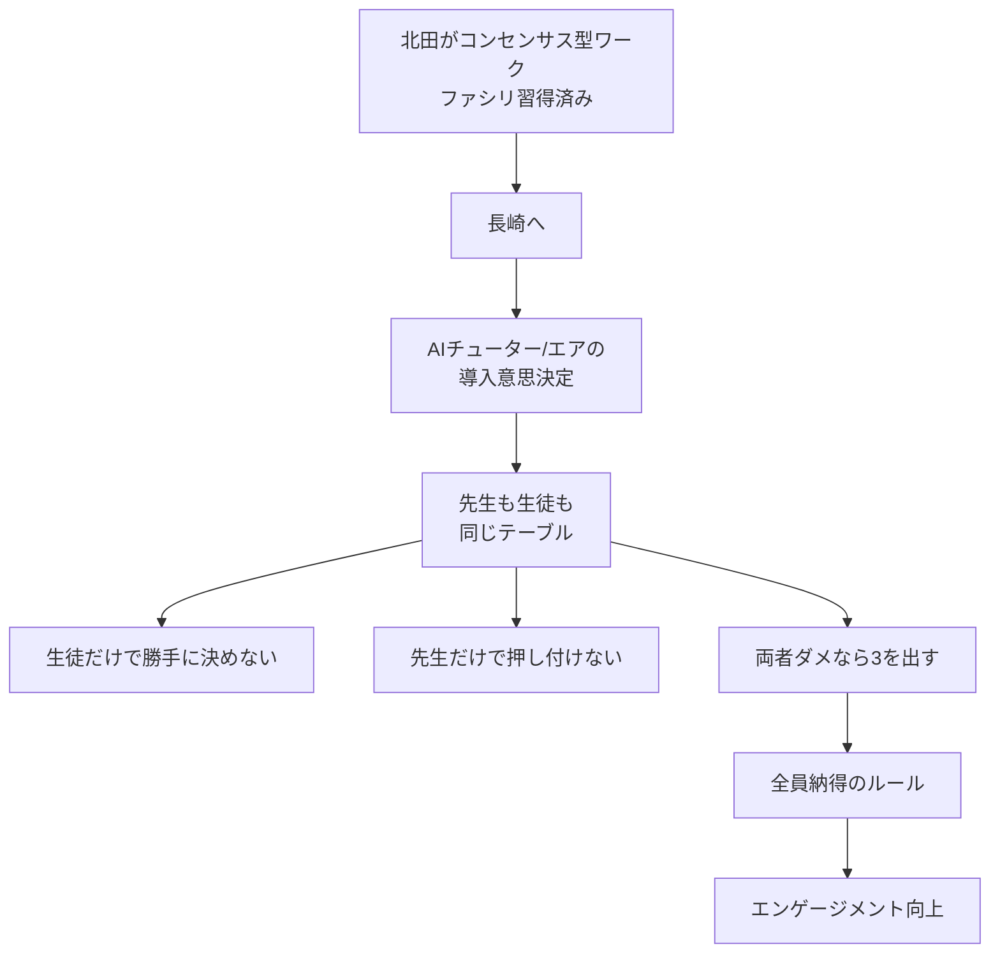
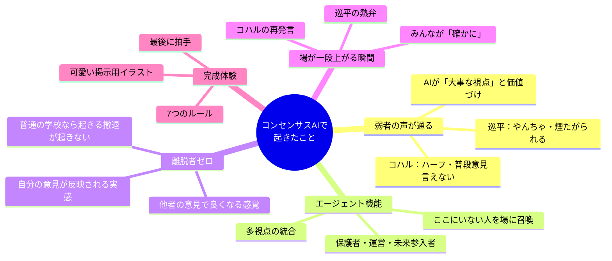

---
tags:
  - プロジェクト
  - プラネタリーラーニング
  - AI×教育
  - 会議録
  - コンセンサスAI
  - 脱植民地化
  - ユースタン
  - AI-Knowledge-Facilitator
created: 2026-06-04
updated: 2026-06-04
---

- [ ] 確認

# プラネタリーラーニング運営MTG 2026-06-04 レポート【最終版】

## 概要

| 項目 | 内容 |
|------|------|
| 日時 | 2026年6月4日（木）09:06〜09:38頃（収録分） |
| 形式 | Zoom オンライン（クローズドキャプション） |
| ダイアログFacilitator | 田原真人 |
| AI Knowledge Facilitator | 北田朋也（KAEL） |
| テーマ | コンセンサスAI×グランドルール作り実践報告／田原新著「プラネタリAIと脱植民地化」／ユースタン×大人の思考アップデートプログラム |

> ⚠️ 文字起こしは09:38付近で途切れています。後続の議論があれば追加版で追記します。

### 参加者

| 名前 | 役割・拠点 |
|------|-----------|
| 田原真人 | プロジェクトリーダー／著者 |
| 北田朋也 | コーディネーター・関西担当（京都／KAEL） |
| atsuko ihara（あっちゃん） | 焚き火場担当（霞ヶ浦） |
| ELLY NAITO（エリ／内藤恵梨） | 発酵食店オーナー（長崎） |
| Nobuhiko Taki（タキ） | ユースタン推進・市役所連携 |

---

## 全体の流れ

| 時刻 | セクション | 内容 |
|------|-----------|------|
| 09:06〜 | 北田 チェックイン | 大阪研修御礼／服部さんからの即仕事化 |
| 09:08〜 | 北田 実践予告 | ナルバでコンセンサスAI実装→大成功の速報 |
| 09:10〜 | あっちゃん チェックイン | 北田報告に強い関心、納得感の質問 |
| 09:13〜 | 田原 チェックイン | 新著「プラネタリAIと脱植民地化」執筆中 |
| 09:15〜 | エリ チェックイン | Claude Codeスライド作り／スマート農業の祭典（熊本） |
| 09:18〜 | 北田 画面共有 | **コンセンサスAI×グランドルール作り 詳細実況** |
| 09:23〜 | 北田 ケーススタディ | コハル・巡平の「3」と弱者活躍の構造 |
| 09:29〜 | 北田 完成報告 | 7つのルール＋確認リスト＋掲示用イラスト |
| 09:29〜 | 田原コメント | 「教育の場のOSに入れたい」 |
| 09:30〜 | タキ チェックイン | **大人の思考アップデートプログラム×ユースタン構想** |
| 09:36〜 | 田原 解説 | タキにコンセンサスAIの原理＋長崎展開構想を共有 |
| 09:38〜 | （途切れ） | 後続未収録 |

---

## 主要トピック

### 1. 大阪研修の即仕事化（北田 チェックイン冒頭）

- 田原さんとの大阪研修が「面白かった」
- **服部さん**が衝撃を受け、その場で「ぜひやってほしい」と声かけ → 即仕事化
- 研修体験が次のクライアントワークへ直結

> 💡 関連: [[project_junion_union_ai_academy]] — 服部圭祐さん主催のユニオンAIアカデミー2026登壇案件と地続き

---

### 2. 田原新著「プラネタリAIと脱植民地化」（田原 チェックイン）



- 当初「**アヘン戦争とAI**」というタイトルだったが、植民地側からの記述になるため変更
- 新タイトル：**「プラネタリAIと脱植民地化」**
- 問題意識：**AIは今、ある種の植民地化の原理で広がっている**
- → **どう脱植民地化して自立していくか**、そのAI活用の原理を本に書き、みんなで「植民地化」していく
- 一回目のドラフトは**10章まで完成**、現在二回目改稿中
- **約1週間後に書き終わる見込み**
- プラネタリーラーニング・MdGORLDシリーズの**思想的な背骨の一つ**として位置づけ
- 完成次第メンバーに共有

---

### 3. エリのチェックイン（内藤恵梨 / 長崎）

#### Claude Codeでのスライド作り体験

- 「みなさんよりだいぶ遅れているので頑張ろう」とClaude Codeでスライド作成
- **AIが作ったたたき台からなかなか離れられない**という壁
- たたき台→自分の言葉に直す作業に時間がかかる
- 100%の完成度を目指すとまだまだ、を実感

#### スマート農業の祭典（熊本）



- お金をかければ50kg運べる大型ドローンなど技術は進歩
- **マッサージ器のブースが3つ**あり「結局体が資本」
- 重いものを持ち上げる人間補助マシンも展示
- これが「スマート農業」の現実、と帰路につく

> 💡 田原コメント：「実践がずいぶん進んでますよね」 → エリ「しがみついてます」

---

### 4. 【本日のメインコンテンツ】コンセンサスAI×グランドルール作り 詳細実況

#### 場の設定

- **場所**：ナルバ（地元・京都／**10代の自学自炊コミュニティ**）
- **目的**：火曜なるばで、**みんなが安心して自分らしく自立して過ごすためのグランドルール**を作る
- **手法**：葵小でやっていたグランドルール作りの**AI実装版／コンセンサス型合意形成**

#### 参加者構成とエージェント設計



- 当初AIが**「全員10代」と誤認**→北田が背景情報を補足
- 畑で作ったものを食べてから学ぶ毎回のルーティン → 畑サポーターも重要なエージェント
- **「これから新しく入ってくるかもしれない未来の参加者」エージェントは生徒たち自身が提案**

#### プロセス：4回の対話で出てきたニーズ → 10個のたたき台



- たたき台10個を読み合い → **ハンドサイン3段階**で判定
  - **1**：賛成
  - **2**：やってみないとわからない／まあ進めてもいい
  - **3**：懸念点・納得いかない（反対意見）

#### ケーススタディ：3を言った子たちが場を引き上げた

| 子ども | 普段の像 | 今回の発言 | 何が起きたか |
|--------|---------|-----------|------------|
| **ヒカリ** | — | 「1」（賛成多め） | スムーズに進行 |
| **コハル** | ハーフ、普段は自分の言葉を言えない | 「3」：「休む＝何でもオッケーになると自分勝手になりそうで良くないんじゃない？」 | 自分の声が初めて場に通った |
| **巡平** | 中学のやんちゃ坊主、魚への愛が強すぎて他人が触るのを許せない、学校で煙たがられる | 「3」：「あの折れない、綺麗事では無理」 | スイッチが入り、次は他の子の代弁者に |
| **北田**（あえて） | — | 「3」：「これできたらルールなんかいらねーんだよ」 | 綺麗事で終わらせないスパイス |

#### 巡平の覚醒シーン（北田の言葉から）

> 「休憩するときは必ず大人に伝えること」というルールに対して
> → **「本当に休みたい人は休みたくても休めなくなる人がいるわけやん。そこが問題なわけやねん」**と熱く語り出した



#### AIチューターの核心的役割

- **AIがコハル・巡平を「ぎゅっと持ち上げる」**
- 「休むことを認めたいけど、伝えること自体が負担になる人もいる」と巡平の言いたいことをサポート＆価値づけ
- コハルの意見も「すごく大事な視点」と評価
- → **声の小さい子・尖った子のロジックが場に通る回路**ができる

#### 「離脱者ゼロ」という発見

> ❗ ここが今日の最大の収穫

普通の学校なら：

```
学級会で意見が分かれる
  ↓
決まってる子は「もうええやん」
  ↓
反対し続ける子は「場を乱してる」扱い
  ↓
学級委員型の子が抽象キーワードでまとめる
  ↓
時間切れで決定
  ↓
誰も満たされない／反対意見は消える
```

今回のコンセンサスAIでは：

```
自分の意見が反映される実感
  ↓
他人の意見も取り上げてさらに良くなる感覚を共有
  ↓
誰も「もうええやん」と離脱しない
  ↓
全員が場に居続ける
```

#### 着地：7つのルール＋掲示用イラスト

- 「やってみないとわからない（2）」の声を受けて
- **「やってみて合わなければ見直す／困るという声を大切にする」がルール7**として追加
- エージェント含め全員「3」がゼロに → **全員コンセンサス到達**
- 女の子の「可愛くしてほしい」リクエストで**掲示用イラスト化**まで一気通貫
- 完成物：**7つのルール＋個別の確認リスト＋休憩スペースについて**

---

### 5. 田原の意味づけ：「教育の場のOSに入れたい」

> 田原「これいいよね。教育の場のOSに入れたいよね、ものを考えるように、決めるときに」



- エリの「データを集めて提案する」活動とも接続
- みんなの意見を集約→合意できる提案を作る思考法として転用可能
- **頭の使い方として、コンセンサス型意思決定がベースにあるとすごくいい**

---

### 6. タキのチェックイン：ユースタン×大人の思考アップデートプログラム

> 09:30時点：市役所の駐車場から参加。10時から市長とユースタンについてブレスト予定

#### 問題意識



- 子供たちの主体性を引き出しても、**親・先生の思考が変わらないと引き戻される**
- 重く感じさせず「**一緒にアップデート脳みそしようぜ**」ノリで企画

#### プログラム構成（4回シリーズ）

| 回 | テーマ | 登壇者 | 日程 |
|----|--------|--------|------|
| 1 | オープニング（教育関係者向け） | **工藤勇一**先生＋長崎の探究関係者・元校長のパネル | **9月5日・6日** 確定 |
| 2 | 不登校支援×働く体験 | 元吉本・**東野さん**（北海道・石垣・大阪で施設運営） | 未定 |
| 3 | EQ ワークショップ | EQスペシャリスト（保護者・子ども両対応） | 未定 |
| 4 | 経営者向け | **窓・堺さん**＋日立**ハピネスプラネット**（タキがエンゲージメントアーキテクトでサポート） | 未定 |

#### 工藤勇一先生の評価

- ユースタンの計画を送ったらすぐ返信
- 「**民間でここまでの形でやっているケースは全国で初めて聞きました**」
- 「もう手伝います」と確約 → 9/5・6 確定

#### 4回目の狙い

- 人材育成のパラダイムシフト時代に、**経営者の固定観念をどう取っ払うか**
- AI（ハピネスプラネット）と組織エンゲージメント（窓）の両輪で語ってもらう

> タキ「自分の中の考えがまとまってすっきりしてる朝です」

---

### 7. 田原 → タキへのコンセンサスAI解説と長崎展開構想

#### コンセンサス型意思決定の系譜



#### 原理の違い

- **声の大きい人の意見**ではなく、**変わった視点の人が「No」と言えば決まらない**
- その人の意見を含めて「Yes」になるにはどうしたらいいか、を**お互いに学び合う**
- これが意思決定の原理として違う
- ただしファシリテータースキル依存でスケールしない問題があった
- → **AIに賛否と理由を入れるとAIが次元を上げたv2, v3を作る**

#### 長崎・教育現場での展開構想



> 田原「**北田が長崎に行って、コンセンサス型のワークをやってくれればいいんじゃないかな**と思ってます」

- 「AIチューター入ります」「エア入ります」を**先生・生徒・保護者で合意形成**する場として転用
- 先生も「先制的に無理」なときは「3」を出せる
- 生徒も「これは困る」なら「3」を出せる
- → 両者が納得できるルールができる → **コミットしてエンゲージメントが高まる**

---

## アクションアイテム

| 担当 | アクション | 期限・備考 |
|------|-----------|-----------|
| 田原 | 新著「プラネタリAIと脱植民地化」完成 → メンバーに送付 | 約1週間後 |
| 田原 | 広水のりさんへ「のりさん原理→AI化→子供実践」のストーリー紹介 | MTG後 |
| 北田 | コンセンサスAIワークのナルバ実践ログを場で共有 | チェックイン後 |
| 北田 | のりさん経由で実装ストーリーを共有 | 紹介後 |
| 北田 | **長崎でコンセンサス型ワーク実施**（先生・生徒合同でのAI導入合意形成） | 田原構想・タイミング調整 |
| タキ | ユースタン×大人の思考アップデートプログラム継続企画 | 9/5・6に工藤先生回 |
| エリ | Claude Codeスライドの自分の言葉化を継続 | 並行 |
| 全員 | 「教育の場のOS」としてコンセンサスAIを各現場で活用検討 | 田原提案 |

---

## キーインサイト（北田視点・場の総括）



### 北田の総括（再掲）

> 大阪研修 → 地域コミュニティでの即実装 → 子どもたちの「心地よかった」という体感
> このサイクルが**最短2週間以内**で回ったことが今日の最大の収穫。
> 「AIで弱者の声が活きる」ことを身体で確認できた事例として、今後の研修・講演で繰り返し引用できる。

### 田原の総括（再掲）

> **教育の場のOSに入れたい**。ものを考えるとき、決めるときに。
> 小学生でもできて、尖った意見が活かされる意思決定原理は、長崎にも、ユースタンにも、転用できる。

---

## 補足

- 本MTG文字起こしは09:38付近で途切れているため、後続議論があれば次回追記
- 田原の新著は完成次第、本Vault内に書籍ノートを作成予定
- ユースタン関連は別プロジェクトノートでの管理を検討
