---
tags:
  - プロジェクト
  - プラネタリーラーニング
  - AI×教育
  - 会議録
  - コンセンサスAI
  - 脱植民地化
  - ユースタン
  - データ自己管理
  - AI-Knowledge-Facilitator
created: 2026-06-04
updated: 2026-06-04
---

- [ ] 確認

# プラネタリーラーニング運営MTG 2026-06-04 レポート【最終版】

## 概要

| 項目 | 内容 |
|------|------|
| 日時 | 2026年6月4日（木）09:00〜09:51（約51分） |
| 形式 | Zoom オンライン（WEBVTT文字起こし） |
| ダイアログFacilitator | 田原真人 |
| AI Knowledge Facilitator | 北田朋也（KAEL） |
| テーマ | ①コンセンサスAI×グランドルール作り実践報告／②田原新著「プラネタリAIによる脱植民地化」構想／③ユースタン×大人の思考アップデートプログラム |

### 参加者

| 名前 | 役割・拠点 |
|------|-----------|
| 田原真人 | プロジェクトリーダー／著者 |
| 北田朋也 | コーディネーター・関西担当（京都／KAEL） |
| atsuko ihara（あっちゃん） | 焚き火場担当（霞ヶ浦） |
| ELLY NAITO（エリ／内藤恵梨） | 発酵食店オーナー（長崎） |
| Nobuhiko Taki（タキ） | ユースタン推進・市役所連携 |

---

## 全体の流れ

| 時刻 | セクション | 内容 |
|------|-----------|------|
| 〜09:06 | 朝の雑談 | エリ×北田：ミニトマトの感想／Claude Code相談 |
| 09:06〜 | 北田 チェックイン | 大阪研修御礼／服部さん即仕事化／コンセンサスAI実践予告 |
| 09:10〜 | あっちゃん チェックイン | 北田報告に強い関心 |
| 09:13〜 | 田原 チェックイン | 新著「プラネタリAIによる脱植民地化」執筆中 |
| 09:15〜 | エリ チェックイン | Claude Codeスライド作り／スマート農業の祭典（熊本） |
| 09:18〜 | 北田 画面共有 | **コンセンサスAI×ナルバ実践 詳細実況** |
| 09:23〜 | 北田 ケーススタディ | コハル・巡平の「3」と弱者活躍の構造 |
| 09:29〜 | 北田 完成報告 | 7つのルール＋掲示用イラスト |
| 09:29〜 | 田原コメント | 「教育の場のOSに入れたい」 |
| 09:30〜 | タキ チェックイン | **大人の思考アップデートプログラム×ユースタン構想** |
| 09:36〜 | 田原 解説 | コンセンサスAI原理＋長崎展開構想 |
| 09:39〜 | 田原 新著シェア | **プラネタリAIによる脱植民地化／データ自己管理と相互依存としての自立** |
| 09:46〜 | 北田 チェックアウト | Web3経験との接続／Obsidian＝ローカルデータ自治 |
| 09:48〜 | あっちゃん チェックアウト | 「人間の素晴らしさと怖さ」体の震えが止まらない |
| 09:49〜 | エリ チェックアウト | Winny時代の情報流出経験／一次データの価値 |
| 09:50〜 | クロージング | 6月どこかで次のスイッチ→じわじわ心の準備を |

---

## 主要トピック

### 0. 朝の雑談：エリの「おじいちゃん世代の知識をどう吸い上げるか」問題

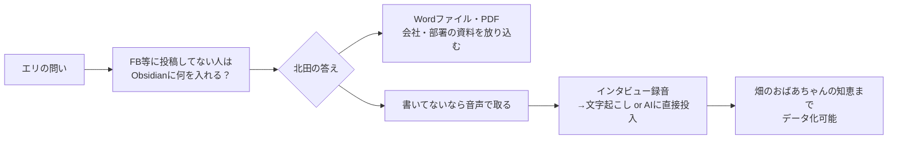

- エリ「FBにあげてない人、じいちゃん達みたいな知識はあるけど書いてない人はどうするんですか？」
- 北田「**音声で取ったらいい**。インタビューして録音、文字起こしorAIに直接投入」
- 「畑のなんかこれよく育つ方法ってなんかどんなことしてんの？」と聞けば、おじいちゃんはうわぁっと喋り出す
- これは後の田原の「**一次データを手元に持つ＝脱植民地化**」と直結する伏線

---

### 1. 大阪研修の即仕事化（北田 チェックイン冒頭）

- 田原さんとの大阪研修が「面白かった」
- **服部さん**が衝撃を受け、その場で「ぜひやってほしい」と声かけ → 即仕事化
- 研修体験が次のクライアントワークへ直結

> 💡 関連: [[project_junion_union_ai_academy]] — 服部圭祐さん主催のユニオンAIアカデミー2026登壇案件と地続き

---

### 2. 田原新著「プラネタリAIによる脱植民地化」（田原 チェックイン＋本論シェア）

> 本日のMTG後半（09:39〜09:45）で田原から詳細解説。**プラネタリーラーニング全体の思想的背骨**となる構想。

#### タイトル変遷と問題意識

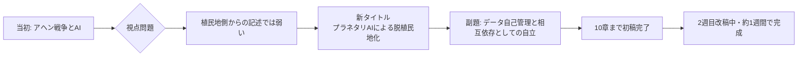

#### 植民地支配の方法論パターン

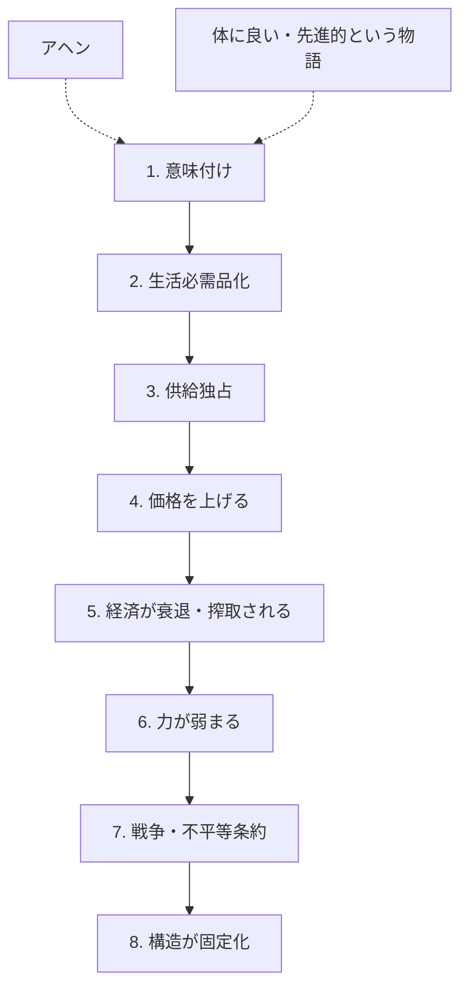

**繰り返されてきた領域：**
- アヘン
- 石油
- 鉄道
- デジタルプラットフォーム
- **クラウドAI帝国主義 ←今ここ**

**今のAI状況：**
- 「AI無しでは業務が成立しない」「使わない企業はもう終わってる」という**意味付けが作られている**
- 企業が特定AI企業に依存 → 値段を上げられて、お金とノウハウを吸い取られる
- 5大AI企業がそれぞれの戦略を展開中

#### 単純な抵抗の限界

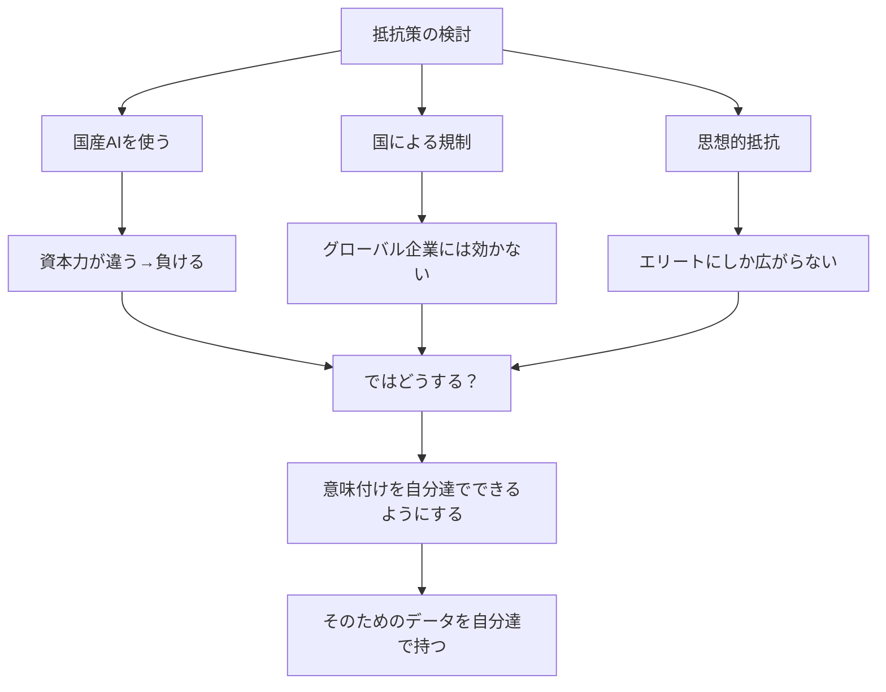

#### 脱植民地化の道：「データを手元に置く」

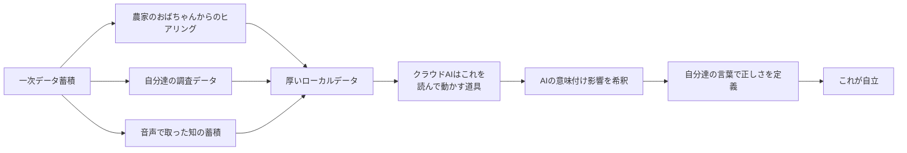

#### 熊谷晋一郎的「自立」の再定義

> 熊谷晋一郎（小児麻痺）の自立論：
> **「自立とは多くの人に依存することだ。依存の仕方を自分たちで選べることが自立なのだ」**

**田原の自伝的例：**
- 予備校講師時代、必ず**3つ以上の予備校で働く**ルールを自分に課した
- 1つだけだとそこの社員化＝従属
- 3つあれば「条件悪いなら止めますから」と交渉できる
- → これがAI×企業との関係にも当てはまる

#### MdWORLDの設計思想：AIは交換可能、データが核

```
   ┌─────────────────────────────────┐
   │      自分のデータ（核）       │
   │   時間をかけて貯めたMD群        │
   └─────────────────────────────────┘
              │
         ┌────┴────────────────────┐
         ▼          ▼          ▼          ▼
      Claude    OpenAI   ローカルLLM   その他
       （交換可能・嫌ならスイッチ可能）
```

> 田原「**MDファイルはなんのAIも読めるんだから、あなた方は交換可能なんですよ**。嫌なら別のやつに切り替えられる。
> ただ、自分のこの貯めてきたデータは**自分の思考の源であり大事なもの**なんです」

#### 結論：教育を脱植民地化の起点に

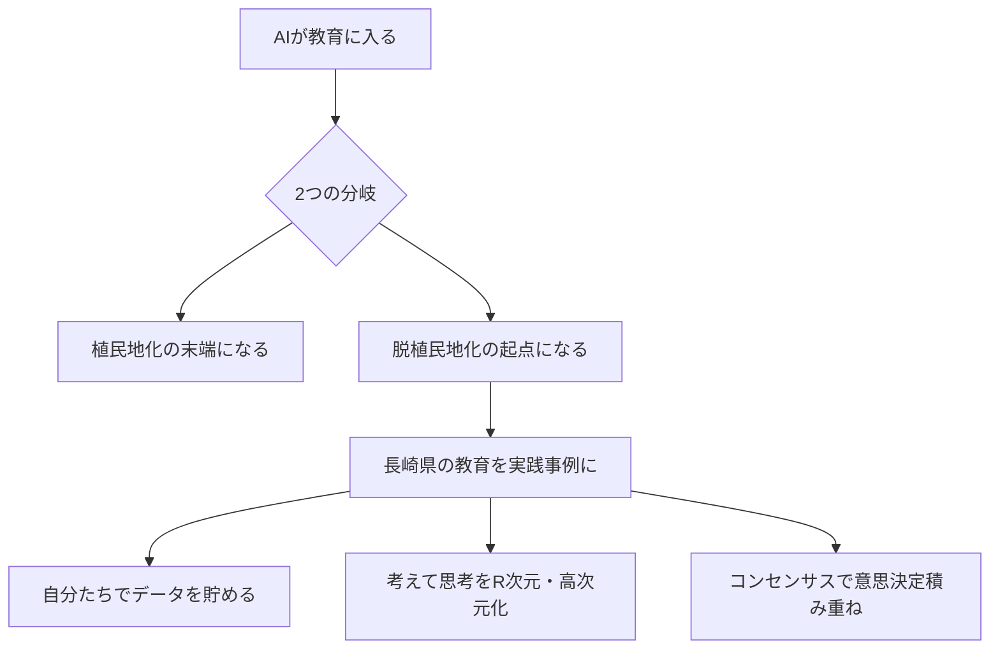

> 田原「**長崎県の教育を脱植民地化の起点にして**、自分たちでデータをためて思考を高次元化していく教育実践の事例にしていけないか」

---

### 3. エリのチェックイン（内藤恵梨 / 長崎）

#### Claude Codeでのスライド作り体験

- 「みなさんよりだいぶ遅れているので頑張ろう」とClaude Codeでスライド作成
- **AIが作ったたたき台からなかなか離れられない**という壁
- たたき台→自分の言葉に直す作業に時間がかかる
- 100%の完成度を目指すとまだまだ、を実感

#### スマート農業の祭典（熊本）

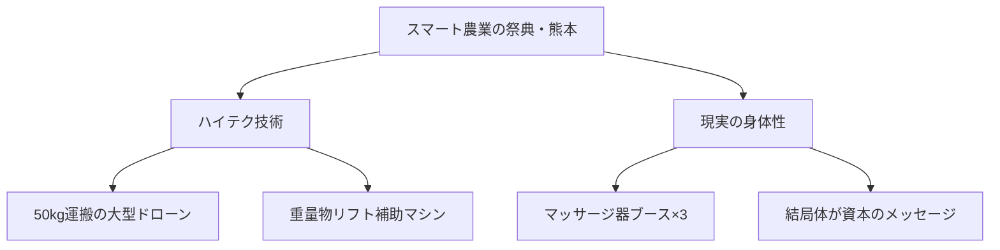

> エリ「これが現実だなぁと帰ってきました」

> 田原「実践がずいぶん進んでますよね」 → エリ「しがみついてます」

---

### 4. 【本日のメインコンテンツ】コンセンサスAI×グランドルール作り 詳細実況

#### 場の設定

- **場所**：ナルバ（地元・京都／**10代の自学自炊コミュニティ**）
- **目的**：火曜なるばで、**みんなが安心して自分らしく自立して過ごすためのグランドルール**を作る
- **手法**：葵小でやっていたグランドルール作りの**AI実装版／コンセンサス型合意形成**

#### 参加者構成とエージェント設計

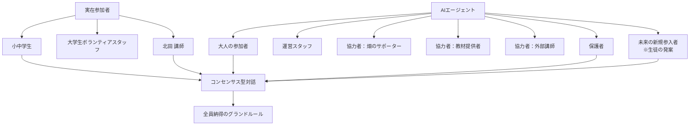

- 当初AIが**「全員10代」と誤認**→北田が背景情報を補足
- 畑で作ったものを食べてから学ぶ毎回のルーティン → 畑サポーターも重要なエージェント
- **「これから新しく入ってくるかもしれない未来の参加者」エージェントは生徒たち自身が提案**

#### プロセス：4回の対話で出てきたニーズ → 10個のたたき台

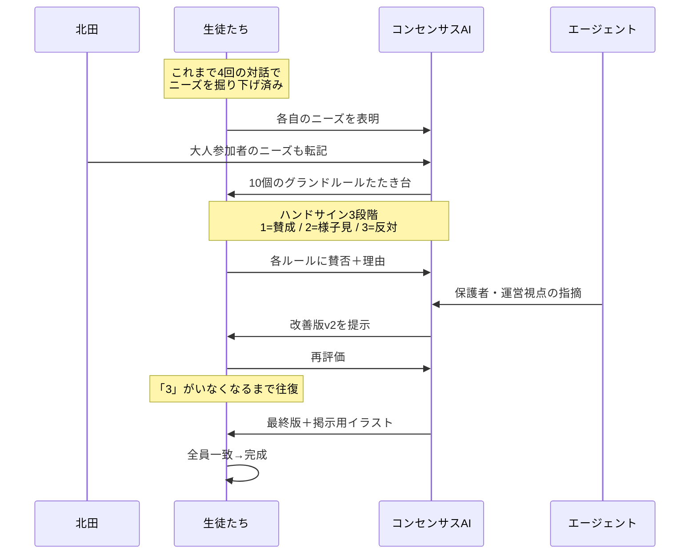

#### ケーススタディ：3を言った子たちが場を引き上げた

| 子ども | 普段の像 | 今回の発言 | 何が起きたか |
|--------|---------|-----------|------------|
| **ヒカリ** | — | 「1」（賛成多め） | スムーズに進行 |
| **コハル** | ハーフ、普段は自分の言葉を言えない | 「3」：「休む＝何でもオッケーになると自分勝手になりそうで良くないんじゃない？」 | 自分の声が初めて場に通った |
| **巡平** | 中学のやんちゃ坊主、魚への愛が強すぎて他人が触るのを許せない、学校で煙たがられる | 「3」：「あの折れない、綺麗事では無理」 | スイッチが入り、次は他の子の代弁者に |
| **北田**（あえて） | — | 「3」：「これできたらルールなんかいらねーんだよ」 | 綺麗事で終わらせないスパイス |

#### 巡平の覚醒シーン

> 「休憩するときは必ず大人に伝えること」というルールに対して
> → **「本当に休みたい人は休みたくても休めなくなる人がいるわけやん。そこが問題なわけやねん」**と熱く語り出した

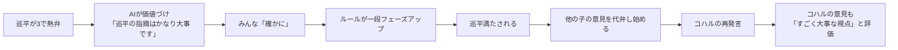

#### AIチューターの核心的役割

- AIが**コハル・巡平を「ぎゅっと持ち上げる」**
- 「休むことを認めたいけど、伝えること自体が負担になる人もいる」と巡平の言いたいことをサポート＆価値づけ
- 普段意見を言えないコハルの意見も「すごく大事な視点」と評価
- → **声の小さい子・尖った子のロジックが場に通る回路**ができる

#### 「離脱者ゼロ」という発見

> ❗ ここが今日の最大の収穫

```
【普通の学校での意思決定】
意見が分かれる
  ↓
決まってる子は「もうええやん」
  ↓
反対し続ける子は「場を乱してる」扱い
  ↓
学級委員型の子が抽象キーワードでまとめる
  ↓
時間切れで決定
  ↓
誰も満たされない／反対意見は消える

【今回のコンセンサスAI】
自分の意見が反映される実感
  ↓
他人の意見も取り上げてさらに良くなる感覚を共有
  ↓
誰も「もうええやん」と離脱しない
  ↓
全員が場に居続ける
```

#### 着地：7つのルール＋掲示用イラスト

- 「やってみないとわからない（2）」の声を受けて
- **「やってみて合わなければ見直す／困るという声を大切にする」がルール7**として追加
- エージェント含め全員「3」がゼロに → **全員コンセンサス到達**
- 女の子の「可愛くしてほしい」リクエストで**掲示用イラスト化**まで一気通貫
- 完成物：**7つのルール＋個別の確認リスト＋休憩スペースについて**

---

### 5. 田原の意味づけ：「教育の場のOSに入れたい」

> 田原「これいいよね。教育の場のOSに入れたいよね、ものを考えるように、決めるときに」

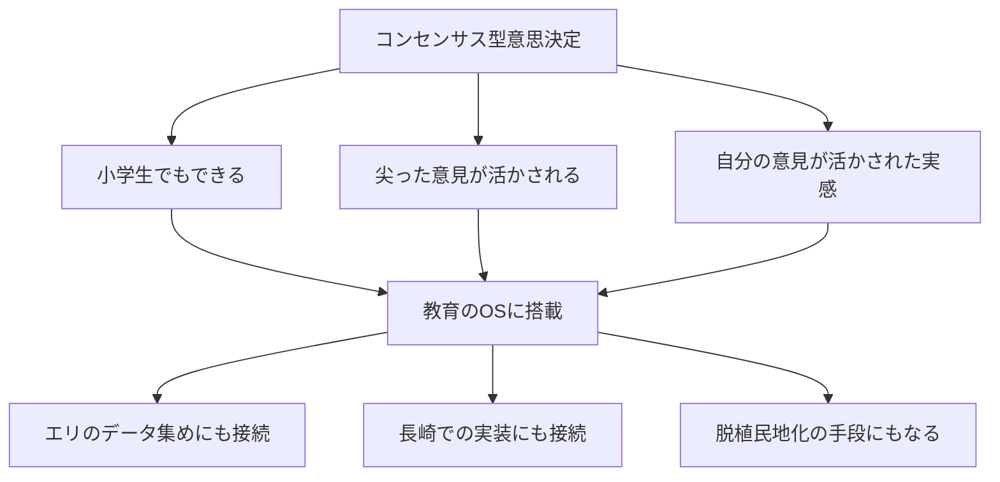

> あっちゃん「自分の意見は活かされるみたいな感じになる」
> 田原「尖った意見がちゃんと活かされるからね」

---

### 6. タキのチェックイン：ユースタン×大人の思考アップデートプログラム

> 09:30時点：市役所の駐車場から参加。10時から市長とユースタンについてブレスト予定

#### 問題意識

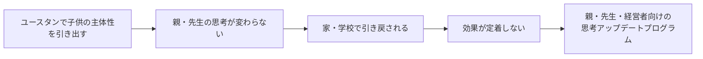

- 子供たちの主体性を引き出しても、**親・先生の思考が変わらないと引き戻される**
- 重く感じさせず「**一緒にアップデート脳みそしようぜ**」ノリで企画

#### プログラム構成（4回シリーズ）

| 回 | テーマ | 登壇者 | 日程 |
|----|--------|--------|------|
| 1 | オープニング（教育関係者向け） | **工藤勇一**先生＋長崎の探究関係者・元校長のパネル | **9月5日・6日** 確定 |
| 2 | 不登校支援×働く体験 | 元吉本・**東野さん**（北海道・石垣・大阪で施設運営） | 未定 |
| 3 | EQ ワークショップ | EQスペシャリスト（保護者・子ども両対応） | 未定 |
| 4 | 経営者向け | **窓・堺さん**＋日立**ハピネスプラネット**（タキがエンゲージメントアーキテクトでサポート） | 未定 |

#### 工藤勇一先生の評価

- ユースタンの計画を送ったらすぐ返信
- 「**民間でここまでの形でやっているケースは全国で初めて聞きました**」
- 「もう手伝います」と確約 → 9/5・6 確定

#### 4回目の狙い

- 人材育成のパラダイムシフト時代に、**経営者の固定観念をどう取っ払うか**
- AI（ハピネスプラネット）と組織エンゲージメント（窓）の両輪で語ってもらう

> タキ「自分の中の考えがまとまってすっきりしてる朝です」

---

### 7. 田原 → タキへのコンセンサスAI解説と長崎展開構想

#### コンセンサス型意思決定の系譜

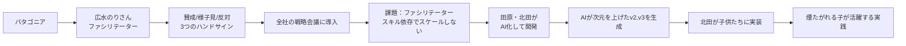

#### 原理の違い

- **声の大きい人の意見**ではなく、**変わった視点の人が「No」と言えば決まらない**
- その人の意見を含めて「Yes」になるにはどうしたらいいか、を**お互いに学び合う**
- これが意思決定の原理として違う
- ただしファシリテータースキル依存でスケールしない問題
- → **AIに賛否と理由を入れるとAIが次元を上げたv2, v3を作る**

#### 長崎・教育現場での展開構想

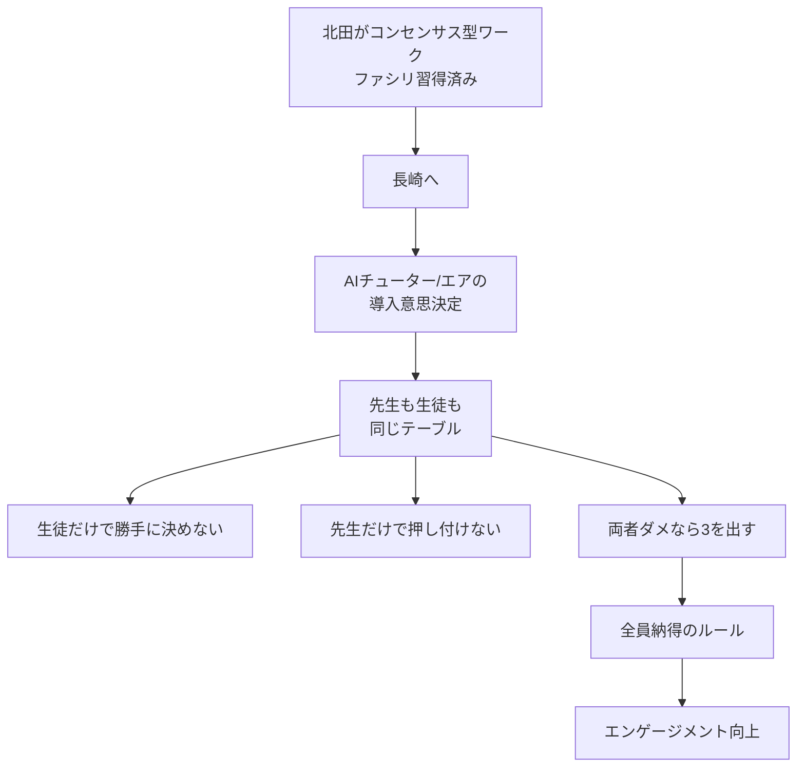

> 田原「**北田が長崎に行って、コンセンサス型のワークをやってくれればいいんじゃないかな**と思ってます」

---

### 8. チェックアウト

#### 北田朋也（09:46〜）

> ❝ 一個のところに属していると全部そこに握られている感じになる ❞

- ブロックチェーン・**Web3への関わり**との接続：中央集権から離れて個人で立つ思想
- 「AI界隈もそれに近くなってきてる」感覚
- **自分のパーソナリティを他者に委ねない**ことが教育界では特に重要に
- **Obsidianなどローカルで何を持つか／どこまでAIに触らせるかの設計**が重要に
- > 「今、おそらく社会がこれから打ち当たっていくところを最先端で見てるんやろうな」
- 「MdWORLDが早くもアップデートしてしまった」と冗談を交えつつ、**紙ではなく Web/GitHub などで随時更新する形**を提案

#### atsuko ihara（09:48〜）

> ❝ 人間の素晴らしさと怖さをすごい感じる ❞

- 本当に意味付けというか、自分の中でもいっぱい気づかないようなものがある
- それによって**良いこともあれば、怖いこともある**
- 「**体の震えが止まらない内容です**」

#### ELLY NAITO（09:49〜）：自衛官時代のWinny記憶

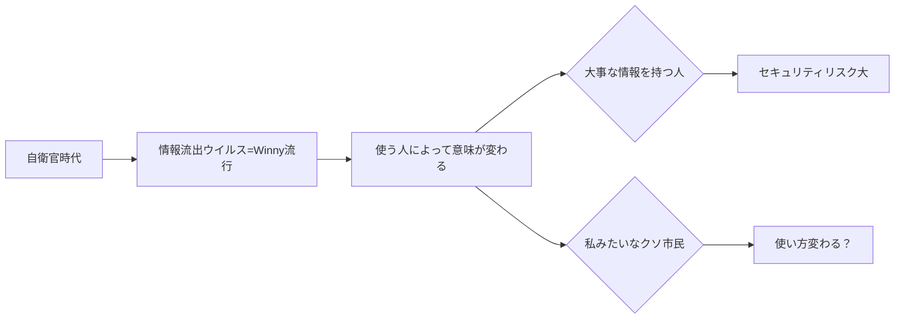

- 田原応答：
  - セキュリティ重要だが、一方で**考えるためには素材を貯める必要**がある
  - 北沢さんの例（音声でノウハウを貯める）のように**一次データの蓄積**こそが大事
- > 田原「Winnyの開発者は国家に殺された的なところもあるしね」

#### 田原のクロージング

> ❝ 6月のどっかのタイミングでまたスイッチ入ると思いますんで。
> はい、それに向けてちょっと皆さん、じわじわと心の準備をしていきましょう。 ❞

---

## アクションアイテム

| 担当 | アクション | 期限・備考 |
|------|-----------|-----------|
| 田原 | 新著「プラネタリAIによる脱植民地化」完成 → メンバーに送付 | 約1週間後 |
| 田原 | 広水のりさんへ「のりさん原理→AI化→子供実践」のストーリー紹介 | MTG後 |
| 田原 | 6月どこかで次のスイッチを入れる→メンバーは心の準備を | 6月中 |
| 北田 | コンセンサスAIワークのナルバ実践ログを場で共有 | チェックイン後 |
| 北田 | のりさん経由で実装ストーリーを共有 | 紹介後 |
| 北田 | **長崎でコンセンサス型ワーク実施**（先生・生徒合同でのAI導入合意形成） | 田原構想・タイミング調整 |
| エリ | 音声インタビューで地域知のローカルデータ化を試す | 並行 |
| エリ | Claude Codeスライドの自分の言葉化を継続 | 並行 |
| タキ | ユースタン×大人の思考アップデートプログラム継続企画 | 9/5・6に工藤先生回 |
| 全員 | 「教育の場のOS」としてコンセンサスAIを各現場で活用検討 | 田原提案 |
| 全員 | 「データを手元に置く＝脱植民地化」の視点で各実践を再点検 | 思想的背骨 |

---

## キーインサイト（北田視点・場の総括）

### 本MTGで現れた3つの軸の重なり

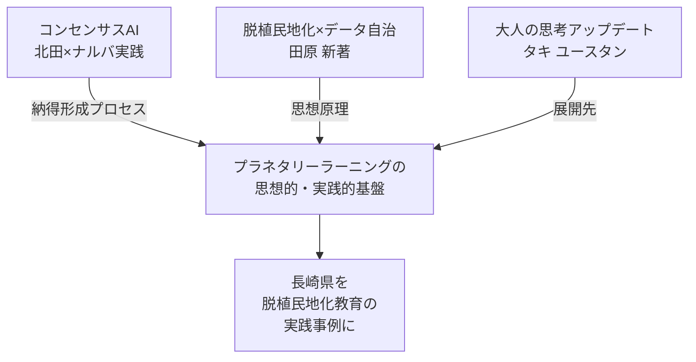

- **3つのトピックが偶然並走したのではなく、同じ問題意識の異なる切り口**であることが場で見えてきた
- コンセンサスAI＝「弱者の声＝一次データ」を統合する技術
- 脱植民地化＝「一次データを手元に置き、AIは交換可能ツールとして使う」原理
- ユースタン＝「大人の固定観念を脱植民地化する」教育プログラム

### 「離脱者ゼロ」の発見が全体を貫く

普通の学校・組織で起きる**意見離脱**は、本質的には**意味付け権限の植民地化**と同型。
コンセンサスAIは、**全員の意味付けを場に残す**ことで離脱を止めた。
これは田原の「**自分達で意味付ける**＝脱植民地化」と完全に呼応する。

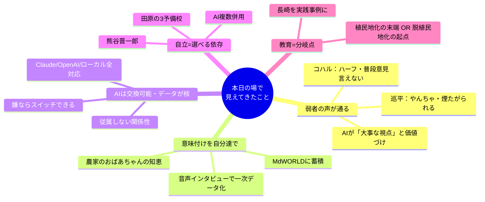

---

## 補足

- 本MTGは**プラネタリーラーニングの思想と実践が一気通貫した記念回**として記録される
- 田原の新著は完成次第、本Vault内に書籍ノートを作成予定
- ユースタン関連は別プロジェクトノートでの管理を検討
- 9月5日・6日（工藤勇一先生回）は要カレンダー反映
