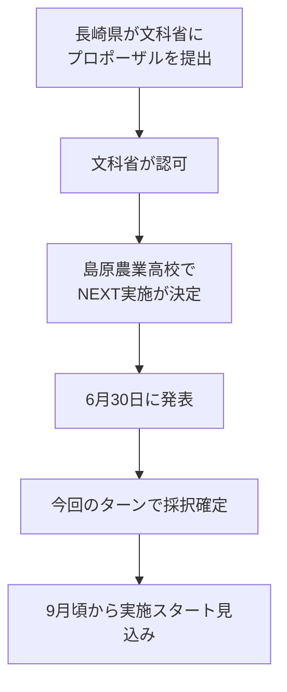
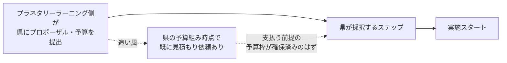

---
tags:
  - プラネタリーラーニング
  - AI×教育
  - 会議録
created: 2026-07-02
updated: 2026-07-02
---

# プラネタリーラーニング運営MTG 2026-07-02 レポート【生成中】

## 概要

| 項目 | 内容 |
|------|------|
| 日時 | 2026年7月2日（木）09:02〜（進行中） |
| 形式 | Zoom オンライン |
| ダイアログFacilitator | 田原真人 |
| テーマ | NEXT採択の正式報告（長崎県・島原農業高校）と今後のステップ |

### 参加者（09:05時点）

| 名前 | 役割・拠点 |
|------|-----------|
| 田原真人 | プロジェクトリーダー |
| 北田朋也 | コーディネーター・関西担当（京都／KAEL） |
| ELLY NAITO（エリ／内藤恵梨） | 発酵食店オーナー（長崎） |
| Noriko Takemoto | 今回参加（普段この時間帯は仕事で参加できず、今回初めて合流） |

---

## 全体の流れ

| 時刻 | セクション | 内容 |
|------|-----------|------|
| 09:02〜 | 開始前の雑談 | 北田の東京出張／エリのトライアスロン話 |
| 09:03〜 | 採択の祝福 | エリ「採択って良かったですね」／グループLINEで紹介のあった吉村さん（ピーちゃん）の話題 |
| 09:04〜 | Takemotoさん合流 | 「やっとこの時間入りました」 |
| 09:04〜 | 田原 ステータス報告 | **NEXT採択の経緯と今後のステップ**（録画開始） |

---

## 主要トピック

### 1. NEXT採択の正式ステータス（田原報告）

前回MTG（6/4）で田原が語った「**長崎県の教育を脱植民地化の起点に**」という構想が、正式な採択という形で動き出した。

#### 今後のステップ：県との契約プロセス

- 県の予算組みの段階で「見積もりを出してくれ」という話が既にあった → **こちらに支払うつもりで予算が取られているはず**
- 県とやり取りしながら「すんなり決まっていくだろう」という見通し

#### 未確定・確認事項

- 長崎県のホームページには、まだこのプロポーザル（採択結果）が**掲載されていない**（エリ・田原とも未確認）
- **教育長や広田さんに聞きながら**進めていく

---

### 2. 開始前の雑談・チェックイン的やりとり

- 北田：先日**東京に呼ばれて**行ってきた
- エリ：東京方面には山の用事で行くことがある／**トライアスロン**もやっている（田原「トライアスロンの数いましたよ」）
- エリ→田原「とりあえずなんか**採択って良かったですね**」、北田「名前載っててよかった」
- グループLINEで紹介されていたのは**吉村さん（ピーちゃん）**（田原）
- Noriko Takemotoさんが合流：「たまたまここに仕事がずっと入ってた。やっとこの時間入りました」

---

## アクションアイテム（09:05時点）

| 担当 | アクション | 期限・備考 |
|------|-----------|-----------|
| 田原 | 長崎県HPのプロポーザル掲載状況を教育長・広田さんに確認 | 進行中 |
| プラネタリーラーニング側 | 県へのプロポーザル・予算（見積もり）提出 | 県の採択ステップに向けて |
| 全員 | 9月実施スタートを見据えた準備 | 見込みスケジュール |
