---
tags:
  - プラネタリーラーニング
  - AI×教育
  - 会議録
created: 2026-07-02
updated: 2026-07-02
---

# プラネタリーラーニング運営MTG 2026-07-02 レポート【最終版】

## 概要

| 項目 | 内容 |
|------|------|
| 日時 | 2026年7月2日（木）09:02〜10:01（約59分） |
| 形式 | Zoom オンライン |
| ダイアログFacilitator | 田原真人 |
| テーマ | ①NEXT採択の正式報告（長崎県・島原農業高校）／②FAJ万博イベントのAI統合実践／③プロジェクトファシリテーション戦略 |

### 参加者

| 名前 | 役割・拠点 |
|------|-----------|
| 田原真人 | プロジェクトリーダー |
| 北田朋也 | コーディネーター・関西担当（京都／KAEL） |
| ELLY NAITO（エリ／内藤恵梨） | 発酵食店オーナー（長崎）・島原現地の窓口 |
| Noriko Takemoto（ピーちゃん／竹本紀子） | **今回初参加**。**日本ファシリテーション協会（FAJ）前会長**。フリーランス／企業研修（ダイバーシティ）・大学講師（キャリアデザイン／ファシリテーション入門） |
| あっちゃん（伊原淳子／茨城） | 焚き火場担当（09:18頃から発言） |
| 野邉さん（みなもラボ） | 島出身・地方×AIの実践者（09:40頃合流） |

---

## 全体の流れ

| 時刻 | セクション | 内容 |
|------|-----------|------|
| 09:02〜 | 雑談・チェックイン | 北田の東京出張／エリのトライアスロン／採択の祝福 |
| 09:04〜 | 田原 ステータス報告 | NEXT採択の経緯（長崎県→文科省認可→島原農業高校・9月開始見込み） |
| 09:05〜 | 論点整理 | 追加要素の予算・島原農業へのアクセス可否 |
| 09:07〜 | 長崎県HP確認 | 「ネクスト長崎人材育成事業」はマイスターHS成果報告書と判明 |
| 09:10〜 | 現場の不安 | 「生殺し状態」・エリが現地窓口・7/18前に伝言 |
| 09:14〜 | 島原訪問計画 | 7/22〜24の日程具体化・広田さん同行・見学セッティング |
| 09:19〜 | ピーちゃん自己紹介 | FAJ前会長・万博×いのち会議×FAJ全国イベント報告 |
| 09:27〜 | 田原 実演 | AI統合ワークフロー（Drive×MCP→KJ法→統合文脈→HTML） |
| 09:36〜 | 応用構想 | フューチャーデザインを島原キックオフに |
| 09:37〜 | エリ自己紹介 | 元海上自衛官・食料自給率×もったいない・高校生ゼミ6年目 |
| 09:40〜 | 野邉さん合流 | 島×AIの親和性／AIクオリティコントロール質疑 |
| 09:47〜 | 戦略 | 「プロジェクトファシリテーション」ロールの旗取り・長尾教育長 |
| 09:49〜 | あっちゃん | 霞ヶ浦・未来共創WS／出会いの価値 |
| 09:52〜 | 予算・時期整理 | 18億円・4本柱・チーム提案は約2億円・9月開始想定 |
| 09:55〜 | 北田 提案 | 先行事例リサーチ＋自動リサーチエージェント構築 |
| 09:58〜 | エリ 現場の声 | 漠然とした不安・理想論への拒否感 |
| 09:59〜 | 田原 総括 | 現場×2040年逆算をつなぐ「ウルトラC」・信用が先 |
| 10:01 | クロージング | 「来週には急展開の可能性。体調を整えて」 |

---

## 主要トピック

### 1. NEXT採択の正式ステータス（田原報告）

前回MTG（6/4）で田原が語った「**長崎県の教育を脱植民地化の起点に**」という構想が、正式な採択という形で動き出した。

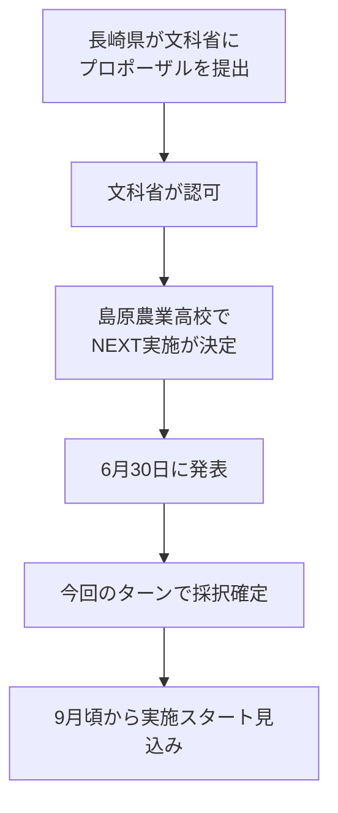

#### 今後のステップ：県との契約プロセス

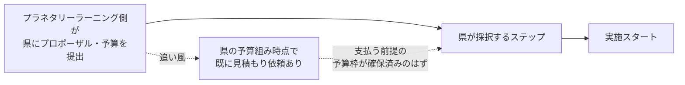

- 県の予算組みの段階で「見積もりを出してくれ」という話が既にあった → **こちらに支払うつもりで予算が取られているはず**
- 県とやり取りしながら「すんなり決まっていくだろう」という見通し

#### 未確定・確認事項

- 長崎県のホームページには、まだこのプロポーザル（採択結果）が**掲載されていない**（エリ・田原とも未確認）
- **教育長や広田さんに聞きながら**進めていく

---

### 2. 開始前の雑談・チェックイン的やりとり

- 北田：先日**東京に呼ばれて**行ってきた
- エリ：東京方面には山の用事で行くことがある／**トライアスロン**もやっている（田原「トライアスロンの数いましたよ」）
- エリ→田原「とりあえずなんか**採択って良かったですね**」、北田「名前載っててよかった」
- グループLINEで紹介されていたのは**吉村さん（長崎に精通しているコンサル）**
- Noriko Takemotoさん（ピーちゃん）が合流：「たまたまここに仕事がずっと入ってた。やっとこの時間入りました」

---

### 3. 追加要素の予算と島原訪問計画

- エリさんの紹介で「アーバンリーグ」（要確認）を見に行った。**これをプログラムに追加する場合、県予算には多分含まれていない**。ただし予算には余剰もあるはずで、**どういうコミュニケーションを取りながら追加していくか**を広田さんと相談する必要がある
- **7月22〜24日頃、田原が熊本→島原へ**。その段階で島原農業高校にアクセスできるかは**教育長に聞かないとわからない**
- アクセスできない場合は、島原の状況やエリさんの店（今日の背景に映っている場所）などを見て回る形になる

### 4. 長崎県HPの「NEXT」掲載をその場で確認 → 別事業の成果報告書と判明

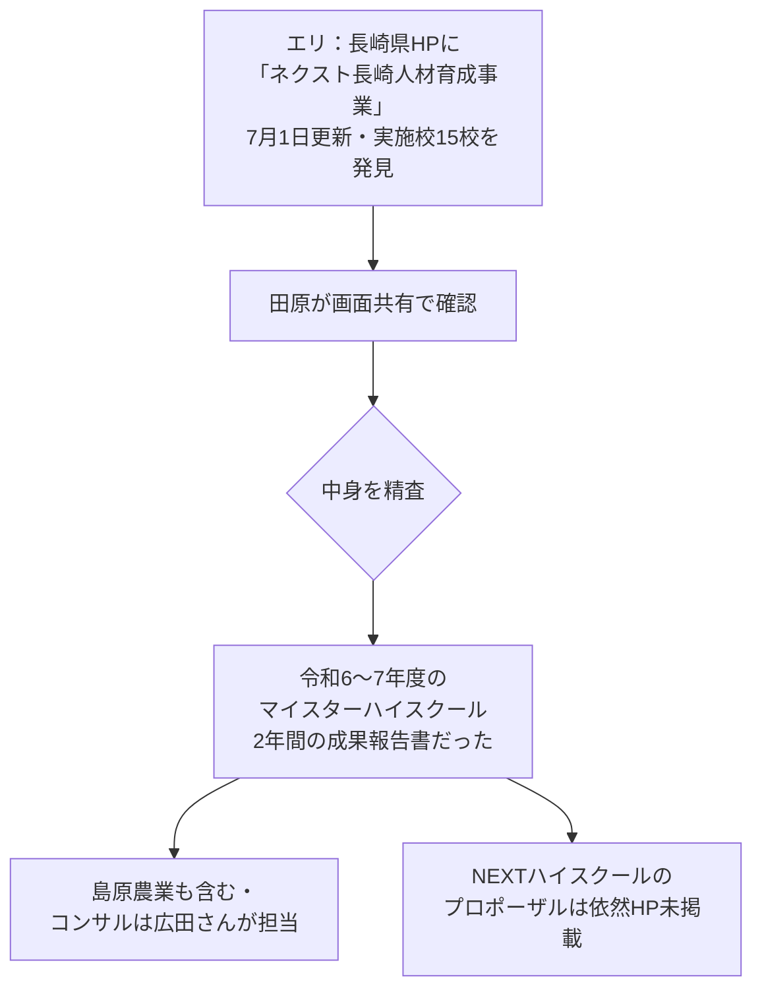

- マイスターハイスクールは**NEXTハイスクールの一つ前のプログラム**（より小さい予算）
- 田原「なまじ『ネクスト』とかつけてるからややこしい」
- エリ「色々なお金が流れてるんですね」→ 田原「僕もこういうお金を使うやり方はやってきてないので今回勉強してます」

### 5. 現場（島原農業の先生たち）の不安にどう応えるか

> 本パートの核心。**採択は決まったが現場との対話はまだ始められない**、という過渡期特有の問題。

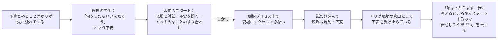

- 田原「スタートするには、**現状の話を聞いて、現場のチームビルディングからじっくり行かなくちゃいけない**。でも今は現場にアクセスしちゃいけない状況だから、始まらない・決められない」
- 田原「**『決まったらまず一緒に考えるところからスタートするので安心してください』という話しか今のところできない**」→ エリ「言っときましょうかね」→ 田原「それが伝わってるだけでも全然違う」
- エリの現地での役割：**「知ってる顔」「不安だよと言える相手」としての窓口**。「末端の先生たちまで不安になってた。そりゃそうよねって」
- **7月18日に島原農業高校のオープンスクール**があり、エリはその前に学校へ行く機会がある → 先生たちにメッセージを伝えるチャンス

### 6. 現場の「生殺し状態」（前パートの続き）

> 田原「**学校をゼロから一気に再発明します。そしてなかなかやりません。中身はまだ言えません。みたいなことを生殺し状態で、もう7月まで来てるわけだから**」

- エリは先生たちから「不安なんだけど」と**言われ続けている**。「悪いことにはならないですから」と言うしかない状態
- 他の学校の関係者も「ええ？」という反応で混乱している

### 7. 島原訪問（7/22〜24）の具体スケジュールが確定

| 日 | 田原 | 広田さん | エリ |
|----|------|---------|------|
| 7/22 | 熊本で研修 → 熊本泊 | （田原と一緒に熊本の教育委員会へ） | — |
| 7/23 | 午前：熊本で用事／午後：フェリーで島原入り（15時頃着が目安） | 23日に島原入り | 案内・アテンド開始 |
| 7/24 | 朝から終日島原 → 夜帰路（大村空港） | 九州の別件へ移動 | **終日アテンド**・島原農業高校見学セッティング・長崎市内の店＆観光案内 → 空港へ送る |

- **島原農業高校の見学は「NEXTの視察」としてではなく「エリさんの知り合いの見学」という形**でセッティング（採択プロセス中で現場に公式アクセスできないため）。田原「低い解像度でもいいから、とにかく現場を見られる感じになるからいいよね」
- エリ「とにかく皆さん、**運動靴履いてきてください**」
- 熊本→島原はフェリー移動。**何時の便かを早めに決める**のが宿題
- **広田さんの人物像**：長崎県教育委員会からも信頼されているコンサル。マイスターハイスクールで島原農業高校もサポートしていた → 島原農業とのパイプ役
- **あっちゃん（伊原淳子）も「私も行きたい」→ 参加調整中**。エリ「車7人乗れますよ。案内します。飛行機も最後大村（空港）に送っていくので安心してください」
- エリの店は長崎市内（島原から50km超）。「6次産業のサイクルをしている小さい店」で、観光を含めて案内予定
- 田原「長崎とか島原とか、遠いとみんな近くにあるんじゃないかって勝手に思っちゃう」→ 現地の距離感はエリ頼み

### 8. ピーちゃん（Noriko Takemotoさん）初参加・自己紹介

- **「ピーちゃん」の由来**：ミュージカル女優を目指していた頃、「ピート」という男役を演じて「ピート」→「ピーちゃん」に
- **仕事**（フリーランス）：
  - 企業研修：ダイバーシティ・多様な人材をどう生かすか
  - 大学講師：「キャリアデザイン」（キャリアから人生を見る）＋「ファシリテーション入門」
  - ファシリテーションをずっと探究。地域連携の仕事にも呼ばれる
- **日本ファシリテーション協会（FAJ）** 所属：全国約1,000人の会員を持つNPO、21年目

#### 万博×いのち会議×FAJ 全国イベント（先週末・田原も協力）

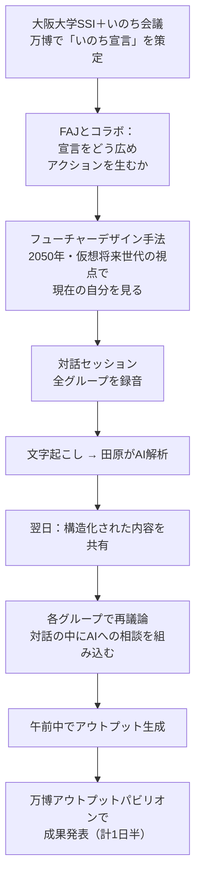

- 「近い未来・すぐ出る結果」にとらわれず、**長期視点・広い視野**で見る工夫としてフューチャーデザイン（大学発の研究手法）を導入
- **田原「ああいうAIの使い方は、このネクストハイスクールでやろうとしていることと重なる」**→ ピーちゃんにその話の共有をリクエスト

### 9. FAJイベントの成果：AIが対話の視野を広げた

- ピーちゃん：形にできたこと以上に、**プロセスの中でAIから得られた知見によって、参加者が「目の前の自分の興味関心」だけでなく、未来志向で周りの課題も含めた視野で話し合えた**ことへの反応が良かった

### 10. 田原のAI統合ワークフロー実演（画面共有）

北田の質問「大人数・多グループの統合をやってみて、統合の質や反映度合いはどうだったか？」への回答として、田原が実物を画面共有しながら解説。

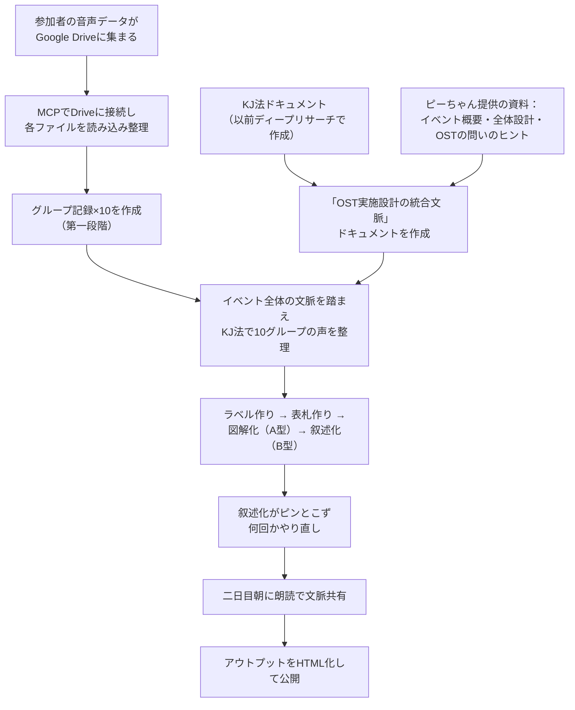

- **ポイント：ファシリテーションは機械的にできない**。「単にKJ法で機械的にまとめればいいのではなく、イベントの背景を踏まえる必要がある」→ 背景を整理したドキュメントを**並行して**作りながら統合した
- 実際の作業はハード：「懇親会も30分で切り上げてコツコツやって、夜疲れて早起きして6時からまたやって、ギリギリ9時に間に合いました」
- ピーちゃん側も画面共有：**全グループのアウトプット＋田原作成分＋参加者作成分＋動画まで全部まとまったWebページ**が完成している

### 11. 島原農業高校キックオフへの応用構想：フューチャーデザイン

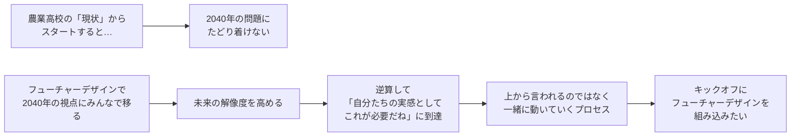

- 田原「そういう意味でフューチャーデザイン的なことが**キックオフのところで入れられたらいいなというイメージがすごく湧いた**。このプログラムに向けてもすごい良いヒントがいっぱいあった」
- 09:34〜：エージェント活用の構想へ——「フューチャーデザインの話し合いをAIでやるとき、さっきのKJ法のアウトプットをドキュメントで渡して文脈を渡した上で…」（→ トピック12へ続く）

---

### 12. FAJイベントの締め：エージェント×フューチャーデザインと「カンファレンスの新しい形」

- 田原：AIとの話し合いに**「未来くん」（2050年に20歳になるエージェント）を各グループで必要に応じて立てる**ことも組み込んでいた
- ピーちゃん：全グループのアウトプットがWeb上に集まり「**まさにここでパビリオンが形成される**」。昨日夜もみんなで集まって作業していた
- 田原「こういうアウトプットにつながる**カンファレンスの新しい形**がだいぶ見えた」／ピーちゃん「**大実験でした**」

### 13. NEXT長崎の構造的課題：採択グループは複数・横の関係が見えない

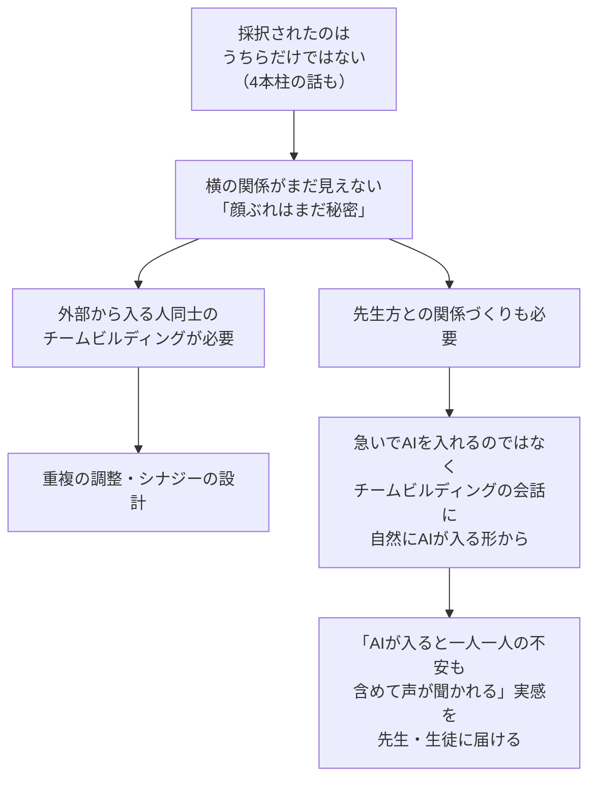

- 田原「本来だったら**我々も不安になる資格があるぐらいの状況**。だってわかんないんだもん、他のところ」
- 「ここは丁寧に時間をかけた方が結局はうまくいく」——FAJイベントのように、声が集められ聞かれる実感から入らないと動かない予感

### 14. エリの自己紹介（ピーちゃん・野邉さん向け）：徹底した現場主義

- **元海上自衛官**。魚雷を扱う部署・補給艦など最前線で「**水と食べ物と油の大事さを18歳から叩き込まれた**」
- 現在の会社：**日本の食料自給率を上げる・もったいないものを生かす**。「ふわっとした理想論ではなく、目の前のことを現場で片付ける」
- 捨てるものをお金に変える、食べられないものを食べられるようにする——**高校生とのゼミ活動で通算6年目**。山・林業も対象
- 田原「そこがいないと現実は動かない。うちのチームには現場に強力なエリさんがいる。ただ**全てをエリさんのパワーで解決できる規模のプロジェクトでもない**ので、予算で現場で動ける人を増やすことも含めて考える」

### 15. 野邉さん（みなもラボ）合流：「島のもやもや感はAIと親和性がある」

- 島出身。「未来の視点に立って考えたいが、**お尻と背中はもうヒリヒリ状態**」で板挟み——それでも田原・北田がAIを重ねて拡張していくのを見て「**島や地方のもやもや感はAIと親和性があるし、爆発力を生む**」と日々実践中
- 野邉さんの質問「イベントで時間がかかったのは、規模のせいか、フューチャーデザイン導入のフェーズが多かったからか？」

#### 田原の回答：AIのクオリティコントロール論

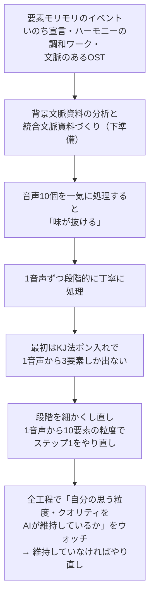

> 田原「**プロセスのクオリティコントロールは、プロセスがちゃんと分かってる人じゃないとできない。意外とAIに任せっきりにできないんだよね**」

- ピーちゃんの補足：「**田原さんにデータを渡すときも、実は全部整理してから渡してる**」——前処理の丁寧さが土台
- ピーちゃん「グループ間の差がすごく出た。**その差はAIの使い方とファシリテーターの関わり方の違い**。今回ファシリテーターめっちゃ必要やなってみんな実感してます」
- 野邉さんの受け止め：背景・文脈がAIに渡っていないと「**上滑り感**」が出て「自分たちの土地に関係ないもの」になる。島原農業も土地の文脈が交差し、複数グループが入ってさらに絡まる → **文脈作りを丁寧にやる必要がある**。「エリさんが現場で漏れた文脈を拾え、ファシリの面も揃っている。どっちも丁寧に扱えるのがこのチームの強み」

### 16. 戦略：「プロジェクトファシリテーション」ロールを旗取りに行く

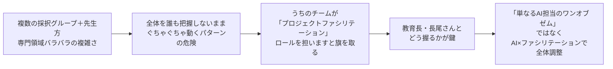

- チームの布陣がロールを裏付ける：**ピーちゃん＝日本ファシリテーション協会 前会長**／**田原＝デジタルファシリテーション研究所**——「ファシリテーターというロールを持っているからこそ」
- 田原「専門領域の違う人たちの情報を統合しながらプロジェクト全体をうまくいくようにするロールは、**多分AIもないとなかなか難しいぐらいの複雑さ**」
- **教育長の名前は長尾さん**。「長尾さんが『そこをうちらによろしく』と言ってくれると、プロジェクト全体がうまくいく可能性が高まる」
- 野邉「その方が現場の先生も安心。『全体どうなってるの？』に答えられる人がいる方がいい」

---

### 17. あっちゃんのチェックイン：霞ヶ浦の「未来共創ワークショップ」と出会いの価値

- ピーちゃんの実践報告を「すごい楽しそう。自分ごとに引っ張り込んで聞いちゃった」
- 地元・かすみがうら市の市役所から「**未来共創ワークショップに出ませんか**」と誘いがあった。外部の会社に業務委託されたらしく、全2回。AIを使うのかは不明
- 去年8月にはあっちゃんのカフェで田原チームのメンバーがワークをやった経緯もあり、「違うところにお誘いが行っちゃう寂しさ」も少し
- ただし市役所開催の場は「市役所はその後何も握らないけど、**そこで出会った住民同士がつながって、そこからいろいろやっていける**」——**出会いの価値**として楽しみにしている
- NEXTについては「学校でどうやっていくかはまだ全くイメージできないけど、**全体をファシリテーションするチームでそれぞれの役割が生かされてつながり、今は想像できない何かが生まれたら面白い**。そこに関われる期待と喜びが湧きつつある」

### 18. スケジュールと予算の整理（あっちゃんの質問への田原回答）

> あっちゃん「これって来年からスタートでしたっけ？」→ 田原「**今年**」

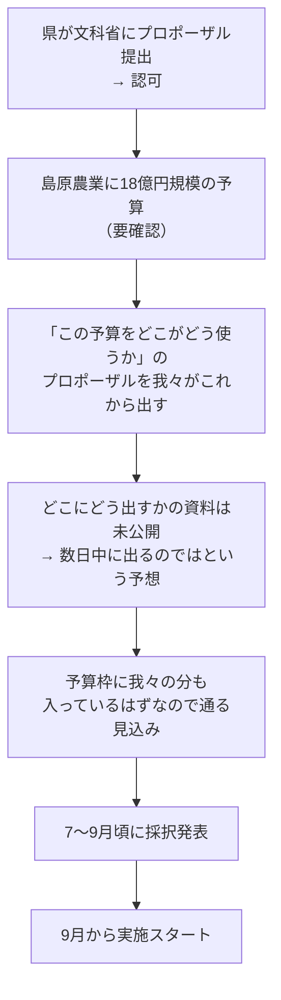

- **「現場にアクセスするな」の壁は実体験済み**：田原が6月に「長崎に行って現場のヒアリングとかできないんですか？」と聞いたら「**そういうあれなんでやらないでください**」と言われた
- ただし**エリさんが以前から別件で現場に入っている**ため、うちのチームだけはエリさん経由で様子を聞けている
- 他のグループは「本当に全然（現場を）知らない中で予算だけ積み上げて『これあります』とそれぞれ言っている」→ **蓋を開けたらびっくり、になるんじゃないか**（田原）
- 島原農業の先生は「やるやる言いながら中身が明かされないまま9月まで引っ張られている。**蛇の生殺し**みたいな状況。当然不安だよね」

---

### 19. 4本柱とAI枠、予算規模の確定（09:54〜）

- 教育長は**4本柱**でプロジェクトを構想しており、「そのうちの1本『AI』の柱を田原さんたちにお願いしたい」という**チラ見せ**は来ている（具体的な指名はまだ）
- 予算規模：**島原農業に来ているお金は18億円**。**チームが出した提案額はせいぜい2億円**

### 20. 北田の提案：先行事例リサーチ＋自動リサーチエージェント（09:55〜）

- 北田の整理：今回は**NEXT第3期**。第1期は希望校なし、第2期は数校が**先行実施**中（国・県主導の"デキレース"的スタート）。第3期で一気に全国に採択校が広がった
- **先行実施校の事例（進め方・タイムスケジュール）をリサーチする必要がある** → 田原「北田さん、そこ良かったらお願いします」→ 北田「リサーチします」
- さらに：**第3期採択校のリストを作り、各校の動きを随時チェックする自動リサーチエージェントを構築** → NEXTハイスクール動向レポートを**プラネタリーのグループに随時流す**
- 田原「スタートってなったら1〜2週間めっちゃ忙しくなる気もする。**でも今はまだ何もできない**」

### 21. エリの現場リアリティと田原の総括：「ウルトラC」（09:58〜）

- 田原の依頼：エリさんが現場で受け止めている不安を、別の時間で聞かせてもらうか、書き溜めてもらう。「**そこでの対応が特に最初、一番大事になってくる**」
- エリの現場の声：
  - 「みんな**漠然とした不安**。できるのかな？現場の先生たちは今以上に仕事が増えるわけだし」
  - 「**知らない人たちがいっぱい来るのも嫌。人間だもん、先生たち**」
  - 「現場は理想論より現実的なものを喜ぶ。**未来とか言われてもわかんねーよ、目の前の飯を食うんだよ**という感じ。ほんと水やりから草むしりからですから」
  - 「『理想ばっかり語りやがって』と言われる。汗水流して作業してる人たちがいっぱいいる」

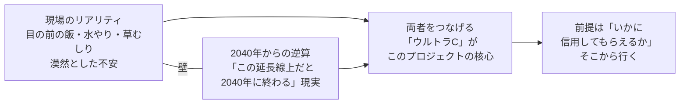

> 田原「現場のリアリティは本当に大事。でも**この延長線上だと2040年に終わるという現実もある**。かといって2040年からの上からのよくわからない抽象論を振りかざしてもダメ。**ここをつなげるウルトラCをやる必要があるんだよね、このプロジェクトは**」

### クロージング（10:01）

> 田原「**来週には多分急展開になっている可能性もあるので、皆さん体調を整えてやっていきましょう**」

---

## アクションアイテム（統合）

| 担当 | アクション | 期限・備考 |
|------|-----------|-----------|
| 田原 | 追加要素（アーバンリーグ・要確認）の予算組み込み方を広田さんと相談 | 直近 |
| 田原 | プロポーザル提出方法の資料公開をウォッチ（数日中に出る予想）→ 県へ提出 | 数日中〜 |
| 田原・エリ | 7/23の熊本→島原フェリー便を早めに確定（15時頃着が目安） | 早めに |
| エリ | 7/18オープンスクール前の訪問で先生たちへ「始まったら一緒に考えるところから。安心して」と伝える | 7/18前 |
| エリ | 現場の不安の声を集めて共有（別時間 or 書き溜め） | 継続・最重要 |
| エリ | 7/24 島原農業高校見学のセッティング（「知り合いの見学」の形）＋終日アテンド | 7/24 |
| あっちゃん | 7/23〜24の島原合流可否を調整 | 調整中 |
| 北田 | **NEXT第2期先行実施校の事例リサーチ**（進め方・タイムスケジュール） | 直近 |
| 北田 | **第3期採択校リスト＋自動リサーチエージェント構築 → プラネタリーグループへ随時レポート** | 構築次第 |
| チーム | 「プロジェクトファシリテーション」ロールの旗取り（教育長・長尾さんとどう握るか） | 採択後 |
| 全員 | 来週の急展開の可能性に備える（体調管理含む） | 来週 |
